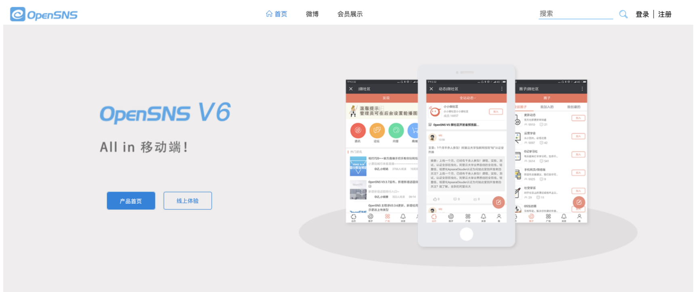
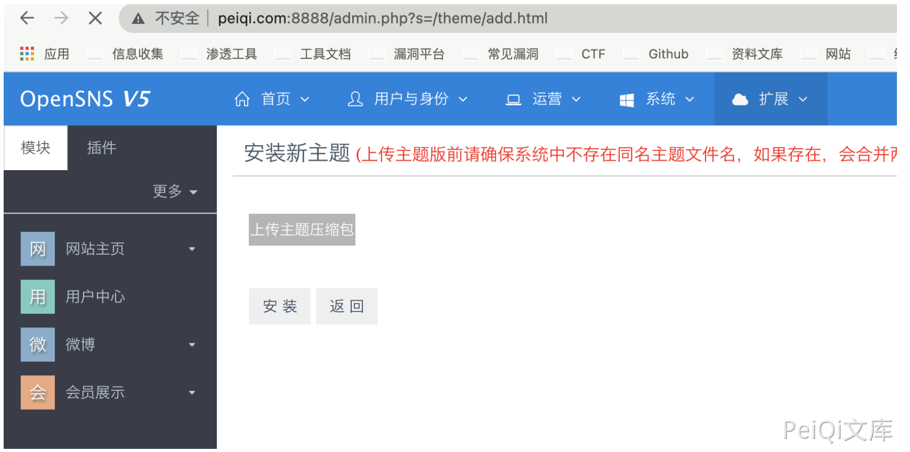
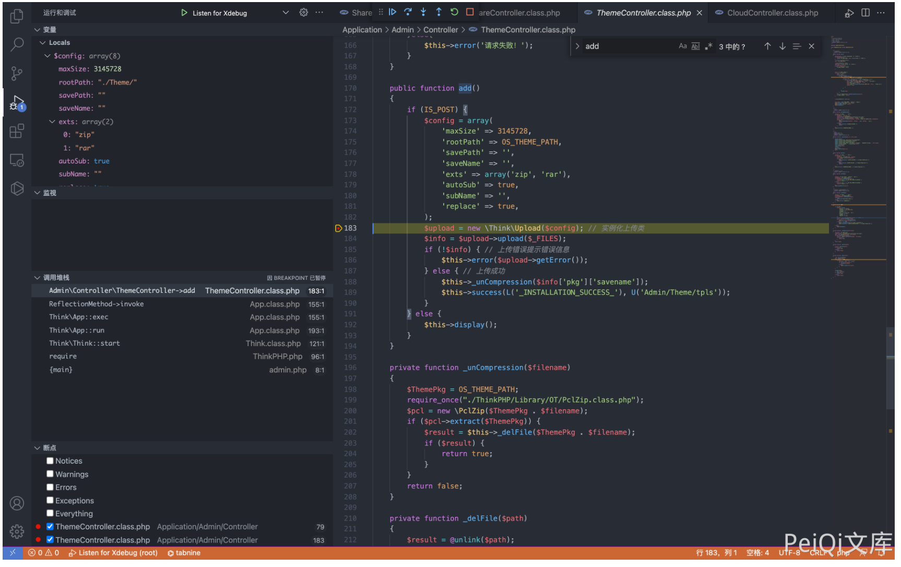
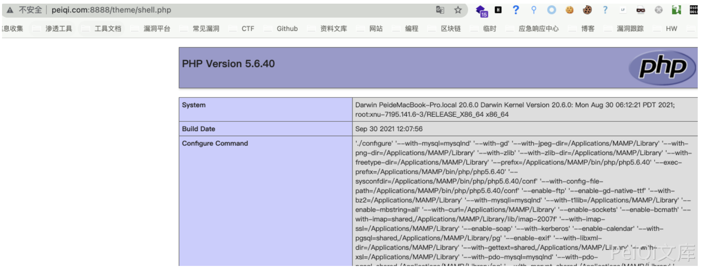

# OpenSNS ThemeController.class.php 后台任意文件上传漏洞

## 漏洞描述

OpenSNS ThemeController.class.php文件中存在文件上传载，其中过滤不足导致可以上传至服务器任意文件

## 漏洞影响

```
OpenSNS
```

## 网络测绘

```
icon_hash="1167011145"
```

## 漏洞复现

登录页面如下



登录后的上传页面`/admin.php?s=/theme/add.html`



存在漏洞的文件为 `Application/Admin/Model/ThemeController.class.php`



其中只需要文件后缀为 zip和rar 就会成功上传并解压至当前的 Theme目录中

