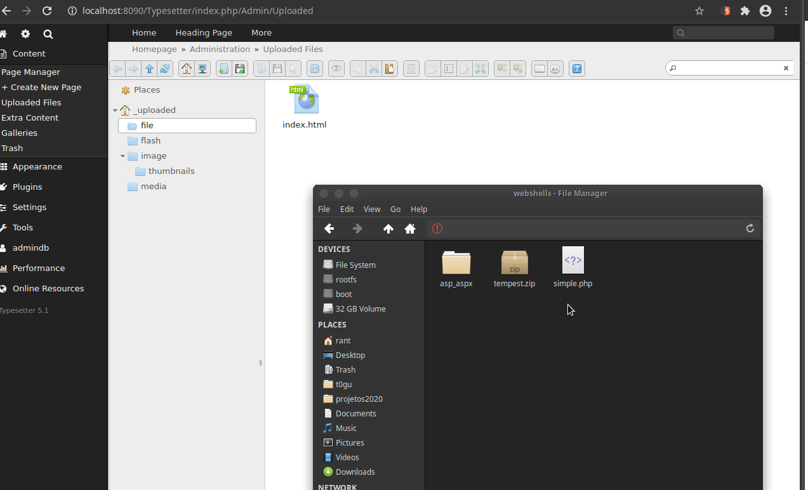

# TypesetterCMS 后台任意文件上传

## 漏洞描述

可以通过将.php放在.zip文件中并解压缩来绕过对.php文件的保护。一旦完成，就可以使用恶意的php文件（webshell）在计算机上执行命令

参考阅读：

- [Github 绕过文件上传限制导致命令执行](https://github.com/Typesetter/Typesetter/issues/674)

## 漏洞影响

```
Typesetter CMS 5-5.1
```

## 漏洞复现

按如下步骤复现


