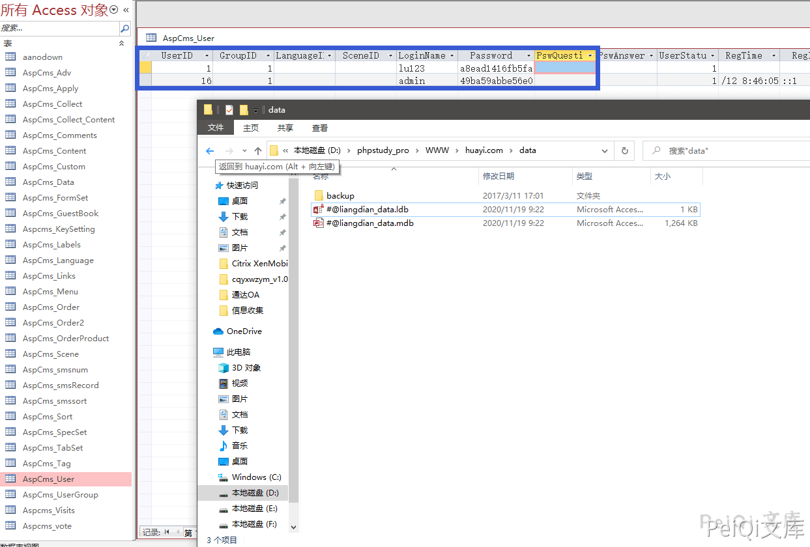
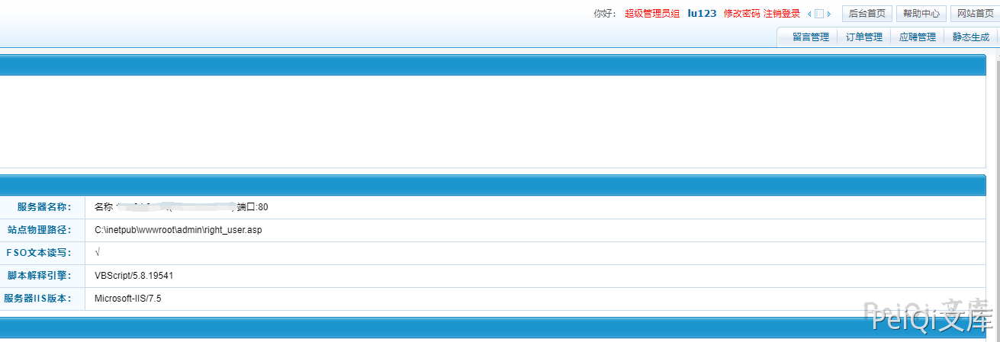

# 华宜互联 硬编码超级管理员漏洞

## 漏洞描述

华宜互联CMS默认存在超级管理员漏洞，如不修改则使用默认账号密码即可登录超级管理员

## 漏洞影响

```
华宜互联CMS
```

## 网络测绘

```
body="华宜网络"
```

## 漏洞复现

原版的源码需要付费，可找到免费版的源码


在目录下的DATA目录中有**mdb文件**, 打开后可以发现存在默认的两个用户

- admin/123456
- lu123/cui123



使用 用户lu123 即可登录超级管理员



