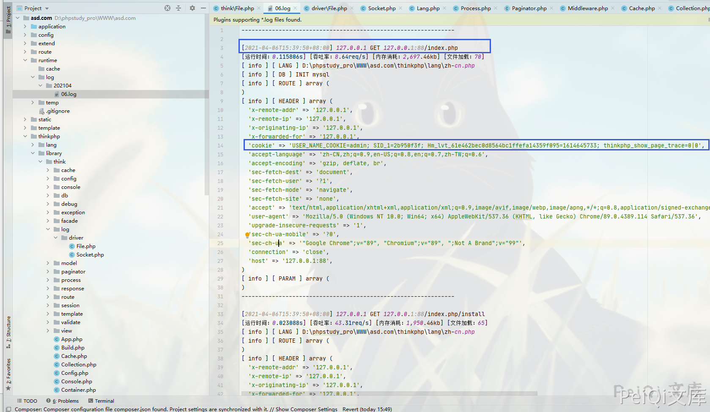
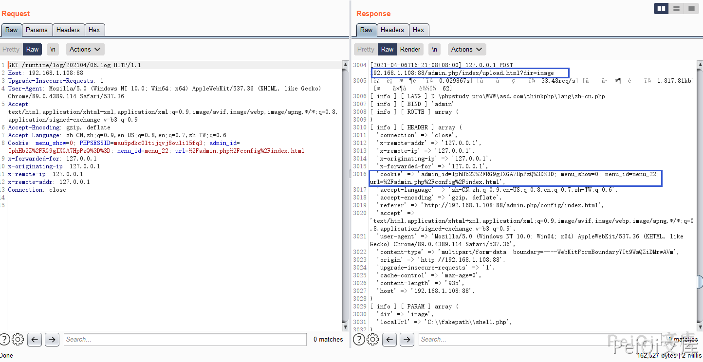

# 快排CMS Socket.php 日志信息泄露漏洞

## 漏洞描述

快排CMS 默认开启日志记录，由于日志名为时间作为文件名，造成管理员的Cookie泄露

## 漏洞影响

```
快排 CMS <= 1.2
```

## 环境搭建

https://gitee.com/qingzhanwang/kpcms

## 漏洞复现

文件 **thinkphp/library/think/log/driver/Socket.php**

这里默认开启日志写入

```plain
runtime/log/202104/06.log
```



其中可以看到泄露了管理员的Cookie信息和其他敏感信息

并且文件命名为 **年+月/日期.log**



这里关注后台的日志文件中的 admin.php页面的cookie就可以获得管理员权限