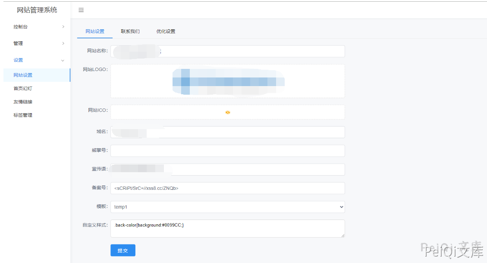
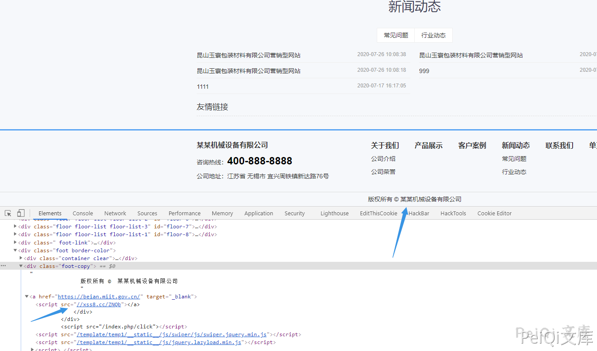
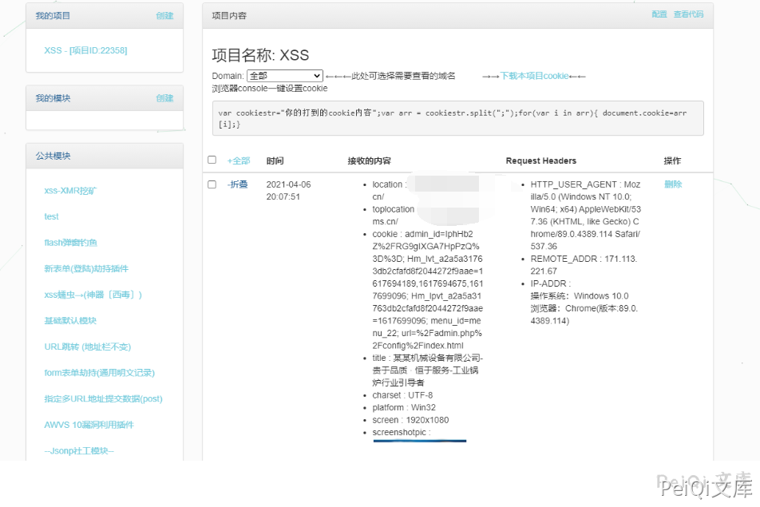

# 快排CMS 后台XSS漏洞

## 漏洞描述

快排CMS 后台存在XSS漏洞，通过后台构造特殊语句可以造成访问网站的用户被XSS影响

## 漏洞影响

```
快排 CMS <= 1.2
```

## 环境搭建

https://gitee.com/qingzhanwang/kpcms

## 漏洞复现

漏洞出现在登录后台的网站编辑的位置，由于没有对输出的字符进行过滤，导致XSS



主页版权处嵌入XSS代码




