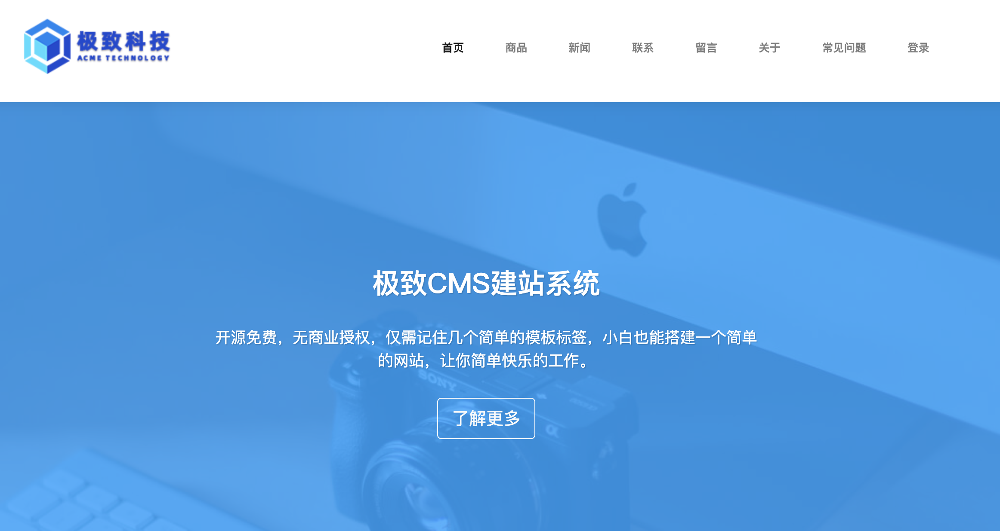
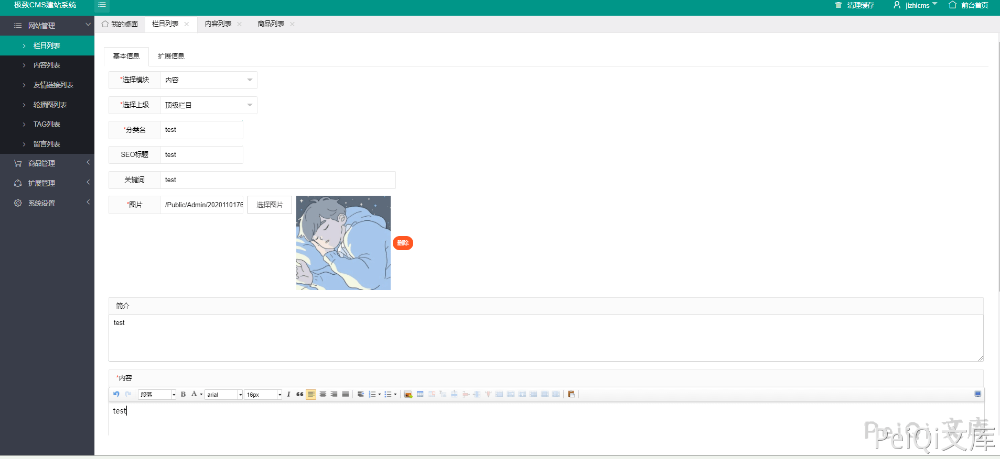
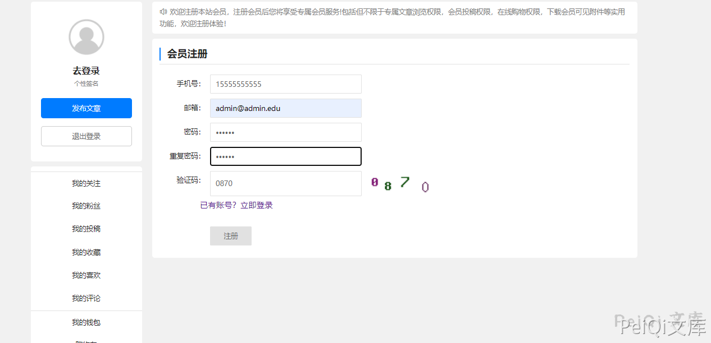
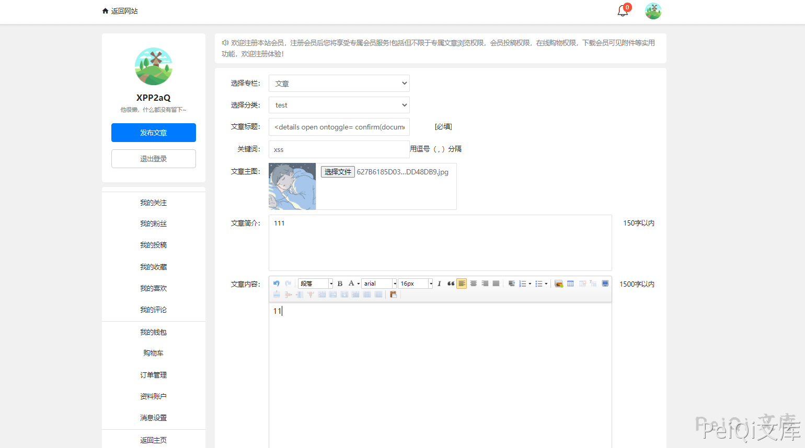
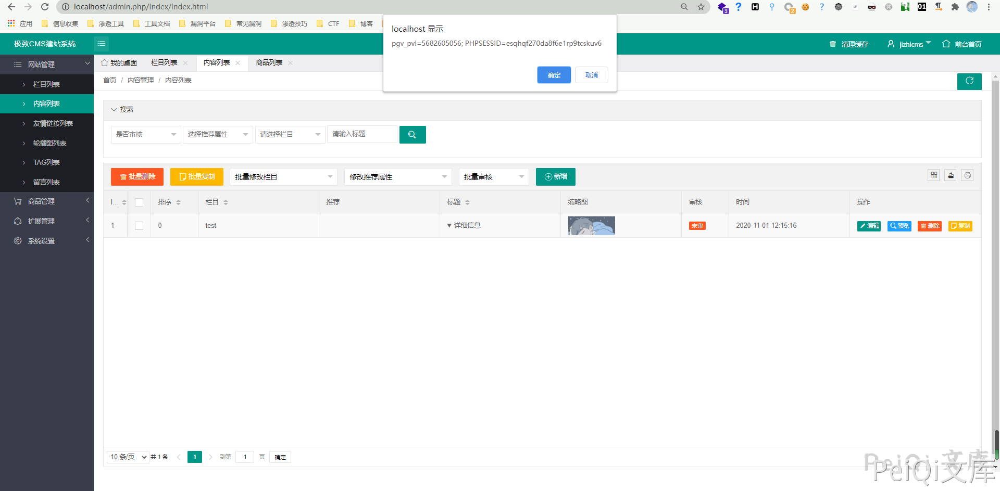

# 极致CMS 1.81 后台存储型XSS

## 漏洞描述

极致CMS后台中存在存储XSS，通过XSS漏洞，可能泄漏敏感信息

## 漏洞影响

```
极致CMS
```

## 网络测绘

```
icon_hash="1657387632"
```

## 漏洞复现

网站主页

登录管理员添加模块



注册用户



点击发布文章



在文章标题处插入xss payload

- `<details open ontoggle= confirm(document[`coo`+`kie`])>`

当管理员访问时XSS成功



