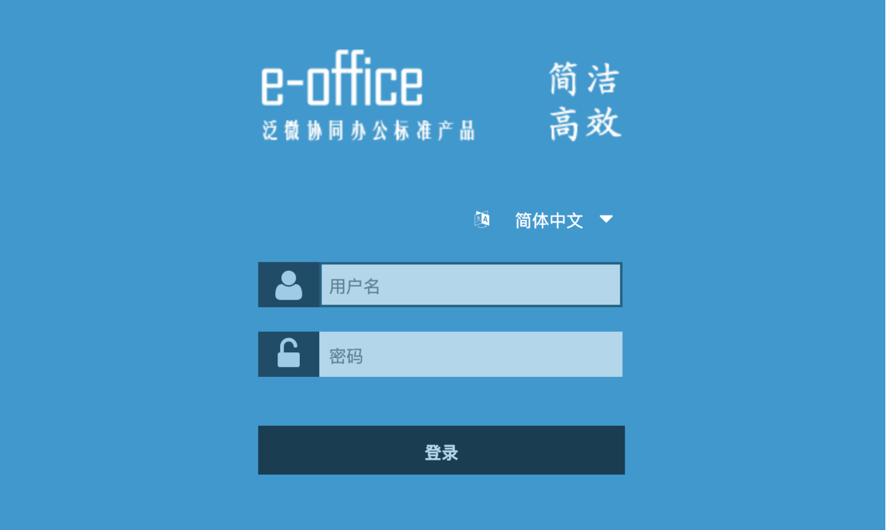
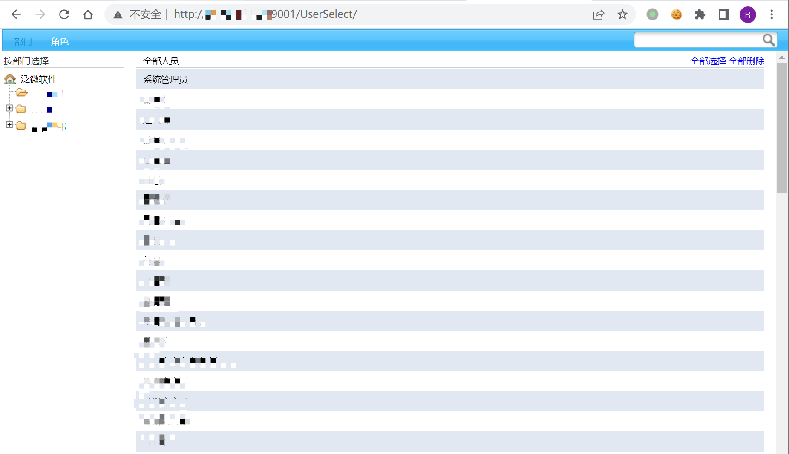

# 泛微OA E-Office UserSelect 未授权访问漏洞

## 漏洞描述

泛微OA E-Office UserSelect接口存在未授权访问漏洞，通过漏洞攻击者可以获取敏感信息

## 漏洞影响

```
泛微OA E-Office
```

## FOFA

```
app="泛微-EOffice"
```

## 漏洞复现

登录页面



验证POC

```
/UserSelect/
```

